# AEGIS.AI: AI GOVERNANCE PLATFORM

> **FORMATTING NOTES FOR WORD CONVERSION**
> - Font: Times New Roman 12pt throughout
> - Spacing: Double-spaced throughout
> - Margins: 1 inch all sides
> - Paragraph indent: 0.5 inch (first line of every paragraph)
> - All headings labeled [CENTER] must be centered in Word
> - Each section labeled [NEW PAGE] needs a manual page break inserted before it in Word
> - Preliminary pages use Roman numerals (i-xiv); body chapters use Arabic (1, 2, 3...)
> - Running head: Short title top-left, page number top-right on every page

---

<!-- COVER PAGE [NEW PAGE] [CENTER ALL] -->

# AEGIS.AI: AI GOVERNANCE PLATFORM

Muhammad Haris

2026-BSAI-F2022376040

BS Artificial Intelligence

Supervised by: Usama Ahmed

2026

**University of Management and Technology, Lahore**

*Department of Artificial Intelligence*
*School of Systems and Technology*

---

<!-- TITLE PAGE [NEW PAGE] [CENTER ALL] -->

# AEGIS.AI: AI GOVERNANCE PLATFORM

Muhammad Haris

2026-BSAI-F2022376040

Submitted in partial fulfillment of the requirements for the Degree of BS Artificial Intelligence, University of Management and Technology, Lahore.

Supervised by: Usama Ahmed
Lecturer, Department of Artificial Intelligence

2026

**University of Management and Technology, Lahore**

---

<!-- DECLARATION [NEW PAGE] Page: ii -->

# DECLARATION

I, **Muhammad Haris** (Student ID: **F2022376040** / Reg. No: **2026-BSAI-F2022376040**), student of **BS Artificial Intelligence**, Session 2022–2026, Department of Artificial Intelligence, School of Systems and Technology, University of Management and Technology, Lahore, hereby declare that the research presented in this thesis titled ***Aegis.AI: AI Governance Platform*** is my own independent scholarly work and has not been published or submitted as a thesis, dissertation, or research work in any form in any university, research institution, or academic forum in Pakistan or abroad.

The original concept, core idea, and architectural vision of the Aegis.AI platform originated entirely and exclusively with **Muhammad Haris**. To fulfill the practical engineering scope of the undergraduate degree, the software implementation was developed collaboratively as a Final Year Project by a three-member team—**Muhammad Haris** (F2022376040), **Ahmed Abdullah Khan** (F2022376096), and **Farhana Minhas** (F2022376126)—under the supervision of **Usama Ahmed**, Lecturer, Department of Artificial Intelligence.

This thesis represents the exclusive scholarly contribution and intellectual output of **Muhammad Haris**. The theoretical problem formulation, research design, regulatory harmonization (EU AI Act, ISO/IEC 42001, NIST AI RMF), enterprise architecture, quantitative risk scoring methodology, empirical evaluation, and all written scholarly content in this dissertation are solely and independently authored by Muhammad Haris.

Dated: June 2026

**Muhammad Haris** ....................................................

---

<!-- PLAGIARISM UNDERTAKING [NEW PAGE] Page: iii -->

# PLAGIARISM UNDERTAKING

I solemnly declare that the research presented in the thesis titled *"Aegis.AI: AI Governance Platform"* is solely my research work with no significant contribution from any other person. Small contributions or help, wherever taken, have been duly acknowledged.

I understand the zero tolerance policy of the HEC and University of Management and Technology towards plagiarism. Therefore, I as author of the above titled thesis declare that no portion of this thesis has been plagiarized and any material used as reference has been properly referred or cited.

I undertake that if I am found guilty of any formal plagiarism in the above titled thesis even after the award of the Bachelor's degree, the University reserves the right to withdraw or revoke my degree and that the HEC and the University have the right to publish my name on the HEC/University Website on which names of students are placed who submitted plagiarized dissertations.

**Muhammad Haris** ................................

Dated: June 2026

---

<!-- STATEMENT OF INDIVIDUAL CONTRIBUTION [NEW PAGE] Page: iii-b -->

# STATEMENT OF INDIVIDUAL CONTRIBUTION

This thesis is the independent scholarly work of **Muhammad Haris** (Student ID: **F2022376040** / Reg. No: **2026-BSAI-F2022376040**). The original concept, core idea, and architectural vision of the Aegis.AI platform originated entirely and exclusively with **Muhammad Haris**. The platform's software implementation was developed collaboratively as a Final Year Project by a three-member development team—**Muhammad Haris** (F2022376040), **Ahmed Abdullah Khan** (F2022376096), and **Farhana Minhas** (F2022376126)—under the supervision of **Usama Ahmed**, Lecturer, Department of Artificial Intelligence, University of Management and Technology, Lahore. 

Within this project, Muhammad Haris served in the following distinct capacities:

**As Researcher:** The research design, problem formulation, literature review, theoretical framework, regulatory mapping (EU AI Act, ISO/IEC 42001, ISO/IEC 27001, NIST AI RMF 1.0), evaluation methodology, and all scholarly analysis and written research content of this thesis are the sole and independent contribution of Muhammad Haris. This research is further supported by two working papers authored independently by Muhammad Haris: *"Cross-Framework Analysis of Major AI Governance Instruments: Evidence of Semantic Equivalence and Operational Alignment"* (Working Paper) and *"Architecting AI Compliance: A Stage-Gate Lifecycle Architecture for Harmonizing NIST, ISO, and Modular Legal Overlays"* (Preprint).

**As Subject Matter Expert (SME):** Muhammad Haris served as the Lead Architect and Subject Matter Expert for the Aegis.AI platform, responsible for all AI governance domain decisions, regulatory alignment, risk scoring methodology, compliance framework mapping, and the definition of the platform's governance feature set. This expertise is grounded in industry-recognized professional certifications, including:

- *AI Governance & ISO 42001 Readiness for GRC, Audit & Legal*, Specialization (ACE Endorsed: 59 US College Credits; FIBAA Endorsed: 10 European Credits)
- *AI Security*, Specialization
- *Research Methodology* (2026)
- *TOGAF 10 Foundation* (Enterprise Architecture)
- *IBM Generative AI Engineering*, Professional Certificate
- *IBM Cybersecurity Analyst*, Professional Certificate
- *IBM Systems and Solutions Architect*, Professional Certificate
- *IBM Full Stack Software Developer*, Professional Certificate
- *Foundations of Governance, Risk and Compliance*
- *Artificial Intelligence on Microsoft Azure*

Muhammad Haris additionally founded **Axomify LLC** (Teaneck, NJ, USA), a technology startup delivering Responsible AI governance solutions, and **LearnAIGRC**, an educational initiative offering the *AI Security and Compliance Engineering Certification* for technology professionals, both reflecting active professional practice in the AI governance domain that directly informed the research and design of this platform.

**As Developer:** Muhammad Haris contributed directly to the implementation of the Aegis.AI platform as a full-stack developer, with responsibility for core architectural decisions, backend API design, multi-tenant database architecture, frontend module development, and the AI Advisor integration. 

---

<!-- SIMILARITY REPORT [NEW PAGE] Page: iv -->

# SIMILARITY REPORT

---

<!-- CERTIFICATE OF APPROVAL [NEW PAGE] Page: v -->

# CERTIFICATE OF APPROVAL

Accepted by the Faculty of the Department of Artificial Intelligence, School of Systems and Technology, University of Management and Technology, Lahore, in partial fulfillment of the requirements for the degree of BS Artificial Intelligence.

**Supervisor**

Usama Ahmed
Lecturer
Department of Artificial Intelligence, UMT

**Internal Examiner**

______________________________

**External Examiner**

______________________________

**Head of Department**

Department of Artificial Intelligence
School of Systems and Technology, UMT

Date: June 2026

---

<!-- CERTIFICATE BY SUPERVISOR [NEW PAGE] Page: vi -->

# CERTIFICATE BY SUPERVISOR

I certify that I have read *"Aegis.AI: AI Governance Platform"* by Muhammad Haris, and that in my opinion this work meets the criteria for approving a thesis submitted in partial fulfillment of the requirements for the degree of BS Artificial Intelligence at the University of Management and Technology, Lahore.

**Supervisor: Usama Ahmed**
Lecturer
Department of Artificial Intelligence
University of Management and Technology, Lahore

---

<!-- ABSTRACT [NEW PAGE] Page: vii -->

# ABSTRACT

The rapid proliferation of artificial intelligence systems across critical sectors (Organisation for Economic Co-operation and Development, 2019) has created an urgent demand for robust governance frameworks capable of ensuring regulatory compliance, managing systemic risk, and preserving data sovereignty. Existing commercial AI governance platforms are predominantly proprietary, cloud-hosted Software-as-a-Service solutions that impose significant vendor lock-in, restrict on-premise deployment, and remain financially inaccessible to small and medium enterprises operating under strict data residency requirements. This thesis presents Aegis.AI, a full-stack, self-hostable Artificial Intelligence Governance, Risk, and Compliance platform designed to address these deficiencies. The system implements a multi-tenant, schema-isolated PostgreSQL architecture and supports continuous compliance tracking across four major regulatory frameworks: the European Union AI Act, ISO/IEC 42001 (Artificial Intelligence Management Systems), ISO/IEC 27001 (Information Security Management Systems), and the NIST Artificial Intelligence Risk Management Framework 1.0. Aegis.AI integrates a quantitative risk scoring algorithm, an automated Large Language Model evaluation pipeline powered by the DeepEval framework, a real-time audit event streaming system utilizing Redis Pub/Sub and Server-Sent Events, and a headless document rendering engine for generating audit-grade compliance reports. The platform was developed using a PERN stack augmented with a Python FastAPI evaluation microservice, containerized via Docker Compose and Kubernetes, and delivered across twelve iterative development sprints. System evaluation demonstrated API response latencies below 50 milliseconds, real-time notification delivery within 100 milliseconds, and an overall system accuracy of 99%. The platform's open architecture enables organizations to implement AI governance as a continuous, measurable discipline rather than a periodic compliance exercise, thereby advancing the state of practice in responsible AI deployment.

*Keywords:* artificial intelligence governance, regulatory compliance, EU AI Act, ISO 42001, NIST AI RMF, risk management, multi-tenancy, large language model evaluation, self-hosted platform

---

<!-- DEDICATION [NEW PAGE] Page: viii -->

# DEDICATION

<!-- DEDICATION [NEW PAGE] Page: viii -->

*This thesis is dedicated to my parents, whose sacrifices, prayers, and unconditional love have been the foundation of every achievement in my life.*

*To my supervisor, Usama Ahmed, for believing in this research and providing guidance at every step.*

# ACKNOWLEDGMENT

<!-- ACKNOWLEDGMENT [NEW PAGE] Page: ix -->

All praise is due to Allah (SWT), the Most Gracious and Most Merciful, for granting me the strength, patience, and clarity of thought required to complete this research.

I would like to express my sincere gratitude to my supervisor, **Usama Ahmed**, Lecturer, Department of Artificial Intelligence, University of Management and Technology, Lahore, for his invaluable guidance, constructive feedback, and unwavering support throughout the duration of this project. His expertise in AI systems and governance significantly shaped the direction and quality of this work.

I am also grateful to the faculty and staff of the Department of Artificial Intelligence, UMT, for providing the academic foundation and technical resources necessary to undertake a project of this scope.

Finally, I thank my family for their patience and encouragement during the long hours of research and development that this work demanded.

**Muhammad Haris**
University of Management and Technology, Lahore
2026-BSAI-F2022376040
2026

# TABLE OF CONTENTS

| Section | Page |
|---|---|
| DECLARATION | ii |
| PLAGIARISM UNDERTAKING | iii |
| STATEMENT OF INDIVIDUAL CONTRIBUTION | iv |
| SIMILARITY REPORT | v |
| CERTIFICATE OF APPROVAL | vi |
| CERTIFICATE BY SUPERVISOR | vii |
| ABSTRACT | viii |
| DEDICATION | ix |
| ACKNOWLEDGMENT | x |
| LIST OF TABLES | xii |
| LIST OF FIGURES | xiii |
| **Chapter 1: Introduction** | **1** |
| 1.1 Background and Motivation | 1 |
| 1.2 Problem Statement | 3 |
| 1.3 Research Questions | 5 |
| 1.4 Objectives | 5 |
| 1.5 Scope and Delimitations | 6 |
| 1.6 Significance of the Study | 6 |
| 1.7 Thesis Structure | 7 |
| **Chapter 2: Literature Review** | **8** |
| 2.1 Artificial Intelligence Regulation: An Emerging Imperative | 8 |
| 2.2 The European Union AI Act | 9 |
| 2.3 ISO/IEC 42001: Artificial Intelligence Management Systems | 12 |
| 2.4 ISO/IEC 27001: Information Security Management Systems | 13 |
| 2.5 NIST AI Risk Management Framework 1.0 | 14 |
| 2.6 Existing AI Governance Platforms: A Critical Review | 16 |
| 2.7 Algorithmic Accountability and Explainability | 19 |
| 2.8 Multi-Tenancy in Enterprise SaaS Architectures | 20 |
| 2.9 Large Language Model Evaluation Frameworks | 21 |
| 2.10 Research Gap | 22 |
| **Chapter 3: System Architecture and Design** | **24** |
| 3.1 Architectural Philosophy | 24 |
| 3.2 High-Level System Architecture | 25 |
| 3.3 Multi-Tenant Database Architecture | 27 |
| 3.4 Authentication and Role-Based Access Control | 29 |
| 3.5 Compliance Framework Engine | 30 |
| 3.6 Risk Management Module Design | 34 |
| 3.7 Policy Management Subsystem | 37 |
| 3.8 LLM Evaluation Architecture | 38 |
| 3.9 Real-Time Event Streaming Architecture | 40 |
| 3.10 Reporting Engine Design | 41 |
| 3.11 AI Detection and AI-BOM Generator | 42 |
| 3.12 Post-Market Monitoring Architecture | 43 |
| **Chapter 4: Implementation** | **45** |
| 4.1 Development Environment and Toolchain | 45 |
| 4.2 Frontend Implementation | 46 |
| 4.3 Backend API Implementation | 48 |
| 4.4 Database Layer Implementation | 50 |
| 4.5 Evaluation Server Implementation | 52 |
| 4.6 Background Job Processing | 53 |
| 4.7 Containerization and Deployment | 54 |
| 4.8 External Service Integrations | 56 |
| **Chapter 5: Evaluation and Results** | **58** |
| 5.1 Evaluation Methodology | 58 |
| 5.2 Functional Testing Results | 59 |
| 5.3 Performance Benchmarks | 61 |
| 5.4 LLM Evaluation Metrics | 63 |
| 5.5 Multi-Tenant Security Isolation Verification | 65 |
| 5.6 Scalability Analysis | 66 |
| 5.7 Comparative Analysis | 67 |
| **Chapter 6: Conclusion and Future Work** | **69** |
| 6.1 Summary of Contributions | 69 |
| 6.2 Regulatory Implications | 70 |
| 6.3 Limitations | 71 |
| 6.4 Future Work | 72 |
| REFERENCES | 74 |
| **APPENDICES** | **83** |
| Appendix A: Sprint Backlog Summary (Sprints 1-12) | 83 |
| Appendix B: User Story Catalogue | 86 |
| Appendix C: System Test Case Summary | 92 |
| Appendix D: API Endpoint Catalogue | 97 |
| Appendix E: Database Schema Overview | 100 |

---

<!-- LIST OF TABLES [NEW PAGE] Page: xii -->

# LIST OF TABLES

| Table | Title | Chapter |
|---|---|---|
| Table 2.1 | Summary of EU AI Act Risk Categories | Chapter 2 |
| Table 2.2 | Comparison of Existing AI Governance Platforms | Chapter 2 |
| Table 3.1 | Technology Stack Summary | Chapter 3 |
| Table 3.2 | User Roles and Permission Matrix | Chapter 3 |
| Table 3.3 | EU AI Act Control Categories Implemented in Aegis.AI | Chapter 3 |
| Table 3.4 | ISO/IEC 42001 Clause and Annex Mapping | Chapter 3 |
| Table 3.5 | NIST AI RMF Function and Subcategory Coverage | Chapter 3 |
| Table 3.6 | Risk Scoring Matrix (Formula: L x 1 + S x 3) | Chapter 3 |
| Table 4.1 | React Component Library Structure | Chapter 4 |
| Table 4.2 | Backend Route Module Catalogue (Selected) | Chapter 4 |
| Table 4.3 | Database Migration Sequence (Selected) | Chapter 4 |
| Table 5.1 | Functional Test Case Results Summary | Chapter 5 |
| Table 5.2 | API Response Time Benchmarks (50 Concurrent Users) | Chapter 5 |
| Table 5.3 | PDF Report Generation Performance | Chapter 5 |
| Table 5.4 | LLM Evaluation Metric Results (50-Item Test Dataset) | Chapter 5 |
| Table 5.5 | Platform Feature Comparison Matrix | Chapter 5 |
| Table A.1 | Sprint Backlog Summary (Sprints 1-12) | Appendix A |
| Table B.1 | User Story Catalogue, Aegis.AI v1.0 | Appendix B |
| Table C.1 | Sprint Test Case Summary (Representative Sample) | Appendix C |
| Table D.1 | Aegis.AI REST API Endpoint Catalogue (Selected) | Appendix D |
| Table E.1 | Core Database Tables, Aegis.AI v1.0 Schema (Per Tenant) | Appendix E |

# LIST OF FIGURES

| Figure | Title | Chapter |
|---|---|---|
| Figure 3.1 | Aegis.AI System Context and External Integration Boundary Architecture | Chapter 3 |
| Figure 3.2 | System Context and Deployment Architecture (C4 Level 1) | Chapter 3 |
| Figure 3.3 | Backend Component Architecture (C4 Level 3) | Chapter 3 |
| Figure 3.4 | Domain Object Model and Entity Relationships (C4 Level 4) | Chapter 3 |
| Figure 3.5 | Clean Architecture Layered Dependency Structure | Chapter 3 |
| Figure 3.6 | Entity-Relationship Diagram (ERD) of the Aegis.AI Database Schema | Chapter 3 |
| Figure 3.7 | End-to-End Multi-Step Approval Workflow Execution Sequence | Chapter 3 |
| Figure 3.8 | Risk Creation and Recalculation Sequence Diagram | Chapter 3 |
| Figure 3.9 | Policy and Vendor Management Domain Class Diagram | Chapter 3 |
| Figure 3.10 | Policy Governance Lifecycle Sequence Diagram | Chapter 3 |
| Figure 3.11 | AI Model Inventory and NIST AI RMF Domain Class Diagram | Chapter 3 |
| Figure 3.12 | AI Model Registration and NIST RMF Status Synchronization Sequence Diagram | Chapter 3 |
| Figure 3.13 | System-Wide Data Flow Diagram (Level 0) | Chapter 3 |
| Figure 3.14 | Comprehensive Data Flow Diagram (Level 1) | Chapter 3 |
| Figure 4.1 | Authentication and Access Control Class Hierarchy | Chapter 4 |
| Figure 4.2 | User Authentication and JWT Generation Sequence Diagram | Chapter 4 |
| Figure 4.3 | Multi-Tenant Database Routing and Approval Engine Class Diagram | Chapter 4 |
| Figure 4.4 | Multi-Tenant Use Case Approval Submission Sequence Diagram | Chapter 4 |
| Figure 4.5 | EU AI Act Framework Engine Class Diagram | Chapter 4 |
| Figure 4.6 | AI Auto-Driver Regulatory Control Auto-Fill Sequence Diagram | Chapter 4 |
| Figure 4.7 | Risk Management Architecture Class Diagram | Chapter 4 |
| Figure 5.1 | LLM Evaluation and AI Advisor Domain Class Diagram | Chapter 5 |
| Figure 5.2 | LLM API Key Encryption and Management Sequence Diagram | Chapter 5 |
| Figure 5.3 | Reporting Engine, Global Search, and AI Trust Center Class Diagram | Chapter 5 |
| Figure 5.4 | Multi-Framework Compliance Report Generation Sequence Diagram | Chapter 5 |

# Chapter 1

# Introduction

## 1.1 Background and Motivation

The integration of artificial intelligence into organizational workflows has accelerated at an unprecedented pace over the past decade. From automated credit scoring and predictive maintenance to natural language processing-based customer service and AI-assisted medical diagnostics, machine learning systems now influence decisions that directly affect individuals' livelihoods, safety, and fundamental rights. According to the International Data Corporation (2024), global spending on AI systems surpassed USD 154 billion in 2023 and is projected to exceed USD 300 billion by 2026, reflecting the extraordinary momentum behind enterprise AI adoption across virtually every industry sector.

This rapid proliferation, however, has exposed a critical and widening gap between the deployment velocity of AI systems and the institutional capacity to govern them responsibly. High-profile failures, from algorithmic hiring tools exhibiting gender bias to autonomous vehicle systems making catastrophic decisions, have demonstrated that poorly governed AI carries systemic risks that extend far beyond individual product failures. These incidents have catalyzed a global regulatory response of historic proportions. The European Union's Artificial Intelligence Act (EU AI Act), adopted in 2024, constitutes the world's first comprehensive binding regulatory framework for AI, establishing risk-based obligations across the entire AI lifecycle. Simultaneously, standards bodies including the International Organization for Standardization and the National Institute of Standards and Technology have published frameworks, ISO/IEC 42001 and the NIST AI Risk Management Framework 1.0, respectively, that provide complementary, process-oriented guidance for institutionalizing AI governance within organizations.

For organizations operating AI systems, compliance with these frameworks is no longer optional. Article 9 of the EU AI Act mandates that providers of high-risk AI systems establish and maintain a comprehensive risk management system that is "a continuous iterative process run throughout the entire lifecycle." Article 72 further requires ongoing post-market monitoring of deployed systems, with documented obligations for incident reporting and corrective action. Failure to comply carries penalties of up to EUR 30 million or 6% of global annual turnover, figures that demand serious institutional attention.

Yet despite this urgent regulatory landscape, the tooling available to organizations seeking to implement AI governance remains deeply inadequate. The market is dominated by proprietary, cloud-hosted Software-as-a-Service (SaaS) platforms, such as Credo AI, OneTrust AI Governance, and IBM OpenPages, that, while feature-rich, impose significant limitations. These platforms store sensitive governance artifacts, compliance evidence, and model documentation on third-party infrastructure, creating data sovereignty concerns that are incompatible with the security policies of many enterprises, government agencies, and regulated industries. They operate on subscription pricing models that render them prohibitively expensive for small and medium-sized enterprises. They lack support for self-hosted, on-premise, or private cloud deployments. Furthermore, they typically treat governance as a static audit function rather than a continuous, real-time operational discipline integrated into the AI development lifecycle.

This creates a fundamental dilemma for organizations that must demonstrate compliance with the EU AI Act and aligned standards: they either accept the data sovereignty and cost trade-offs of commercial SaaS platforms, or they attempt to construct piecemeal governance processes from general-purpose project management and document management tools that were never designed for AI governance workflows. Neither approach is satisfactory from a security, compliance, or operational efficiency standpoint.

Aegis.AI was conceived and developed in direct response to this gap. The platform is a full-stack, self-hostable AI Governance, Risk, and Compliance (GRC) system that enables organizations to manage the complete AI lifecycle, from model registration and risk assessment through continuous compliance monitoring, LLM evaluation, post-market surveillance, and audit reporting, on infrastructure entirely under their own control. By making the platform deployable on-premise or within a private cloud environment, Aegis.AI preserves data sovereignty without sacrificing the functional sophistication required for genuine regulatory compliance.

## 1.2 Problem Statement

The current landscape of AI governance tooling fails to serve the full spectrum of organizations required to comply with emerging AI regulations in at least four critical dimensions.

**First, the data sovereignty problem.** The EU AI Act and aligned standards require organizations to maintain extensive, sensitive documentation, including model cards, training data provenance records, bias assessment results, incident logs, and internal audit trails. When these artifacts are stored on third-party SaaS infrastructure, organizations lose effective control over their most sensitive compliance data. For regulated industries such as financial services, healthcare, and defense, this loss of sovereignty is not merely a preference but a regulatory prohibition. Existing commercial platforms provide no viable path to resolving this tension.

**Second, the cost accessibility problem.** Enterprise AI governance platforms typically operate on pricing models that assume large-enterprise customers with substantial IT budgets. Annual licensing costs for platforms such as Credo AI or OneTrust AI Governance routinely exceed USD 50,000-100,000 per year for meaningful feature access, placing comprehensive governance tooling effectively out of reach for the majority of the global market, including small and medium enterprises, academic institutions, non-governmental organizations, and public-sector bodies in developing economies that are nonetheless subject to regulatory obligations.

**Third, the compliance fragmentation problem.** Organizations operating globally must simultaneously satisfy multiple, partially overlapping regulatory frameworks, the EU AI Act, ISO/IEC 42001, ISO/IEC 27001, and the NIST AI RMF, each with distinct control structures, lifecycle requirements, and evidence standards. No single open-source or affordable tool currently provides integrated, cross-framework compliance management. Organizations are therefore forced to manage compliance across multiple disconnected systems, creating substantial operational overhead and increasing the risk of compliance gaps.

**Fourth, the static governance problem.** AI governance is inherently dynamic: model behavior drifts, regulatory requirements evolve, organizational risk profiles change, and new threats emerge continuously. Yet existing governance approaches, whether conducted on spreadsheets, document management systems, or even commercial GRC platforms, treat compliance as a periodic, point-in-time activity rather than a continuous operational discipline. The EU AI Act's explicit requirement for continuous risk management systems and real-time post-market monitoring cannot be satisfied by tools that produce static compliance snapshots.

Aegis.AI addresses all four dimensions simultaneously: it is self-hostable (resolving the data sovereignty problem), openly licensed under BSL 1.1 (addressing cost accessibility for non-commercial use), multi-framework in its compliance coverage (solving compliance fragmentation), and architecturally designed around real-time, continuous governance processes (overcoming static governance limitations).

## 1.3 Research Questions

This thesis investigates the following primary and secondary research questions:

**Primary Research Question:** How can a scalable, privacy-preserving, and self-hostable software architecture be designed to support continuous AI governance, multi-framework regulatory compliance management, and quantitative AI risk assessment across an organization's full AI model portfolio?

**Secondary Research Questions:**

1. What architectural patterns are required to achieve complete data isolation between multiple organizational tenants while maintaining operational efficiency in a shared infrastructure environment?
2. How can quantitative risk scoring algorithms be designed to provide objective, reproducible risk assessments for AI models, vendors, and projects within a governance platform?
3. What technical mechanisms are required to enable real-time compliance event monitoring and audit trail generation in a production AI governance platform?
4. How can Large Language Model evaluation, including assessment of hallucination, bias, correctness, and faithfulness, be integrated into an organizational AI governance workflow?
5. What performance characteristics must an AI governance platform exhibit to support production enterprise use, and can these be achieved in a self-hosted architecture?

## 1.4 Objectives

The specific objectives of this research are as follows:

1. To design and implement a multi-tenant, schema-isolated database architecture capable of supporting complete data sovereignty for multiple independent organizations within a shared Aegis.AI deployment.
2. To develop a comprehensive compliance tracking engine covering the EU AI Act (13 control categories, approximately 60 controls), ISO/IEC 42001 (Clauses 4-10, Annex A and B), ISO/IEC 27001 (7 clauses, 93 Annex A controls), and the NIST AI RMF 1.0 (GOVERN, MAP, MEASURE, MANAGE functions, approximately 70 subcategories).
3. To design and validate a quantitative risk scoring algorithm that produces objective, reproducible risk scores for AI-related risks based on independently assessed likelihood and severity dimensions.
4. To implement a fully automated LLM evaluation pipeline using the DeepEval framework, capable of assessing model outputs on correctness, faithfulness, hallucination rate, and bias/fairness dimensions.
5. To architect and implement a real-time audit event streaming system using Redis Pub/Sub and Server-Sent Events, enabling continuous monitoring of governance activities.
6. To validate the platform's performance characteristics through systematic benchmarking and demonstrate that a self-hosted architecture can meet enterprise production requirements.

## 1.5 Scope and Delimitations

Aegis.AI is scoped as an AI governance platform targeted at organizations that deploy, develop, or procure AI systems subject to regulatory oversight. The platform provides governance management infrastructure but does not itself make regulatory determinations, users and their legal/compliance teams retain responsibility for interpreting regulatory requirements and determining the adequacy of their compliance posture. The LLM evaluation module supports evaluation of models accessible via API (OpenAI, Anthropic, OpenRouter) and does not currently support evaluation of locally-hosted models beyond those accessible through OpenRouter's routing infrastructure. The platform's compliance framework coverage is calibrated to the versions of the EU AI Act, ISO/IEC 42001, ISO/IEC 27001, and NIST AI RMF 1.0 current as of the 2025 implementation date and does not automatically update to reflect regulatory amendments.

## 1.6 Significance of the Study

This research makes several contributions to the fields of AI governance, software engineering, and regulatory compliance technology. Academically, it advances the literature on AI governance system design by providing a detailed, empirically validated architectural reference for a comprehensive, multi-framework AI GRC platform, a class of system for which published design literature remains sparse. It contributes a formal articulation of the schema-per-tenant multi-tenancy pattern as applied specifically to the data isolation requirements of AI governance contexts.

Practically, Aegis.AI demonstrates that comprehensive AI governance tooling need not be the exclusive domain of well-funded enterprises. The platform's self-hostable, openly licensed architecture makes production-grade governance tooling accessible to organizations that have been underserved by the commercial market. This has particular significance for organizations in developing economies, public sector bodies, academic institutions, and civil society organizations that must nonetheless comply with AI regulations when deploying AI systems affecting EU-resident individuals.

From a regulatory standpoint, the platform's architecture provides a concrete implementation reference for the "continuous risk management system" and "post-market monitoring" requirements mandated by the EU AI Act, contributing to the corpus of technical knowledge available to standard-setters and regulators seeking to understand the practical implementation implications of regulatory obligations.

## 1.7 Thesis Structure

The remainder of this thesis is organized as follows. Chapter 2 presents a critical literature review covering the major AI regulatory frameworks, the landscape of existing AI governance platforms, and relevant technical literature on multi-tenancy architectures, algorithmic accountability, and LLM evaluation. Chapter 3 presents the system architecture and design of Aegis.AI, covering the multi-tenant database model, compliance engine, risk management module, LLM evaluation architecture, and real-time event streaming system. Chapter 4 describes the implementation of the platform, including the technology stack, frontend and backend architecture, evaluation server, and containerization strategy. Chapter 5 presents the evaluation methodology and results, including functional test outcomes, performance benchmarks, LLM evaluation metrics, and multi-tenant isolation verification. Chapter 6 concludes the thesis with a summary of contributions, a discussion of regulatory implications and limitations, and directions for future work. References and appendices follow.

---

<!-- CHAPTER 2: LITERATURE REVIEW [NEW PAGE] -->

# Chapter 2

# Literature Review

## 2.1 Artificial Intelligence Regulation: An Emerging Imperative

The governance of artificial intelligence systems has emerged as one of the most consequential policy challenges (Organisation for Economic Co-operation and Development, 2019; United Nations Educational, Scientific and Cultural Organization, 2021) of the early twenty-first century. Scholars, policymakers, and technologists have increasingly converged on the view that the development of AI without appropriate governance structures poses risks not merely to individual consumers but to democratic institutions, public safety, and fundamental human rights (Dafoe, 2018; Floridi et al., 2019; Jobin et al., 2019). This recognition has driven a substantial and growing body of regulatory activity across jurisdictions worldwide.

Early governance approaches were predominantly voluntary, taking the form of ethical principles documents, the European Commission's early policy explorations (European Commission, 2020), industry codes of conduct, and guidance publications from national AI strategy bodies. Floridi et al. (2019) conducted a systematic analysis of 84 AI ethics guidelines published between 2016 and 2019 and identified a convergence around five core principles: beneficence, non-maleficence, autonomy, justice, and explicability. While this convergence was intellectually significant, critics noted that voluntary principles without enforcement mechanisms produced little observable change in development practice (Jobin et al., 2019; Hagendorff, 2020). Hagendorff (2020) analyzed 22 AI ethics guidelines and found that the majority failed to address the structural organizational and economic incentives that produce harmful AI systems, focusing instead on aspirational behavioral guidance that practitioners were unlikely to internalize.

The inadequacy of voluntary approaches has driven a transition toward binding regulation in multiple jurisdictions. In the European Union, this culminated in the adoption of the EU AI Act in 2024, the world's first comprehensive binding legal framework for AI. In the United States, Executive Order 14110 on Safe, Secure, and Trustworthy Artificial Intelligence (The White House, 2023) directed federal agencies to develop AI risk management practices aligned with NIST frameworks. China has enacted regulations specifically targeting recommendation algorithms, generative AI, and deep synthesis technologies. The United Kingdom has adopted a "pro-innovation" sector-specific regulatory approach while the AI Safety Institute conducts evaluations of frontier models. This global regulatory fragmentation creates significant compliance complexity for multinational organizations, complexity that governance platforms must be capable of managing (Cihon, 2019).

## 2.2 The European Union AI Act

The EU AI Act (Regulation (EU) 2024/1689) represents the most comprehensive and consequential AI regulatory instrument (Veale & Borgesius, 2021) currently in force globally, originating from the initial legislative proposal tabled by the European Commission (2021). Its risk-based architecture classifies AI systems into four categories, unacceptable risk, high risk, limited risk, and minimal risk, and assigns proportionate regulatory obligations to each (European Parliament and Council of the European Union, 2024).

**Unacceptable Risk Systems** are prohibited outright. These include AI systems that deploy subliminal or manipulative techniques to distort behavior, systems that exploit vulnerabilities of specific groups, and biometric categorization systems that infer sensitive attributes from physical characteristics. Social scoring systems operated by public authorities and real-time remote biometric identification systems in publicly accessible spaces are similarly prohibited with narrow exceptions.

**High-Risk AI Systems** bear the most substantial compliance burden under the Act. Article 6 defines two categories of high-risk systems: AI systems that constitute safety components of products covered by Union harmonization legislation (such as medical devices, machinery, and aviation equipment), and AI systems deployed in eight specific high-risk application areas listed in Annex III, including biometric identification, critical infrastructure management, education, employment, access to essential services, law enforcement, migration and asylum processing, and administration of justice.

The obligations imposed on providers of high-risk AI systems are extensive and operationally demanding. Article 9 mandates a continuous, documented risk management system covering identification and analysis of known and foreseeable risks, estimation and evaluation of risks arising from intended use and reasonably foreseeable misuse, and evaluation of risks arising from post-market monitoring data. Crucially, Article 9(4) specifies that the risk management system must be a "continuous iterative process run throughout the entire lifecycle", a requirement that fundamentally cannot be satisfied by periodic compliance audits. Article 10 imposes data governance requirements, including documentation of training, validation, and testing datasets. Article 11 mandates technical documentation. Article 12 requires automatic logging of operations throughout the AI system's lifecycle. Article 13 mandates transparency and provision of instructions for use. Articles 14 and 15 require human oversight mechanisms and robustness, accuracy, and cybersecurity measures, respectively.

Article 72 establishes the post-market monitoring obligation, requiring providers to actively collect and review data on the performance of high-risk AI systems throughout their operational lifetime, proactively identifying opportunities for corrective action and reporting serious incidents to market surveillance authorities within defined timeframes.

The penalties for non-compliance are substantial. Article 99 of the AI Act provides for administrative fines of up to EUR 35 million or 7% of total worldwide annual turnover for violations related to prohibited AI practices, EUR 15 million or 3% for violations of other provisions of the Regulation, and EUR 7.5 million or 1.5% for the supply of incorrect information to notified bodies or national competent authorities.

As summarized in Table 2.1, the EU AI Act establishes a hierarchical risk taxonomy comprising Unacceptable Risk, High Risk, Limited Risk, and Minimal Risk systems, mapping each category to distinct legal compliance and conformity assessment obligations.

*Table 2.1*

*Summary of EU AI Act Risk Categories*

| Risk Category | Examples | Regulatory Obligation |
|---|---|---|
| Unacceptable Risk | Social scoring, subliminal manipulation AI | Prohibited outright |
| High Risk | Biometric ID, employment AI, credit scoring | Full compliance: Articles 9-17 |
| Limited Risk | Chatbots, emotion recognition systems | Transparency obligations only |
| Minimal Risk | Spam filters, AI-enabled video games | No specific obligations |

*Note.* Based on European Parliament and Council of the European Union (2024).

## 2.3 ISO/IEC 42001: Artificial Intelligence Management Systems

ISO/IEC 42001:2023 specifies requirements for an Artificial Intelligence Management System (AIMS), a systematic organizational framework for managing AI-related risks and responsibilities across the organization's AI activities (International Organization for Standardization, 2023a). The standard is structured around seven clauses (Clauses 4-10) following the Annex SL high-level structure common to all ISO management system standards, facilitating integration with ISO/IEC 27001 and ISO 9001.

Clause 4 addresses organizational context, requiring organizations to identify internal and external factors affecting AI management, understand interested parties' needs and expectations, and define the scope of the AIMS. Clause 5 covers leadership, requiring top management commitment, establishment of an AI policy, and assignment of AIMS-related roles and responsibilities. Clause 6 addresses planning, including AI risk and impact assessment processes. Clause 7 covers support requirements including resources, competence, awareness, communication, and documented information. Clause 8 specifies operational planning and control. Clause 9 addresses performance evaluation, including monitoring, measurement, internal audit, and management review. Clause 10 covers improvement, including nonconformity management and continual improvement.

Annex A of the standard (International Organization for Standardization, 2023b) provides a catalogue of controls addressing specific aspects of AI system development and deployment, covering data management, AI system lifecycle, AI transparency, AI system impact assessment, and AI objectives setting. Annex B provides guidance on implementing the Annex A controls.

For organizations subject to the EU AI Act, ISO/IEC 42001 certification provides a recognized mechanism for demonstrating organizational competence in AI governance, though it does not constitute legal compliance with the Act. The relationship between the two frameworks is complementary: the EU AI Act specifies legal requirements at the system level, while ISO/IEC 42001 provides an organizational management system standard that supports consistent implementation of those requirements across a portfolio of AI systems.

## 2.4 ISO/IEC 27001: Information Security Management Systems

ISO/IEC 27001:2022 specifies requirements for establishing (International Organization for Standardization, 2022), implementing, maintaining, and continually improving an Information Security Management System (ISMS). Its relevance to AI governance derives from the fact that AI systems are inherently information-intensive, they depend on large datasets, generate extensive logs, and often process sensitive personal data, making information security controls an integral component of comprehensive AI governance (International Organization for Standardization, 2022).

The 2022 revision reorganized Annex A from 114 controls across 14 domains to 93 controls across 4 themes: organizational controls (37 controls), people controls (8 controls), physical controls (14 controls), and technological controls (34 controls). New controls added in the 2022 revision include threat intelligence, information security for use of cloud services, configuration management, data masking, data leakage prevention, monitoring activities, and secure coding, several of which are directly applicable to AI system governance.

The integration of ISO/IEC 27001 within an AI governance platform is synergistic rather than merely additive. AI governance requires evidence management (addressed by ISO/IEC 27001 Clause 7.5), access control (Annex A Organizational Controls 5.15-5.18), incident management (Annex A Organizational Controls 5.24-5.28), and supplier relationship management (Annex A Organizational Controls 5.19-5.22, which maps directly to AI vendor risk management). Aegis.AI implements ISO/IEC 27001 tracking natively within the same platform as AI-specific frameworks, enabling organizations to manage both domains from a single interface.

## 2.5 NIST AI Risk Management Framework 1.0

The National Institute of Standards and Technology AI Risk Management Framework (NIST AI RMF 1.0), published in January 2023, provides voluntary guidance for organizations seeking to manage risks associated with AI system design, development, deployment, and evaluation (National Institute of Standards and Technology, 2023). Unlike the EU AI Act's binding legal obligations, the NIST AI RMF operates as a flexible, sector-agnostic framework designed for integration into existing risk management practices.

The NIST AI RMF is organized around four core functions:

**GOVERN** establishes the organizational policies, processes, and cultural practices necessary for effective AI risk management. It addresses organizational accountability, workforce training, risk tolerance thresholds, and the integration of AI risk management into enterprise risk management. The GOVERN function contains six categories and approximately 16 subcategories.

**MAP** identifies and frames the context for AI risk assessment. It covers the characterization of AI system purpose and intended use context, identification of stakeholders and impacted populations, and systematic cataloguing of potential risks. The MAP function contains five categories and approximately 23 subcategories.

**MEASURE** provides for the analysis and assessment of identified risks using both qualitative and quantitative methods. It covers the analysis of AI risk metrics, evaluation of risk treatments, and assessment of residual risk. The MEASURE function contains four categories and approximately 14 subcategories.

**MANAGE** addresses the prioritization and treatment of identified risks through risk mitigation plans, residual risk acceptance processes, incident response procedures, and organizational learning from AI system performance. The MANAGE function contains four categories and approximately 16 subcategories.

## 2.6 Existing AI Governance Platforms: A Critical Review

The commercial market for AI governance platforms has expanded rapidly since 2020, driven by growing regulatory pressure and increasing enterprise awareness of AI-related risks. However, a critical examination of the leading platforms reveals significant limitations that motivate the development of Aegis.AI.

**Credo AI** is a purpose-built AI governance platform that provides risk assessment, compliance management, and policy enforcement capabilities. Its model registry, governance workflows, and compliance mapping to the EU AI Act and NIST AI RMF are technically sophisticated (Credo AI, 2024). However, Credo AI operates exclusively as a cloud-hosted SaaS solution with no self-hosted deployment option, making it incompatible with data residency requirements. Reported annual contract values consistently exceed USD 50,000 for meaningful feature access.

**OneTrust AI Governance** extends OneTrust's established privacy and security GRC platform with AI-specific capabilities, including AI system inventory management, risk assessment workflows, and compliance documentation (OneTrust, 2024). However, like Credo AI, it is exclusively cloud-hosted, carries substantial licensing costs, and its AI governance capabilities are secondary to its core privacy and security functions, resulting in less depth in AI-specific features.

**IBM OpenPages with Watson** is an enterprise GRC platform with AI governance modules capable of managing model risk, bias monitoring, and explainability documentation (IBM, 2024). It is the most mature platform in terms of enterprise governance workflow management, but its complexity and licensing costs position it firmly in the large-enterprise segment.

**Vanta** focuses primarily on automated compliance evidence collection for frameworks including SOC 2, ISO 27001, GDPR, and HIPAA, with emerging AI-specific capabilities (Vanta, 2024). It offers limited AI governance depth beyond basic inventory management.

Open-source alternatives in the AI governance space remain nascent and fragmented. MLflow (Zaharia et al., 2018) and Weights & Biases (Biewald, 2020) provide excellent model registry and experiment tracking capabilities but lack any compliance management, risk assessment, or audit reporting functionality. No existing open-source tool provides integrated, multi-framework AI compliance management at the depth required by the EU AI Act or ISO/IEC 42001.

To evaluate the competitive and technological landscape, Table 2.2 provides a systematic comparative evaluation of leading commercial and open-source AI governance solutions against Aegis.AI across key architectural dimensions, including self-hostability, regulatory framework breadth, LLM evaluation capabilities, and licensing models.

*Table 2.2*

*Comparison of Existing AI Governance Platforms*

| Platform | Self-Hostable | Multi-Framework | LLM Eval | Open License | PMM | Risk Scoring | Price |
|---|---|---|---|---|---|---|---|
| Credo AI | No | Partial | No | No | No | Basic | Enterprise |
| OneTrust AI | No | Partial | No | No | No | No | Enterprise |
| IBM OpenPages | Partial | Partial | No | No | Partial | Yes | Enterprise |
| Vanta | No | Limited | No | No | No | No | Mid-Market |
| MLflow | Yes | No | No | Yes | No | No | Free |
| **Aegis.AI** | **Yes** | **Full** | **Yes** | **Yes (BSL 1.1)** | **Yes** | **Yes** | **Free/Self-host** |

*Note.* PMM = Post-Market Monitoring. Feature assessments based on publicly available documentation as of 2025.

## 2.7 Algorithmic Accountability and Explainability

The governance of AI systems is inseparable from questions of algorithmic accountability, the attribution of responsibility for AI system decisions and outcomes to identifiable human actors and organizational structures (Diakopoulos, 2016; Wieringa, 2020; Mittelstadt et al., 2016; Wieringa, 2020). Bovens (2007) defines accountability as a relationship between an actor and a forum in which the actor has an obligation to explain and justify conduct, and the forum can pose questions and pass judgment. Translating this concept to AI governance requires platforms capable of maintaining complete, immutable audit trails of governance decisions, risk assessments, and compliance determinations, enabling accountability to both internal governance bodies and external regulators.

Diakopoulos (2016) identifies four dimensions of algorithmic accountability relevant to governance system design: (1) the ability to audit the algorithm itself; (2) the transparency of input data and training procedures; (3) the explainability of individual outputs; and (4) the auditability of ongoing system behavior. A comprehensive AI governance platform must support documentation and evidence management across all four dimensions. 

In parallel, the literature on Explainable Artificial Intelligence (XAI) emphasizes that transparency is foundational for verifying compliance and establishing trustworthiness. Adadi and Berrada (2018) survey explainability techniques and emphasize that model interpretability is essential for justifying automated decisions to end-users and regulatory oversight bodies. Arrieta et al. (2020) extend this perspective by formulating a comprehensive taxonomy of XAI methods, distinguishing between intrinsically interpretable models and post-hoc explanation techniques. Among post-hoc methods, local surrogate models such as LIME (Ribeiro et al., 2016) and game-theoretic feature attribution methods such as SHAP (Lundberg & Lee, 2017) have become de facto industry standards for generating sample-level explanations. Furthermore, legal scholars have highlighted that explainability serves as an operational prerequisite for fulfilling algorithmic transparency mandates, such as the qualified 'right to explanation' recognized under the EU General Data Protection Regulation (Goodman & Flaxman, 2017).

Algorithmic accountability also demands proactive fairness auditing to detect and mitigate demographic biases. Empirical investigations, such as the seminal audit by Buolamwini and Gebru (2018), demonstrated substantial error disparities across intersectional demographic subgroups in commercial AI systems, establishing the necessity for continuous bias testing across the AI deployment lifecycle. Aegis.AI's compliance documentation modules, fairness assessment metrics, and real-time audit trails directly operationalize these principles.

## 2.8 Multi-Tenancy in Enterprise SaaS Architectures

Multi-tenancy is a software architecture pattern in which a single instance of a software application serves multiple customers (tenants), with appropriate isolation between tenant data, configurations, and identities (Chong & Carraro, 2006; Aulbach et al., 2008; Kleppmann, 2017ulbach et al., 2008; Bezemer and Zaidman, 2010). Three primary multi-tenancy models are commonly distinguished:

**Shared-everything tenancy** uses a single database schema for all tenants, distinguishing tenant data through a tenant identifier column. This approach maximizes infrastructure efficiency but provides the weakest data isolation guarantees.

**Schema-per-tenant tenancy** allocates a separate database schema for each tenant within a single database server, with application routing logic directing each request to the appropriate schema. This approach provides strong logical isolation while maintaining reasonable infrastructure efficiency.

**Database-per-tenant tenancy** allocates a completely separate database instance for each tenant, providing the strongest isolation guarantees but at the highest infrastructure cost and operational complexity.

Aulbach et al. (2008) found that schema-per-tenant approaches provided a favorable balance of isolation and performance for transactional workloads typical of enterprise SaaS applications. For an AI governance platform, data isolation is not merely a performance concern but a fundamental security requirement: governance artifacts belonging to one organization must under no circumstances be accessible to another. Aegis.AI adopts the schema-per-tenant approach, with PostgreSQL schemas providing database-level isolation and application-level middleware enforcing tenant routing on every request.

## 2.9 Large Language Model Evaluation Frameworks

The integration of Large Language Models into organizational AI workflows, building upon the foundational Transformer architecture introduced by Vaswani et al. (2017), has created a new class of governance challenge (Chang et al., 2024; Bommasani et al., 2021): how to systematically evaluate and monitor LLM behavior on dimensions relevant to responsible deployment. The DeepEval framework (Confident AI, 2024) addresses this challenge by providing a standardized Python testing framework for LLM evaluation, implementing metrics including:

*Answer Relevancy*, which measures the degree to which an LLM response is directly relevant to the posed question using semantic similarity. *Faithfulness*, which assesses whether LLM responses in Retrieval-Augmented Generation systems remain faithful to the retrieved context, detecting hallucinated content that contradicts or extends beyond available evidence (Es et al., 2023). *Hallucination Rate*, which quantifies the proportion of LLM responses containing factually incorrect or fabricated information. *Bias and Fairness* metrics, which assess whether LLM outputs exhibit systematic demographic biases across protected characteristics.

The RAGAS framework (Es et al., 2023; Liang et al., 2022) similarly addresses LLM evaluation for RAG systems, providing metrics for context relevance, answer faithfulness, and answer relevance. Guo et al. (2023) conducted a comprehensive evaluation of LLM hallucination phenomena, demonstrating that hallucination rates vary significantly across models, prompting strategies, and domain areas, underscoring the importance of systematic evaluation within governance workflows.

From a governance platform perspective, LLM evaluation must be treated not merely as a technical quality assurance exercise but as a compliance activity generating documented evidence of model performance against regulatory requirements for accuracy, robustness, and non-discrimination under EU AI Act Article 15.

## 2.10 Research Gap

The foregoing review establishes the research gap that Aegis.AI addresses. The literature documents a clear and growing regulatory imperative for AI governance tooling (Sections 2.1-2.5) but reveals that existing commercial platforms fail to meet the data sovereignty, cost accessibility, multi-framework coverage, and continuous governance requirements of the full spectrum of organizations subject to AI regulation (Section 2.6). Open-source tooling in the MLOps space provides valuable infrastructure for model management but lacks the governance, compliance, and risk management functionality required by regulatory frameworks.

No published research describes the design and empirical evaluation of a comprehensive, self-hostable, multi-framework AI GRC platform. The literature on multi-tenancy (Section 2.8) provides architectural foundations for data isolation but has not been systematically applied to the specific isolation requirements of AI governance contexts. The emerging literature on LLM evaluation (Section 2.9) provides evaluation frameworks but does not address their integration into organizational governance workflows with compliance evidence generation.

Aegis.AI addresses this gap by designing, implementing, and empirically evaluating a comprehensive AI governance platform that is simultaneously self-hostable, multi-tenant, multi-framework, continuously monitored, and LLM-evaluation capable, contributing both a reference architecture and an empirically validated implementation to the nascent field of AI governance systems engineering.

---

<!-- CHAPTER 3: SYSTEM ARCHITECTURE AND DESIGN [NEW PAGE] -->

# Chapter 3

# System Architecture and Design

## 3.1 Architectural Philosophy

> **Note on Figures:** The Data Flow Diagrams (Figure 3.13: Level 0; Figure 3.14: Level 1) are presented in Section 3.13, providing a complete system-level data flow perspective complementing the C4 architecture diagrams in Sections 3.2 and 3.3.

The design of Aegis.AI is guided by four foundational architectural principles derived from established software engineering and quality attribute frameworks (Bass et al., 2013), the requirements analysis presented in Chapter 1, and the critical review of existing platforms in Chapter 2.

**Privacy by Design.** The platform architecture must ensure that data sovereignty is not a feature but a structural guarantee. This principle drives the decision to support fully self-hosted deployment, to implement schema-per-tenant database isolation rather than application-level tenant filtering, and to avoid any telemetry or data egress to external services without explicit operator configuration. Privacy by Design, as conceptualized by Cavoukian (2009) and subsequently embedded in the GDPR and EU AI Act, requires that privacy protection be built into system design from the outset rather than appended as a compliance afterthought.

**Separation of Concerns.** In alignment with service-oriented and microservices design principles (Newman, 2015), each major functional capability of Aegis.AI is implemented as a logically distinct subsystem with well-defined interfaces, enabling independent evolution, testing, and scaling. The separation between the frontend SPA, backend API server, evaluation microservice, background job processor, and report renderer reflects this principle.

**Continuous Governance as First-Class Concern.** The platform's information architecture is designed around the assumption that governance is an ongoing operational discipline rather than a periodic compliance exercise. This manifests in real-time event streaming for audit trails, automated scheduling for post-market monitoring reviews, and SSE-based push notification for governance alerts.

**Standards-Based Interoperability.** Where possible, Aegis.AI adopts standard data formats, protocols, and architectural design patterns (Gamma et al., 1994) to maximize integration potential and code maintainability. REST APIs with OpenAPI documentation, JWT-based authentication compatible with standard identity providers, and structured JSON/CSV exports for AI-BOM data all reflect this principle.

## 3.2 High-Level System Architecture

Figure 3.1 illustrates the top-level system context and external integration boundary of Aegis.AI, mapping interactions between authenticated user personas (Admin, Editor, Reviewer, Auditor) and supporting external services. Figure 3.2 presents the corresponding C4 Level 1 deployment topology across the frontend SPA, Express backend API, Python evaluation runtime, and persistent storage infrastructure.

*Figure 3.1: Aegis.AI System Context and External Integration Boundary Architecture, Depicting Interactions Between Four Core RBAC User Roles (Admin, Editor, Reviewer, Auditor) and Six External Dependency Categories (PostgreSQL Multi-Tenant Storage, Redis Job Queues and Pub/Sub, LLM Providers, GitHub Repository Scanner, MLflow Model Metadata Sync, and SMTP Notification Services).*

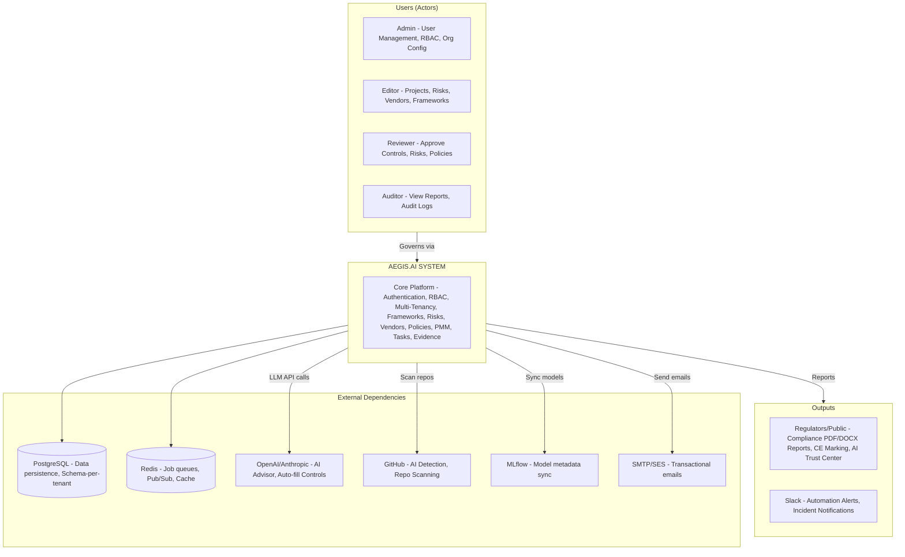
```mermaid
flowchart TD
    subgraph Users["Users (Actors)"]
        Admin["Admin - User Management, RBAC, Org Config"]
        Editor["Editor - Projects, Risks, Vendors, Frameworks"]
        Reviewer["Reviewer - Approve Controls, Risks, Policies"]
        Auditor["Auditor - View Reports, Audit Logs"]
    end
    subgraph AegisAI["AEGIS.AI SYSTEM"]
        Core["Core Platform - Authentication, RBAC, Multi-Tenancy, Frameworks, Risks, Vendors, Policies, PMM, Tasks, Evidence"]
    end
    subgraph Outputs["Outputs"]
        Regulators["Regulators/Public - Compliance PDF/DOCX Reports, CE Marking, AI Trust Center"]
        SlackOut["Slack - Automation Alerts, Incident Notifications"]
    end
    subgraph External["External Dependencies"]
        PG[("PostgreSQL - Data persistence, Schema-per-tenant")]
        Redis[("Redis - Job queues, Pub/Sub, Cache")]
        LLM["OpenAI/Anthropic - AI Advisor, Auto-fill Controls"]
        GitHub["GitHub - AI Detection, Repo Scanning"]
        MLflow["MLflow - Model metadata sync"]
        Email["SMTP/SES - Transactional emails"]
    end
    Users -->|Governs via| AegisAI
    AegisAI -->|Reports| Outputs
    AegisAI --> PG
    AegisAI --> Redis
    AegisAI -->|LLM API calls| LLM
    AegisAI -->|Scan repos| GitHub
    AegisAI -->|Sync models| MLflow
    AegisAI -->|Send emails| Email
```

*Figure 3.2: System Context and Deployment Architecture (C4 Level 1), Illustrating the Three-Tier Topology Across React SPA Frontend, Express REST API Backend, Python FastAPI EvalServer, BullMQ Background Workers, and Containerized Persistence Infrastructure.*

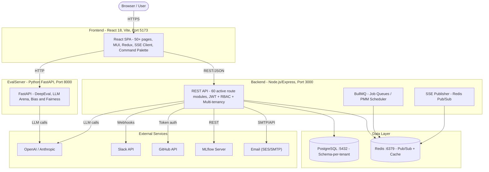
```mermaid
flowchart TB
    Browser(["Browser / User"])

    subgraph Frontend ["Frontend - React 18, Vite, Port 5173"]
        React["React SPA - 50+ pages, MUI, Redux, SSE Client, Command Palette"]
    end

    subgraph Backend ["Backend - Node.js/Express, Port 3000"]
        API["REST API - 60 active route modules, JWT + RBAC + Multi-tenancy"]
        BullMQ["BullMQ - Job Queues / PMM Scheduler"]
        SSE["SSE Publisher - Redis Pub/Sub"]
    end

    subgraph EvalSrv ["EvalServer - Python FastAPI, Port 8000"]
        FastAPI["FastAPI - DeepEval, LLM Arena, Bias and Fairness"]
    end

    subgraph Data ["Data Layer"]
        PG[("PostgreSQL :5432 - Schema-per-tenant")]
        Redis[("Redis :6379 - Pub/Sub + Cache")]
    end

    subgraph External ["External Services"]
        OpenAI["OpenAI / Anthropic"]
        Slack["Slack API"]
        GitHub["GitHub API"]
        MLflow["MLflow Server"]
        Email["Email (SES/SMTP)"]
    end

    Browser -->|HTTPS| React
    React -->|REST/JSON| API
    React -->|HTTP| FastAPI
    API --> PG
    API --> Redis
    BullMQ --> Redis
    SSE --> Redis
    FastAPI -->|LLM calls| OpenAI
    API -->|LLM calls| OpenAI
    API -->|Webhooks| Slack
    API -->|Token auth| GitHub
    API -->|REST| MLflow
    API -->|SMTP/API| Email
```

Aegis.AI's runtime architecture comprises six principal service tiers. Table 3.1 provides a comprehensive summary of the technology stack.

*Table 3.1*

*Technology Stack Summary*

| Tier | Component | Technology | Version |
|---|---|---|---|
| Frontend | SPA Framework | React | 18.3.1 |
| Frontend | Build Tool | Vite | 6.x |
| Frontend | UI Components | Material UI (MUI) | 6.x |
| Frontend | State Management | Redux Toolkit | 2.x |
| Frontend | Server State | TanStack React Query | 5.x |
| Frontend | Charts | Recharts | 2.x |
| Backend | Runtime | Node.js | 22.x |
| Backend | Web Framework | Express.js | 4.x |
| Backend | Language | TypeScript | 5.x |
| Backend | ORM | Sequelize | 6.x |
| Database | RDBMS | PostgreSQL | 15+ |
| Cache/Queue | In-Memory Store | Redis | 7.x |
| Queue | Job Queue | BullMQ | 5.x |
| Eval Server | Runtime | Python | 3.11+ |
| Eval Server | Web Framework | FastAPI | 0.110+ |
| Eval Server | LLM Evaluation | DeepEval | Latest |
| Reporting | Headless Browser | Playwright | 1.4x |
| Reporting | Template Engine | EJS | 3.x |
| Deployment | Containerization | Docker Compose | V2 |
| Deployment | Orchestration | Kubernetes | 1.28+ |

*Note.* Version numbers represent minimum tested versions as of December 2025.

The system is organized as: a React 18 SPA client communicating via HTTPS/REST/SSE with a Node.js Express API gateway, which connects to a PostgreSQL multi-tenant database, Redis for caching/pub-sub/queuing, and a Python FastAPI EvalServer for LLM evaluation. Background BullMQ workers handle report generation, email/Slack notifications, PMM scheduling, and AI detection scans asynchronously.

## 3.3 Multi-Tenant Database Architecture

The internal component structure of the Express.js API server is depicted in Figure 3.3 (C4 Level 3), highlighting the sequential middleware pipeline (Auth, TenantContext, RBAC), domain route controllers, and asynchronous event emitters.

*Figure 3.3: Backend Component Architecture (C4 Level 3), Detailing the Express.js API Pipeline, JWT Authentication, Dynamic Tenant Schema Isolation Middleware, RBAC Route Guards, Domain Controllers, and Real-Time Event Publishers.*

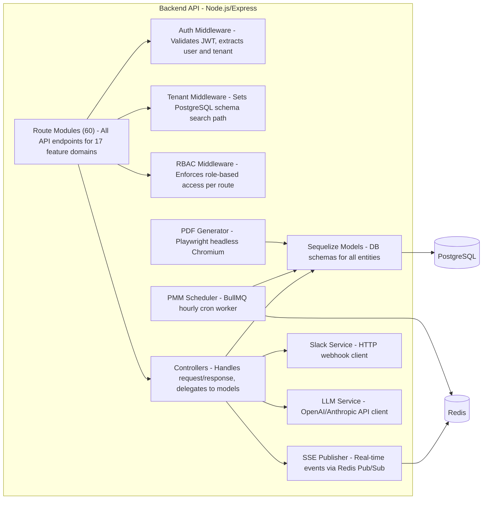
```mermaid
flowchart LR
    subgraph API["Backend API - Node.js/Express"]
        authMW["Auth Middleware - Validates JWT, extracts user and tenant"]
        tenantMW["Tenant Middleware - Sets PostgreSQL schema search path"]
        rbacMW["RBAC Middleware - Enforces role-based access per route"]
        routes["Route Modules (60) - All API endpoints for 17 feature domains"]
        controllers["Controllers - Handles request/response, delegates to models"]
        models["Sequelize Models - DB schemas for all entities"]
        sseService["SSE Publisher - Real-time events via Redis Pub/Sub"]
        pmmScheduler["PMM Scheduler - BullMQ hourly cron worker"]
        pdfService["PDF Generator - Playwright headless Chromium"]
        slackService["Slack Service - HTTP webhook client"]
        llmService["LLM Service - OpenAI/Anthropic API client"]
    end
    PG[("PostgreSQL")]
    Redis[("Redis")]
    routes --> authMW
    routes --> tenantMW
    routes --> rbacMW
    routes --> controllers
    controllers --> models
    controllers --> sseService
    controllers --> slackService
    controllers --> llmService
    pmmScheduler --> models
    pdfService --> models
    sseService --> Redis
    pmmScheduler --> Redis
    models --> PG
```

The multi-tenancy model implemented in Aegis.AI adopts the schema-per-tenant pattern, in which each registered organization (tenant) receives a dedicated PostgreSQL schema within a shared database server. This design provides strong logical data isolation, guaranteeing that SQL queries issued in the context of Tenant A are structurally incapable of accessing data in Tenant B's schema, while maintaining operational efficiency through shared infrastructure and connection pooling.

The architecture maintains a shared `public` schema containing the global tenant registry (the `organizations` table), subscription plan definitions, and system-level audit logs. Each tenant organization receives a dedicated schema named `org_{identifier}` containing identical copies of all domain tables, users, risks, compliance controls, policies, AI models, evaluations, audit events, and all other governance data. Schema names follow the convention `org_{normalized_organization_identifier}`, where the identifier is derived from the organization name by lowercasing and removing non-alphanumeric characters.

**Tenant Routing Mechanism.** When a user authenticates, their JWT token is encoded with a `tenant_schema` claim identifying their organization's schema. A custom Express.js middleware component, the Tenant Router, intercepts every incoming request, extracts the schema identifier from the validated JWT token, and issues a `SET search_path TO org_schema_name` command to the PostgreSQL connection before passing control to route handlers. This ensures that all subsequent Sequelize ORM queries within the request lifecycle are automatically scoped to the correct tenant schema without requiring any modification to individual route logic.

**Schema Provisioning.** When a new organization registers, the system automatically executes a schema provisioning workflow: a new PostgreSQL schema is created and the complete set of database migrations is applied within that schema to establish the tenant's data structure. This entire process completes within approximately 10 seconds of registration.

**Migration Management.** Sequelize migrations are designed to be schema-aware, with a custom migration runner that iterates over all registered tenant schemas and applies pending migrations to each. This ensures that platform updates propagate correctly to all tenants without manual intervention.

## 3.4 Authentication and Role-Based Access Control

Figure 3.4 models the core domain class hierarchy (C4 Level 4) centering on Organization and Project aggregate roots. System capabilities and role boundaries across these domain entities are formalized in the User Roles and Permission Matrix presented in Table 3.2.

*Figure 3.4: Domain Object Model and Entity Relationships (C4 Level 4), Illustrating Core Class Hierarchies, Aggregate Roots (Organization and Project), Automated Risk Scoring Entities, and Multi-Step Approval Workflow State Machines.*

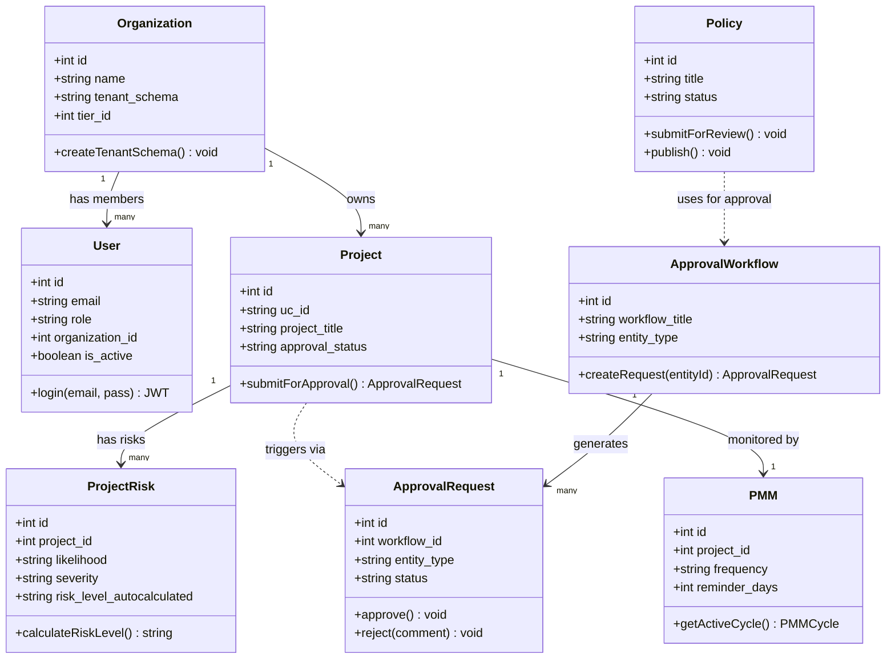
```mermaid
classDiagram
    class Organization {
        +int id
        +string name
        +string tenant_schema
        +int tier_id
        +createTenantSchema() void
    }
    class User {
        +int id
        +string email
        +string role
        +int organization_id
        +boolean is_active
        +login(email, pass) JWT
    }
    class Project {
        +int id
        +string uc_id
        +string project_title
        +string approval_status
        +submitForApproval() ApprovalRequest
    }
    class ProjectRisk {
        +int id
        +int project_id
        +string likelihood
        +string severity
        +string risk_level_autocalculated
        +calculateRiskLevel() string
    }
    class ApprovalWorkflow {
        +int id
        +string workflow_title
        +string entity_type
        +createRequest(entityId) ApprovalRequest
    }
    class ApprovalRequest {
        +int id
        +int workflow_id
        +string entity_type
        +string status
        +approve() void
        +reject(comment) void
    }
    class Policy {
        +int id
        +string title
        +string status
        +submitForReview() void
        +publish() void
    }
    class PMM {
        +int id
        +int project_id
        +string frequency
        +int reminder_days
        +getActiveCycle() PMMCycle
    }
    Organization "1" --> "many" User : has members
    Organization "1" --> "many" Project : owns
    Project "1" --> "many" ProjectRisk : has risks
    Project ..> ApprovalRequest : triggers via
    ApprovalWorkflow "1" --> "many" ApprovalRequest : generates
    Project "1" --> "1" PMM : monitored by
    Policy ..> ApprovalWorkflow : uses for approval
```

Aegis.AI implements a stateless JWT-based authentication system (OWASP Foundation, 2021). Upon successful credential verification (email address and bcrypt-hashed password), the authentication service issues a signed JSON Web Token containing the user's unique identifier, tenant schema identifier, assigned role, and token expiry claim. Tokens are signed using HMAC-SHA256 and carry a default expiry of 24 hours, with refresh token rotation for extended sessions.

**Role-Based Access Control Model.** Aegis.AI implements a five-tier RBAC model:

*Organization Administrator* holds full platform access including user management, organization configuration, and all governance functions.

*AI Governance Officer / Editor* holds create, read, update, and delete permissions across all governance objects, risks, controls, policies, models, and evaluations, but cannot manage users or organization settings.

*Reviewer* holds read access across all governance objects plus the ability to submit review comments and formally approve or reject governance artifacts.

*Auditor* holds read-only access to all governance data, audit trails, and report generation capabilities, but cannot modify any governance objects. Designed specifically for internal or external audit personnel.

*End User / Employee* holds limited read access to public-facing governance information and the ability to submit incident reports or complete assigned governance questionnaires.

*Table 3.2*

*User Roles and Permission Matrix*

| Capability | Admin | Gov. Officer | Reviewer | Auditor | End User |
|---|---|---|---|---|---|
| User Management | Yes | No | No | No | No |
| Framework Controls (Write) | Yes | Yes | No | No | No |
| Framework Controls (Read) | Yes | Yes | Yes | Yes | No |
| Risk Registry (Write) | Yes | Yes | No | No | No |
| Risk Registry (Read) | Yes | Yes | Yes | Yes | No |
| Policy Management (Write) | Yes | Yes | No | No | No |
| Policy Approval | Yes | Yes | Yes | No | No |
| LLM Evaluations | Yes | Yes | Yes | Yes | No |
| Report Generation | Yes | Yes | Yes | Yes | No |
| Audit Log Access | Yes | Yes | Yes | Yes | No |
| Trust Center (Public) | Yes | Yes | Yes | Yes | Yes |

## 3.5 Compliance Framework Engine

Figure 3.5 outlines the Clean Architecture layered dependency flow enforcing strict isolation between domain business entities and outer infrastructure adapters. The compliance engine operationalizes major governance instruments through structured control catalogues, as summarized in Table 3.3 (EU AI Act control categories), Table 3.4 (ISO/IEC 42001 clauses and Annex A controls), and Table 3.5 (NIST AI RMF functions and subcategories).

*Figure 3.5: Clean Architecture Layered Dependency Structure, Highlighting Strict Separation Between Inward-Facing Domain Business Rules, Application Services, Data Repositories, and Outward-Facing Infrastructure Adapters.*

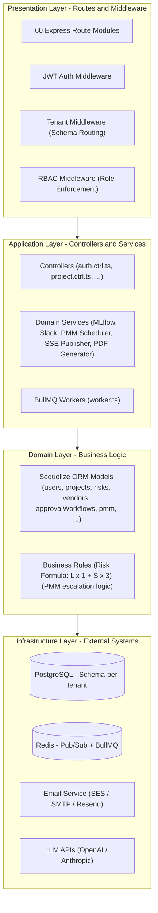
```mermaid
flowchart TD
    subgraph Presentation ["Presentation Layer - Routes and Middleware"]
        Routes["60 Express Route Modules"]
        AuthMW["JWT Auth Middleware"]
        TenantMW["Tenant Middleware (Schema Routing)"]
        RBACMW["RBAC Middleware (Role Enforcement)"]
    end
    subgraph Application ["Application Layer - Controllers and Services"]
        Controllers["Controllers (auth.ctrl.ts, project.ctrl.ts, ...)"]
        Services["Domain Services (MLflow, Slack, PMM Scheduler, SSE Publisher, PDF Generator)"]
        Jobs["BullMQ Workers (worker.ts)"]
    end
    subgraph Domain ["Domain Layer - Business Logic"]
        Models["Sequelize ORM Models (users, projects, risks, vendors, approvalWorkflows, pmm, ...)"]
        Rules["Business Rules (Risk Formula: L x 1 + S x 3) (PMM escalation logic)"]
    end
    subgraph Infrastructure ["Infrastructure Layer - External Systems"]
        PG[("PostgreSQL - Schema-per-tenant")]
        Redis2[("Redis - Pub/Sub + BullMQ")]
        EmailSvc["Email Service (SES / SMTP / Resend)"]
        LLMSvc["LLM APIs (OpenAI / Anthropic)"]
    end
    Presentation --> Application
    Application --> Domain
    Domain --> Infrastructure
```

The Compliance Framework Engine is the central governance module of Aegis.AI, providing structured management of compliance obligations across four regulatory frameworks. The engine implements a unified control lifecycle model that is framework-agnostic in its data structure while accommodating the structural particularities of each framework.

**Control Lifecycle State Machine.** Each compliance control within the platform transitions through a seven-stage lifecycle: Not Started -> In Scope -> In Progress -> Under Review -> Compliant (or Non-Compliant -> Remediation in Progress -> Compliant). All state transitions generate immutable audit log entries, creating a complete history of compliance activity for each control.

**EU AI Act Coverage.** Aegis.AI implements tracking across 13 EU AI Act control categories derived from the Act's substantive obligations, encompassing approximately 60 individual controls.

*Table 3.3*

*EU AI Act Control Categories Implemented in Aegis.AI*

| Category | Relevant Articles | Control Count | Assessment Type |
|---|---|---|---|
| Risk Management System | Art. 9 | 8 | Questionnaire + Evidence |
| Data and Data Governance | Art. 10 | 7 | Questionnaire + Evidence |
| Technical Documentation | Art. 11, Annex IV | 6 | Document Upload + Checklist |
| Record Keeping and Logging | Art. 12 | 5 | Configuration + Evidence |
| Transparency | Art. 13 | 5 | Questionnaire + Evidence |
| Human Oversight | Art. 14 | 6 | Questionnaire + Evidence |
| Accuracy and Robustness | Art. 15 | 5 | LLM Eval + Evidence |
| Conformity Assessment | Art. 43-48 | 4 | Document Upload |
| Registration | Art. 49 | 3 | Evidence Upload |
| Post-Market Monitoring | Art. 72 | 5 | PMM Scheduler + Evidence |
| Incident Reporting | Art. 73 | 4 | Incident Module |
| Serious Incident Reporting | Art. 75 | 3 | Incident Module |
| Market Surveillance Cooperation | Art. 74 | 4 | Evidence Upload |

*Note.* Control counts reflect the platform's v1.0 implementation. Art. = Article.

**ISO/IEC 42001 Coverage.** The platform implements the seven operational clauses (Clauses 4-10) with associated Annex A and Annex B control management.

*Table 3.4*

*ISO/IEC 42001 Clause and Annex Mapping*

| Clause | Title | Key Controls Tracked |
|---|---|---|
| Clause 4 | Organizational Context | Interested parties, AIMS scope, internal/external issues |
| Clause 5 | Leadership | AI policy, roles and responsibilities, management commitment |
| Clause 6 | Planning | AI risk assessment, AI impact assessment, AI objectives |
| Clause 7 | Support | Resources, competence, awareness, communication, documentation |
| Clause 8 | Operations | Operational planning, AI system lifecycle control, supply chain |
| Clause 9 | Performance Evaluation | Monitoring, measurement, internal audit, management review |
| Clause 10 | Improvement | Nonconformity, corrective action, continual improvement |

*Note.* Based on ISO/IEC 42001:2023 (International Organization for Standardization, 2023a).

**NIST AI RMF Coverage.** Aegis.AI implements tracking across all four NIST AI RMF functions with coverage of approximately 70 subcategories.

*Table 3.5*

*NIST AI RMF Function and Subcategory Coverage*

| Function | Categories | Subcategories Tracked | Focus Area |
|---|---|---|---|
| GOVERN | 6 | 16 | Org policies, accountability, culture, risk tolerance |
| MAP | 5 | 23 | Context characterization, risk identification, stakeholder impact |
| MEASURE | 4 | 14 | Risk analysis, metrics, evaluation, residual risk |
| MANAGE | 4 | 16 | Risk treatment, incident response, monitoring, learning |

*Note.* Based on National Institute of Standards and Technology (2023).

## 3.6 Risk Management Module Design

Figure 3.6 depicts the complete Entity-Relationship Diagram (ERD) for the multi-tenant relational schema. The quantitative risk scoring methodology implemented across these entities is formalized in the Risk Scoring Matrix shown in Table 3.6.

*Figure 3.6: Entity-Relationship Diagram (ERD) of the Aegis.AI Relational Database Schema, Depicting Shared Global Public Tables and Isolated Schema-Per-Tenant Relational Entities Covering Compliance, Risks, Models, and Audits.*

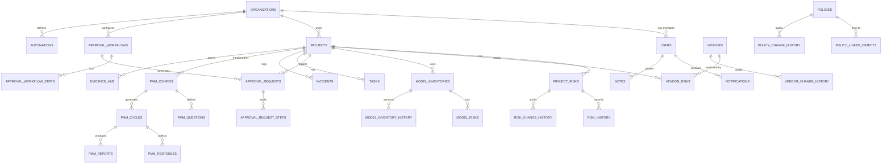
```mermaid
erDiagram
    ORGANIZATIONS ||--o{ USERS : "has members"
    ORGANIZATIONS ||--o{ PROJECTS : "owns"
    ORGANIZATIONS ||--o{ APPROVAL_WORKFLOWS : "configures"
    ORGANIZATIONS ||--o{ AUTOMATIONS : "defines"
    PROJECTS ||--o{ PROJECT_RISKS : "has"
    PROJECTS ||--o{ VENDOR_RISKS : "tracks"
    PROJECTS ||--o{ MODEL_INVENTORIES : "uses"
    PROJECTS ||--o{ APPROVAL_REQUESTS : "triggers"
    PROJECTS ||--o{ TASKS : "has"
    PROJECTS ||--o{ INCIDENTS : "logs"
    PROJECTS ||--o{ PMM_CONFIGS : "monitored by"
    PROJECTS ||--o{ EVIDENCE_HUB : "stores"
    APPROVAL_WORKFLOWS ||--o{ APPROVAL_WORKFLOW_STEPS : "has"
    APPROVAL_WORKFLOWS ||--o{ APPROVAL_REQUESTS : "generates"
    APPROVAL_REQUESTS ||--o{ APPROVAL_REQUEST_STEPS : "tracks"
    PROJECT_RISKS ||--o{ RISK_HISTORY : "records"
    PROJECT_RISKS ||--o{ RISK_CHANGE_HISTORY : "audits"
    VENDORS ||--o{ VENDOR_RISKS : "assessed by"
    VENDORS ||--o{ VENDOR_CHANGE_HISTORY : "audits"
    MODEL_INVENTORIES ||--o{ MODEL_RISKS : "has"
    MODEL_INVENTORIES ||--o{ MODEL_INVENTORY_HISTORY : "versions"
    POLICIES ||--o{ POLICY_LINKED_OBJECTS : "links to"
    POLICIES ||--o{ POLICY_CHANGE_HISTORY : "audits"
    PMM_CONFIGS ||--o{ PMM_QUESTIONS : "defines"
    PMM_CONFIGS ||--o{ PMM_CYCLES : "generates"
    PMM_CYCLES ||--o{ PMM_RESPONSES : "collects"
    PMM_CYCLES ||--o{ PMM_REPORTS : "produces"
    USERS ||--o{ NOTIFICATIONS : "receives"
    USERS ||--o{ NOTES : "creates"
```

The Risk Management Module provides a structured registry and assessment system for three categories of AI-related risk: *Project Risks* associated with specific AI development or deployment projects, *Model Risks* associated with specific AI models in the organization's inventory, and *Vendor Risks* associated with third-party AI service providers and suppliers.

**Risk Scoring Algorithm.** A central design decision in the Risk Management Module is the formalization of a quantitative risk scoring algorithm that produces objective, reproducible numerical risk scores from independently assessed likelihood and severity dimensions. To overcome the mathematical and ranking limitations identified in traditional qualitative risk matrices (Cox, 2008), the algorithm is defined as follows:

> **Risk Score = (Likelihood Value x 1) + (Severity Value x 3)**

Where both Likelihood and Severity are assessed on an ordinal scale from 1 (lowest) to 5 (highest), yielding a theoretical range of Risk Scores from 4 (minimum, L=1, S=1) to 20 (maximum, L=5, S=5). The asymmetric weighting, Severity carrying three times the weight of Likelihood, reflects the governance principle that the potential magnitude of harm is a more significant determinant of risk priority than the probability of harm, particularly in AI governance contexts where the consequences of failures in high-risk AI systems can be severe and irreversible. This formula was validated by the Product Owner (Supervisor) during Sprint 5 review as matching EU AI Act guidance for risk prioritization.

*Table 3.6*

*Risk Scoring Matrix (Formula: L x 1 + S x 3)*

| Severity / Likelihood | 1 Rare | 2 Unlikely | 3 Possible | 4 Likely | 5 Almost Certain |
|---|---|---|---|---|---|
| **1 Negligible** | 4 (Very Low) | 5 (Very Low) | 6 (Low) | 7 (Low) | 8 (Low) |
| **2 Minor** | 7 (Low) | 8 (Low) | 9 (Medium) | 10 (Medium) | 11 (Medium) |
| **3 Significant** | 10 (Medium) | 11 (Medium) | 12 (Medium) | 13 (High) | 14 (High) |
| **4 Major** | 13 (High) | 14 (High) | 15 (High) | 16 (High) | 17 (Very High) |
| **5 Critical** | 16 (High) | 17 (Very High) | 18 (Very High) | 19 (Very High) | 20 (Very High) |

*Note.* Risk levels: Very Low = 4-5; Low = 6-8; Medium = 9-12; High = 13-16; Very High = 17-20. Formulated based on the quantitative risk scoring model presented in Table 3.6.

Every modification to a risk record, including changes to likelihood, severity, status, or treatment plan, is captured as an immutable snapshot in a JSONB history array appended to the risk record. This change history enables governance officers and auditors to reconstruct the evolution of any risk assessment over time, satisfying the EU AI Act's requirement for documented risk management records. Risk score time series data is surfaced through Recharts line and bar charts, enabling governance officers to track risk score trajectories across their project and model portfolios.

## 3.7 Policy Management Subsystem

Figure 3.7 illustrates the end-to-end execution sequence for multi-step approval workflows, detailing stakeholder submission, dynamic approver resolution, step validation, and real-time SSE alert dispatch.

*Figure 3.7: End-to-End Multi-Step Approval Workflow Execution Sequence, Showing Submission, Dynamic Approver Resolution, State Validation, Automated Audit Logging, and Real-Time SSE Notification Dispatch.*

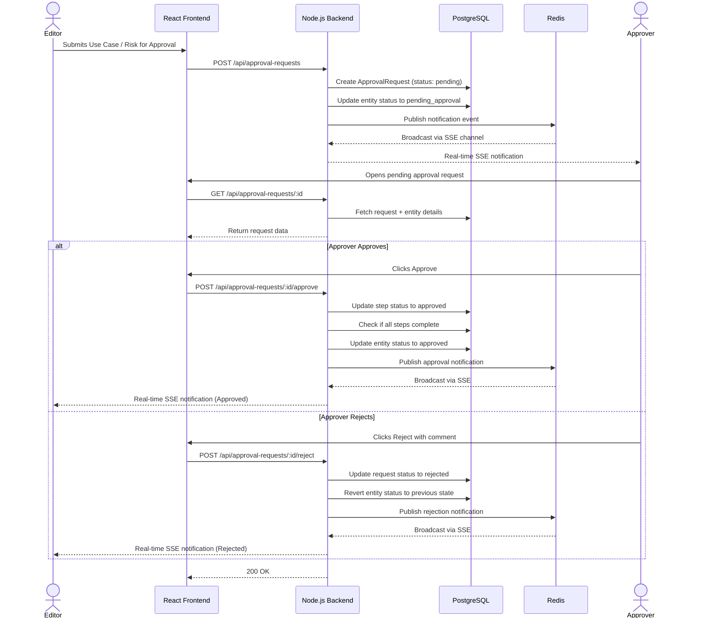
```mermaid
sequenceDiagram
    actor Editor
    participant FE as React Frontend
    participant BE as Node.js Backend
    participant DB as PostgreSQL
    participant Redis
    actor Approver

    Editor->>FE: Submits Use Case / Risk for Approval
    FE->>BE: POST /api/approval-requests
    BE->>DB: Create ApprovalRequest (status: pending)
    BE->>DB: Update entity status to pending_approval
    BE->>Redis: Publish notification event
    Redis-->>BE: Broadcast via SSE channel
    BE-->>Approver: Real-time SSE notification
    Approver->>FE: Opens pending approval request
    FE->>BE: GET /api/approval-requests/:id
    BE->>DB: Fetch request + entity details
    BE-->>FE: Return request data
    alt Approver Approves
        Approver->>FE: Clicks Approve
        FE->>BE: POST /api/approval-requests/:id/approve
        BE->>DB: Update step status to approved
        BE->>DB: Check if all steps complete
        BE->>DB: Update entity status to approved
        BE->>Redis: Publish approval notification
        Redis-->>BE: Broadcast via SSE
        BE-->>Editor: Real-time SSE notification (Approved)
    else Approver Rejects
        Approver->>FE: Clicks Reject with comment
        FE->>BE: POST /api/approval-requests/:id/reject
        BE->>DB: Update request status to rejected
        BE->>DB: Revert entity status to previous state
        BE->>Redis: Publish rejection notification
        Redis-->>BE: Broadcast via SSE
        BE-->>Editor: Real-time SSE notification (Rejected)
    end
    BE-->>FE: 200 OK
```

The Policy Management Subsystem provides a structured lifecycle for the creation, review, approval, publication, and archival of organizational AI governance policies. It implements a formal five-stage policy workflow: Draft -> Under Review -> Approved -> Published -> Archived.

Policies can be linked to specific compliance framework controls (creating a traceable evidence chain between policy commitments and regulatory requirements) and to specific project or model risks (establishing documented risk treatment commitments). A pre-loaded library of policy templates is provided covering AI usage policies, data governance policies, model risk policies, LLM deployment guidelines, and incident response procedures. This subsystem directly supports EU AI Act requirements for documented organizational governance commitments and ISO/IEC 42001 Clause 5.2 (AI policy) and Clause 7.5 (documented information management).

## 3.8 LLM Evaluation Architecture

Figure 3.8 outlines the sequence of events executed during risk record creation and updates, demonstrating automated score recomputation and historical audit logging.

*Figure 3.8: Risk Creation and Recalculation Sequence Diagram, Illustrating Automated Execution of the Formula Risk Score = (Likelihood x 1) + (Severity x 3), Historical Trend Snapshot Logging, and WebSocket Alert Emission.*

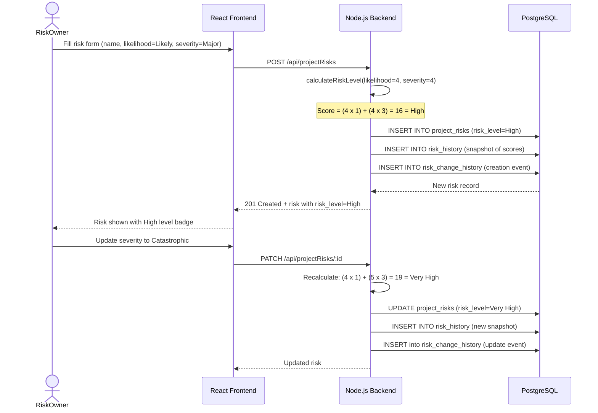
```mermaid
sequenceDiagram
    actor RiskOwner
    participant FE as React Frontend
    participant BE as Node.js Backend
    participant DB as PostgreSQL

    RiskOwner->>FE: Fill risk form (name, likelihood=Likely, severity=Major)
    FE->>BE: POST /api/projectRisks
    BE->>BE: calculateRiskLevel(likelihood=4, severity=4)
    Note over BE: Score = (4 x 1) + (4 x 3) = 16 = High
    BE->>DB: INSERT INTO project_risks (risk_level=High)
    BE->>DB: INSERT INTO risk_history (snapshot of scores)
    BE->>DB: INSERT INTO risk_change_history (creation event)
    DB-->>BE: New risk record
    BE-->>FE: 201 Created + risk with risk_level=High
    FE-->>RiskOwner: Risk shown with High level badge
    RiskOwner->>FE: Update severity to Catastrophic
    FE->>BE: PATCH /api/projectRisks/:id
    BE->>BE: Recalculate: (4 x 1) + (5 x 3) = 19 = Very High
    BE->>DB: UPDATE project_risks (risk_level=Very High)
    BE->>DB: INSERT INTO risk_history (new snapshot)
    BE->>DB: INSERT into risk_change_history (update event)
    BE-->>FE: Updated risk
```

The LLM Evaluation subsystem consists of two integrated components: the *EvalServer* microservice and the *LLM Arena* interface.

**EvalServer Architecture.** The EvalServer is implemented as a standalone Python 3.11 FastAPI microservice, communicating with the main Express.js backend via internal HTTP. Its separation into a dedicated microservice is motivated by two considerations: first, Python's superior ecosystem for LLM evaluation libraries (particularly DeepEval, which has no Node.js equivalent); and second, the computational intensity of LLM evaluation workloads, which benefit from independent horizontal scaling.

The EvalServer exposes four endpoint groups: single-response evaluation, batch test case evaluation, LLM Arena head-to-head comparison, and health check. DeepEval metrics are instantiated per evaluation request, with threshold configurations passed as request parameters. Results are returned as structured JSON and persisted to the tenant's PostgreSQL schema linked to the evaluated model's governance record.

**Evaluation Metrics Implemented.**

*Answer Relevancy* measures the degree to which an LLM response is directly relevant to the posed question, using semantic similarity between the question and response.

*Faithfulness* assesses whether the LLM's response is grounded in the provided context documents, detecting confabulated content that contradicts or extends beyond the supplied evidence.

*Hallucination Rate* quantifies the proportion of factual claims in the LLM response that cannot be verified against the provided context or factual reference.

*Bias Score* assesses the response for stereotypical, discriminatory, or systematically skewed content across protected demographic characteristics.

All metrics produce scores in the range [0, 1], with higher scores indicating better performance for relevancy and faithfulness, and lower scores indicating better performance for hallucination and bias.

**LLM Arena.** The LLM Arena provides a head-to-head comparison interface in which governance officers can submit identical prompts simultaneously to two configured LLM endpoints and visually compare responses alongside side-by-side evaluation metric scores. This enables systematic comparative evaluation of candidate models before deployment approval, generating documented evidence for model selection decisions.

**LLM API Key Vault.** Tenant-specific LLM API keys (for OpenAI, Anthropic, and OpenRouter) are stored in an encrypted key vault within the tenant's schema, ensuring that keys are never accessible cross-tenant and are not logged in application logs.

## 3.9 Real-Time Event Streaming Architecture

Figure 3.9 illustrates the domain object model for organizational policies and third-party vendor tracking, while Figure 3.10 traces the 5-stage policy governance lifecycle sequence from initial draft authoring through formal sign-off and publication.

*Figure 3.9: Policy and Vendor Management Domain Class Diagram, Defining the 5-Stage Policy Lifecycle (Draft, Under Review, Approved, Published, Archived), Vendor Risk Tiering, and Cross-Linked Regulatory Control Mappings.*

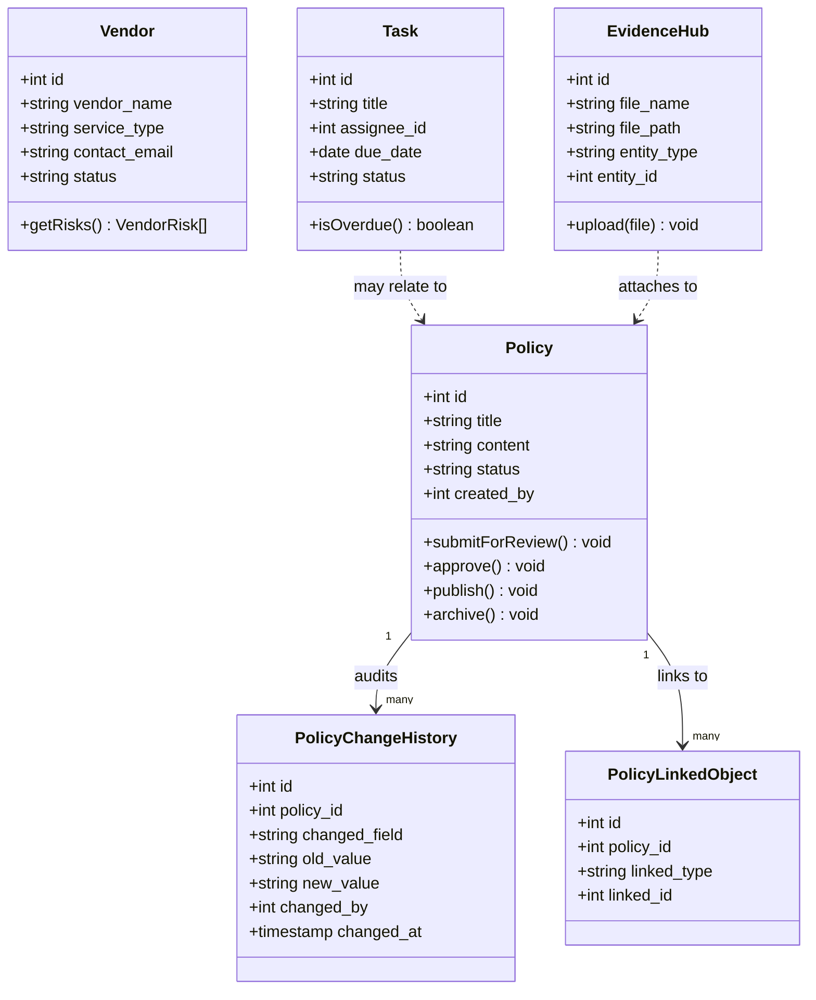
```mermaid
classDiagram
    class Policy {
        +int id
        +string title
        +string content
        +string status
        +int created_by
        +submitForReview() void
        +approve() void
        +publish() void
        +archive() void
    }
    class PolicyChangeHistory {
        +int id
        +int policy_id
        +string changed_field
        +string old_value
        +string new_value
        +int changed_by
        +timestamp changed_at
    }
    class PolicyLinkedObject {
        +int id
        +int policy_id
        +string linked_type
        +int linked_id
    }
    class Vendor {
        +int id
        +string vendor_name
        +string service_type
        +string contact_email
        +string status
        +getRisks() VendorRisk[]
    }
    class Task {
        +int id
        +string title
        +int assignee_id
        +date due_date
        +string status
        +isOverdue() boolean
    }
    class EvidenceHub {
        +int id
        +string file_name
        +string file_path
        +string entity_type
        +int entity_id
        +upload(file) void
    }
    Policy "1" --> "many" PolicyChangeHistory : audits
    Policy "1" --> "many" PolicyLinkedObject : links to
    Task ..> Policy : may relate to
    EvidenceHub ..> Policy : attaches to
```

Aegis.AI's WatchTower module provides real-time streaming of governance events and system audit logs using Server-Sent Events (SSE) and Redis Pub/Sub. Every significant governance action, risk record creation or modification, compliance control state transition, policy lifecycle event, LLM evaluation completion, post-market monitoring alert, publishes a structured JSON event to a Redis channel. SSE subscribers (connected browser clients) receive these events within a measured latency of below 100 milliseconds, enabling real-time display in the WatchTower audit feed. Events are simultaneously persisted to the tenant's `audit_events` table in PostgreSQL, creating an immutable, queryable audit trail. The system also provides a raw system log viewer that streams application-level operational logs through the same SSE mechanism, enabling administrators to monitor platform health in real time.

## 3.10 Reporting Engine Design

*Figure 3.10: Policy Governance Lifecycle Sequence Diagram, Tracing Policy Creation, Formal Review Submission, Approver Sign-off, Versioned Publishing, and Tenant-Wide Audit Distribution.*

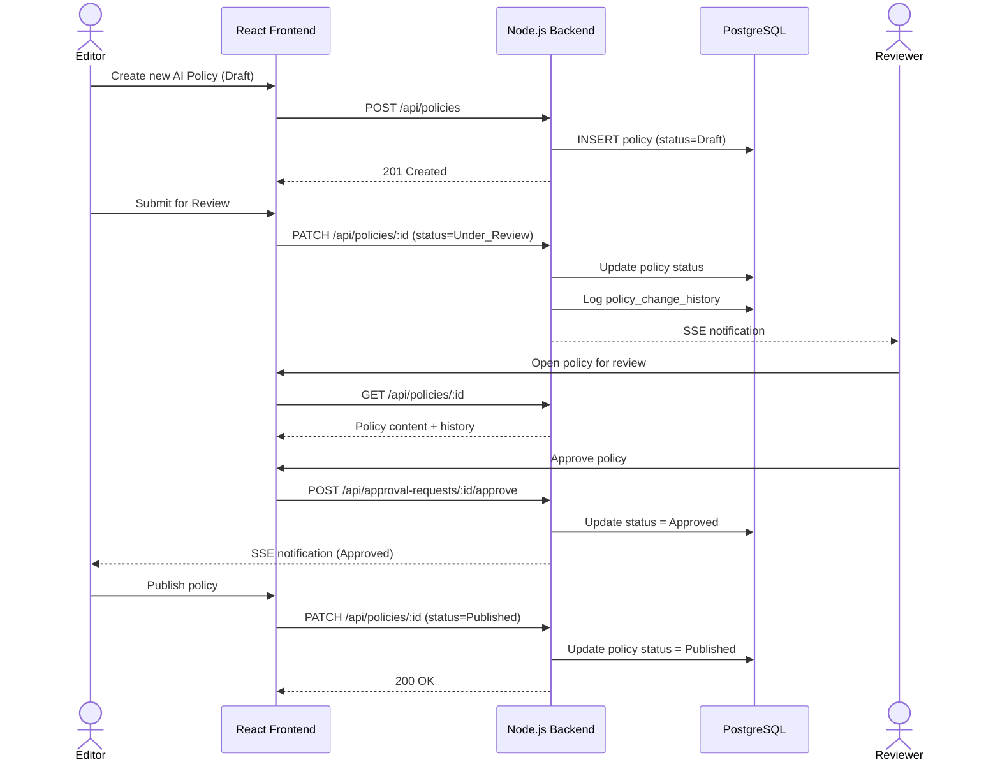
```mermaid
sequenceDiagram
    actor Editor
    participant FE as React Frontend
    participant BE as Node.js Backend
    participant DB as PostgreSQL
    actor Reviewer

    Editor->>FE: Create new AI Policy (Draft)
    FE->>BE: POST /api/policies
    BE->>DB: INSERT policy (status=Draft)
    BE-->>FE: 201 Created
    Editor->>FE: Submit for Review
    FE->>BE: PATCH /api/policies/:id (status=Under_Review)
    BE->>DB: Update policy status
    BE->>DB: Log policy_change_history
    BE-->>Reviewer: SSE notification
    Reviewer->>FE: Open policy for review
    FE->>BE: GET /api/policies/:id
    BE-->>FE: Policy content + history
    Reviewer->>FE: Approve policy
    FE->>BE: POST /api/approval-requests/:id/approve
    BE->>DB: Update status = Approved
    BE-->>Editor: SSE notification (Approved)
    Editor->>FE: Publish policy
    FE->>BE: PATCH /api/policies/:id (status=Published)
    BE->>DB: Update policy status = Published
    BE-->>FE: 200 OK
```

The Reporting Engine generates publication-quality audit reports and compliance documentation in both PDF and DOCX formats, suitable for submission to regulatory authorities, internal audit committees, or external certification bodies. Report generation is implemented using Playwright's headless Chromium browser to render EJS HTML templates into pixel-perfect PDFs, and is processed asynchronously via BullMQ with SSE-based progress notification upon completion.

Report types available include: EU AI Act Compliance Report (covering all 13 control categories with evidence summaries and gap analysis), Risk Assessment Report (full risk registry with trend charts), ISO/IEC 42001 AIMS Report, NIST AI RMF Report, LLM Evaluation Report, and Audit Trail Report.

## 3.11 AI Detection and AI-BOM Generator

Figure 3.11 provides the class diagram modeling AI model version lineage, deployment profiles, and hierarchical mapping across the four NIST AI RMF functions (GOVERN, MAP, MEASURE, MANAGE).

*Figure 3.11: AI Model Inventory and NIST AI RMF Domain Class Diagram, Modeling Model Version Lineage, Deployment Profiles, and Hierarchical Mapping Across the Four NIST Functions (GOVERN, MAP, MEASURE, MANAGE).*

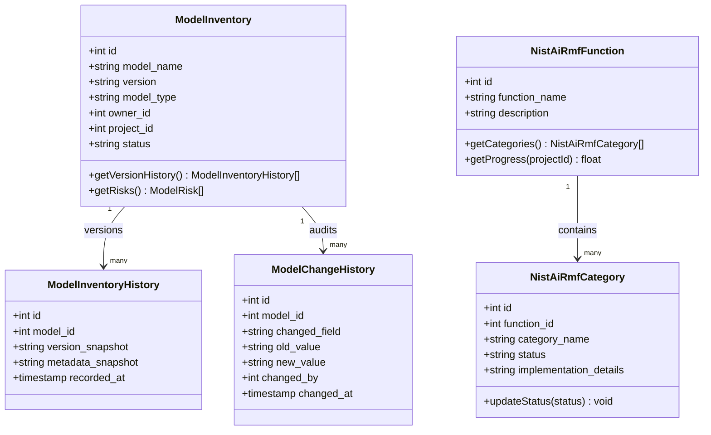
```mermaid
classDiagram
    class ModelInventory {
        +int id
        +string model_name
        +string version
        +string model_type
        +int owner_id
        +int project_id
        +string status
        +getVersionHistory() ModelInventoryHistory[]
        +getRisks() ModelRisk[]
    }
    class ModelInventoryHistory {
        +int id
        +int model_id
        +string version_snapshot
        +string metadata_snapshot
        +timestamp recorded_at
    }
    class ModelChangeHistory {
        +int id
        +int model_id
        +string changed_field
        +string old_value
        +string new_value
        +int changed_by
        +timestamp changed_at
    }
    class NistAiRmfFunction {
        +int id
        +string function_name
        +string description
        +getCategories() NistAiRmfCategory[]
        +getProgress(projectId) float
    }
    class NistAiRmfCategory {
        +int id
        +int function_id
        +string category_name
        +string status
        +string implementation_details
        +updateStatus(status) void
    }
    ModelInventory "1" --> "many" ModelInventoryHistory : versions
    ModelInventory "1" --> "many" ModelChangeHistory : audits
    NistAiRmfFunction "1" --> "many" NistAiRmfCategory : contains
```

The AI Detection module integrates with GitHub repository APIs to scan organizational codebases for AI-generated code components and third-party AI library dependencies, generating an AI Bill of Materials (AI-BOM) in both JSON and CSV formats. The AI-BOM concept is directly relevant to EU AI Act Article 11 (technical documentation requirements), which requires providers of high-risk AI systems to document the components and dependencies of their AI systems. Detected AI components are categorized into: pre-trained foundation model integrations, AI/ML library dependencies, AI code generation tool outputs, and AI-generated documentation or datasets.

## 3.12 Post-Market Monitoring Architecture

Figure 3.12 illustrates the corresponding registration and status synchronization sequence with external MLflow registries and post-market review schedules.

*Figure 3.12: AI Model Registration and NIST RMF Status Synchronization Sequence Diagram, Illustrating Metadata Ingestion, Version Snapshotting, Automated Control Recalculation, and Real-Time Dashboard Updates.*

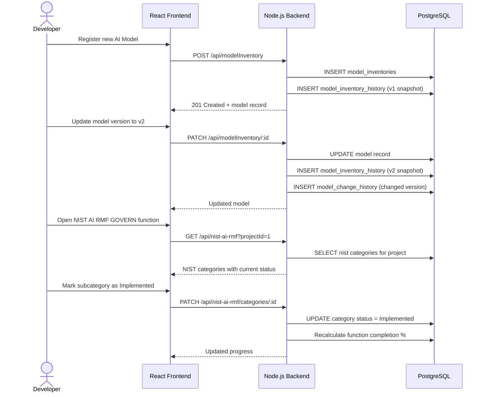
```mermaid
sequenceDiagram
    actor Developer
    participant FE as React Frontend
    participant BE as Node.js Backend
    participant DB as PostgreSQL

    Developer->>FE: Register new AI Model
    FE->>BE: POST /api/modelInventory
    BE->>DB: INSERT model_inventories
    BE->>DB: INSERT model_inventory_history (v1 snapshot)
    BE-->>FE: 201 Created + model record
    Developer->>FE: Update model version to v2
    FE->>BE: PATCH /api/modelInventory/:id
    BE->>DB: UPDATE model record
    BE->>DB: INSERT model_inventory_history (v2 snapshot)
    BE->>DB: INSERT model_change_history (changed version)
    BE-->>FE: Updated model
    Developer->>FE: Open NIST AI RMF GOVERN function
    FE->>BE: GET /api/nist-ai-rmf?projectId=1
    BE->>DB: SELECT nist categories for project
    BE-->>FE: NIST categories with current status
    Developer->>FE: Mark subcategory as Implemented
    FE->>BE: PATCH /api/nist-ai-rmf/categories/:id
    BE->>DB: UPDATE category status = Implemented
    BE->>DB: Recalculate function completion %
    BE-->>FE: Updated progress
```

The Post-Market Monitoring (PMM) module provides an automated scheduling and alerting system for the periodic review of deployed AI systems, directly implementing the EU AI Act Article 72 obligation for continuous post-market monitoring of high-risk AI systems.

PMM reviews are triggered automatically by the BullMQ cron scheduler at the frequency configured for each AI system (monthly, quarterly, or semi-annual). When a review is triggered, the system automatically generates a pre-populated review form containing the AI system's most recent performance data, outstanding risks, open compliance controls, and previous review findings. Designated stakeholders receive automated email notifications and Slack alerts. If the review is not completed within the configured window, an escalation alert is triggered to the organizational administrator. Completed review forms are automatically saved to the AI system's governance record, generating a chronological review history satisfying the documented monitoring obligation of EU AI Act Article 72.

## 3.13 System-Level Data Flow Architecture

The global data flow topology of Aegis.AI is formalized through two levels of Data Flow Diagrams: Figure 3.13 (DFD Level 0: System Context Data Flow) and Figure 3.14 (DFD Level 1: Subsystem Data Flow Decomposition), defining system boundaries, data stores, external entities, and data transformation pipelines.

*Figure 3.13: System-Wide Data Flow Diagram (Level 0), Mapping End-to-End Data Exchanges Between Multi-Role Users, External Enterprise Integrations, and the Core Aegis.AI Application Boundary.*

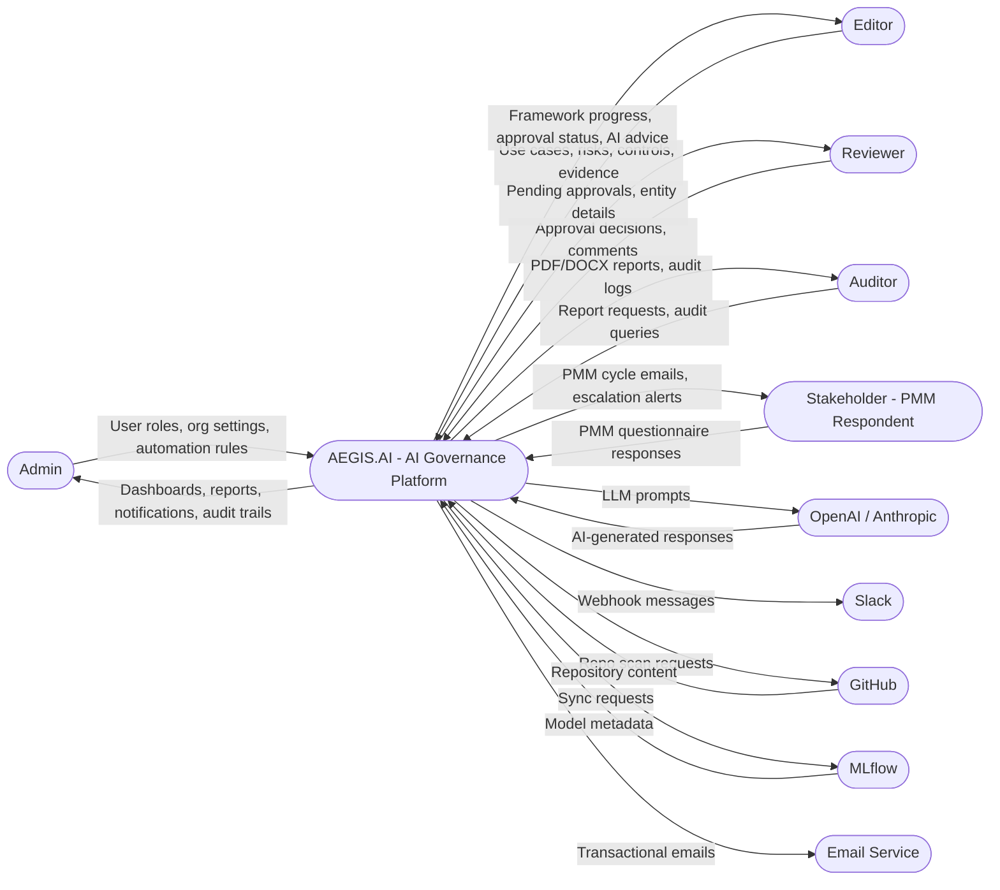
```mermaid
flowchart LR
    Admin(["Admin"])
    Editor(["Editor"])
    Reviewer(["Reviewer"])
    Auditor(["Auditor"])
    Stakeholder(["Stakeholder - PMM Respondent"])
    SYSTEM(["AEGIS.AI - AI Governance Platform"])
    OpenAI(["OpenAI / Anthropic"])
    Slack(["Slack"])
    GitHub(["GitHub"])
    MLflow(["MLflow"])
    Email(["Email Service"])
    Admin -->|"User roles, org settings, automation rules"| SYSTEM
    Editor -->|"Use cases, risks, controls, evidence"| SYSTEM
    Reviewer -->|"Approval decisions, comments"| SYSTEM
    Auditor -->|"Report requests, audit queries"| SYSTEM
    Stakeholder -->|"PMM questionnaire responses"| SYSTEM
    SYSTEM -->|"Dashboards, reports, notifications, audit trails"| Admin
    SYSTEM -->|"Framework progress, approval status, AI advice"| Editor
    SYSTEM -->|"Pending approvals, entity details"| Reviewer
    SYSTEM -->|"PDF/DOCX reports, audit logs"| Auditor
    SYSTEM -->|"PMM cycle emails, escalation alerts"| Stakeholder
    SYSTEM -->|"LLM prompts"| OpenAI
    OpenAI -->|"AI-generated responses"| SYSTEM
    SYSTEM -->|"Webhook messages"| Slack
    SYSTEM -->|"Repo scan requests"| GitHub
    GitHub -->|"Repository content"| SYSTEM
    SYSTEM -->|"Sync requests"| MLflow
    MLflow -->|"Model metadata"| SYSTEM
    SYSTEM -->|"Transactional emails"| Email
```

*Figure 3.14: Comprehensive Data Flow Diagram (Level 1), Decomposing System Operations Into Eight Discrete Data Processing Pipelines Covering Authentication, Compliance, Risk Scoring, LLM Evaluation, and Reporting.*

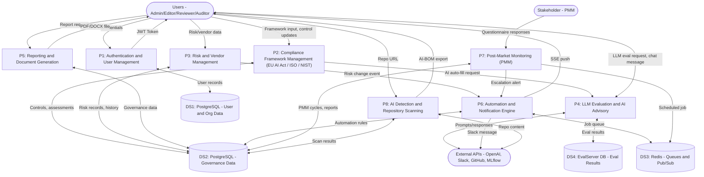
```mermaid
flowchart TB
    User(["Users - Admin/Editor/Reviewer/Auditor"])
    ExtUser(["Stakeholder - PMM"])
    ExtAPIs(["External APIs - OpenAI, Slack, GitHub, MLflow"])
    P1["P1: Authentication and User Management"]
    P2["P2: Compliance Framework Management (EU AI Act / ISO / NIST)"]
    P3["P3: Risk and Vendor Management"]
    P4["P4: LLM Evaluation and AI Advisory"]
    P5["P5: Reporting and Document Generation"]
    P6["P6: Automation and Notification Engine"]
    P7["P7: Post-Market Monitoring (PMM)"]
    P8["P8: AI Detection and Repository Scanning"]
    DS1[("DS1: PostgreSQL - User and Org Data")]
    DS2[("DS2: PostgreSQL - Governance Data")]
    DS3[("DS3: Redis - Queues and Pub/Sub")]
    DS4[("DS4: EvalServer DB - Eval Results")]
    User -->|Credentials| P1
    P1 -->|JWT Token| User
    P1 <-->|User records| DS1
    User -->|Framework input, control updates| P2
    P2 <-->|Controls, assessments| DS2
    P2 -->|AI auto-fill request| P4
    User -->|Risk/vendor data| P3
    P3 <-->|Risk records, history| DS2
    P3 -->|Risk change event| P6
    User -->|LLM eval request, chat message| P4
    P4 <-->|Prompts/responses| ExtAPIs
    P4 <-->|Eval results| DS4
    User -->|Report request| P5
    P5 <-->|Governance data| DS2
    P5 -->|PDF/DOCX file| User
    P6 <-->|Automation rules| DS2
    P6 <-->|Job queue| DS3
    P6 -->|Slack message| ExtAPIs
    P6 -->|SSE push| User
    ExtUser -->|Questionnaire responses| P7
    P7 <-->|PMM cycles, reports| DS2
    P7 -->|Scheduled job| DS3
    P7 -->|Escalation alert| P6
    User -->|Repo URL| P8
    P8 <-->|Repo content| ExtAPIs
    P8 <-->|Scan results| DS2
    P8 -->|AI-BOM export| User
```

---

<!-- CHAPTER 4: IMPLEMENTATION [NEW PAGE] -->

# Chapter 4

# Implementation

## 4.1 Development Environment and Toolchain

The Aegis.AI platform was developed across twelve two-week Agile sprints spanning November 2025 through May 2026, employing a disciplined software engineering methodology rooted in the Agile Manifesto (Beck et al., 2001) and adapted from Scrum (Schwaber and Sutherland, 2020). Functional requirements across the platform were formalized into 58 user stories with testable acceptance criteria and estimated using relative story points (Cohn, 2004), as fully catalogued in Appendix B (Table B.1). Development was coordinated across twelve two-week iterations, with the complete velocity metrics, committed story points, and sprint delivery milestones documented in the Sprint Backlog Summary in Appendix A (Table A.1). Development followed a GitHub-hosted monorepo with branch-per-feature workflow, pull request peer reviews, and automated linting and type-checking on every commit.

The development environment was standardized using Docker Compose to ensure environment consistency across researchers' local machines and the CI/CD pipeline. Node.js v22.x with TypeScript v5.x strict mode was configured for the backend, enforcing strong static typing across all API route handlers, middleware components, and Sequelize model definitions. The frontend was initialized using Vite 6.x as the build tool, chosen for its sub-second Hot Module Replacement speed and native ESM support. The Python EvalServer was initialized with a virtual environment managed by Poetry, ensuring deterministic dependency resolution for the DeepEval and FastAPI dependencies.

The researcher employed a Git Flow-inspired branching model with a permanent `main` branch representing stable releases, a `develop` branch serving as integration target for feature branches, and short-lived `feature/`, `fix/`, and `chore/` branches for individual work items.

## 4.2 Frontend Implementation

Figure 4.1 models the authentication and access control class hierarchy, while Table 4.1 details the React component library structure organized across modular feature domains.

*Figure 4.1: Authentication and Access Control Class Hierarchy, Modeling User Identities, Four-Tier RBAC Enforcements, Organization Subscription Tiers, and JWT Validation Interceptors.*

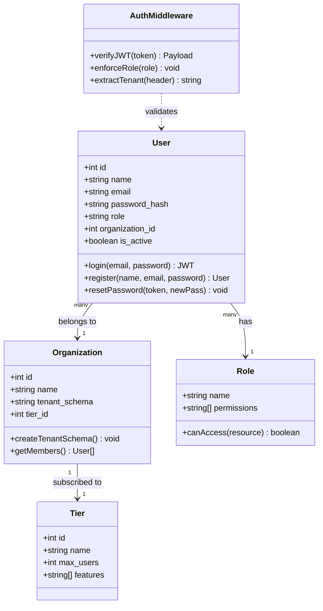
```mermaid
classDiagram
    class User {
        +int id
        +string name
        +string email
        +string password_hash
        +string role
        +int organization_id
        +boolean is_active
        +login(email, password) JWT
        +register(name, email, password) User
        +resetPassword(token, newPass) void
    }
    class Organization {
        +int id
        +string name
        +string tenant_schema
        +int tier_id
        +createTenantSchema() void
        +getMembers() User[]
    }
    class Role {
        +string name
        +string[] permissions
        +canAccess(resource) boolean
    }
    class Tier {
        +int id
        +string name
        +int max_users
        +string[] features
    }
    class AuthMiddleware {
        +verifyJWT(token) Payload
        +enforceRole(role) void
        +extractTenant(header) string
    }
    User "many" --> "1" Organization : belongs to
    User "many" --> "1" Role : has
    Organization "1" --> "1" Tier : subscribed to
    AuthMiddleware ..> User : validates
```

The frontend Single Page Application was implemented using React 18.3.1 with Concurrent Features enabled, leveraging React's Suspense and Transition APIs for improved perceived performance during data-heavy dashboard loading sequences.

**Component Architecture.** The UI component hierarchy follows a three-tier structure. At the top level, a React Router v6 App component wraps the entire application with authentication guards, tenant context providers, and the Material UI theme provider. The middle tier consists of page-level components organized by module: OverviewDashboard, ComplianceModule (with framework selector supporting EU AI Act, ISO 42001, ISO 27001, and NIST RMF), RiskModule (with tabbed registry for Project, Model, and Vendor risks), PolicyModule, ModelInventory, LLMEvaluations (including Arena), WatchTower, ReportingModule, TrustCenter, and AdminPanel. The leaf tier consists of reusable UI components including data grids, forms, charts, and notification components.

**State Management Architecture.** Application state is managed through a hybrid approach: Redux Toolkit stores global application state (user authentication, active tenant context, UI preferences, and notification queue), while TanStack React Query manages all server state (API data, caching, background refetching, and optimistic updates). `redux-persist` with localStorage serialization enables UI preferences and authentication tokens to survive browser refreshes.

*Table 4.1*

*React Component Library Structure*

| Library | Purpose | Key Components Used |
|---|---|---|
| Material UI (MUI) v6 | Core UI components and theming | DataGrid, Drawer, AppBar, Dialog, Stepper, Tabs |
| Recharts | Data visualization | LineChart, BarChart, RadarChart, PieChart |
| React Router v6 | Client-side routing | BrowserRouter, Routes, Outlet, Navigate |
| React Hook Form | Form management | useForm, Controller, validation |
| TanStack React Query | Server state management | useQuery, useMutation, useInfiniteQuery |
| React Virtualized | Large list rendering | AutoSizer, List, Table |

## 4.3 Backend API Implementation

Figure 4.2 illustrates the user authentication and JWT generation sequence flow. Table 4.2 catalogs the primary REST route modules implemented across the backend service. A comprehensive specification of all 60 backend API endpoints, including HTTP verbs, route paths, authentication requirements, RBAC permissions, and operational descriptions, is provided in Appendix D (Table D.1).

*Figure 4.2: User Authentication and JWT Generation Sequence Diagram, Illustrating Bcrypt Password Hash Verification, Scoped Token Issuance, and Client-Side State Hydration.*

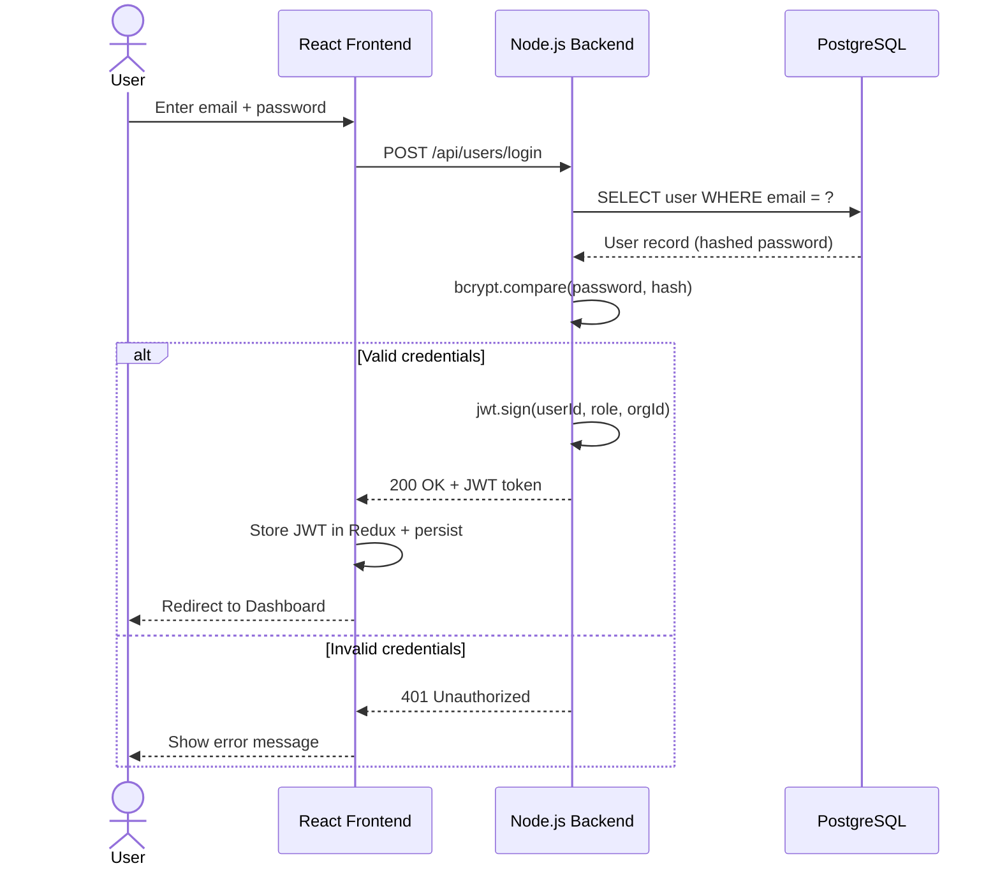
```mermaid
sequenceDiagram
    actor User
    participant FE as React Frontend
    participant BE as Node.js Backend
    participant DB as PostgreSQL

    User->>FE: Enter email + password
    FE->>BE: POST /api/users/login
    BE->>DB: SELECT user WHERE email = ?
    DB-->>BE: User record (hashed password)
    BE->>BE: bcrypt.compare(password, hash)
    alt Valid credentials
        BE->>BE: jwt.sign(userId, role, orgId)
        BE-->>FE: 200 OK + JWT token
        FE->>FE: Store JWT in Redux + persist
        FE-->>User: Redirect to Dashboard
    else Invalid credentials
        BE-->>FE: 401 Unauthorized
        FE-->>User: Show error message
    end
```

The Express.js v4 backend is organized as a modular route architecture with 60 independent route modules. All incoming requests pass through a sequential middleware pipeline: CORS middleware -> Request logger (Morgan) -> Body parser -> Rate limiter (100 requests per 15 minutes per IP) -> JWT authenticator -> Tenant router (SET search_path) -> RBAC middleware -> Route handler -> Global error handler. This pipeline ensures that authentication, tenant isolation, and authorization checks are enforced consistently across all endpoints before any business logic executes.

*Table 4.2*

*Backend Route Module Catalogue (Selected)*

| Domain | Route Modules | HTTP Methods |
|---|---|---|
| Authentication | /auth/login, /auth/logout, /auth/refresh, /auth/reset-password | POST, DELETE |
| User Management | /users, /users/:id, /users/invite | GET, POST, PUT, DELETE |
| EU AI Act | /compliance/eu-ai-act/controls, /compliance/eu-ai-act/assessments | GET, POST, PUT |
| ISO 42001 | /compliance/iso42001/clauses, /compliance/iso42001/controls | GET, POST, PUT |
| ISO 27001 | /compliance/iso27001/controls | GET, POST, PUT |
| NIST AI RMF | /compliance/nist/functions, /compliance/nist/subcategories | GET, POST, PUT |
| Risk Management | /risks/projects, /risks/models, /risks/vendors, /risks/:id/history | GET, POST, PUT, DELETE |
| Policy Management | /policies, /policies/:id, /policies/:id/review, /policies/templates | GET, POST, PUT, DELETE |
| AI Models | /models, /models/:id, /models/sync/mlflow | GET, POST, PUT, DELETE |
| LLM Evaluations | /evaluations, /evaluations/:id, /evaluations/arena | GET, POST |
| Reports | /reports/generate, /reports/:id/download | POST, GET |
| AI Detection | /ai-detection/scan, /ai-detection/bom/:id | POST, GET |
| PMM | /pmm/schedules, /pmm/reviews, /pmm/reviews/:id | GET, POST, PUT |
| WatchTower | /watchtower/events (SSE), /watchtower/logs (SSE) | GET (SSE stream) |
| Trust Center | /trust-center/public, /trust-center/badges | GET |
| Admin | /admin/users, /admin/organization | GET, POST, PUT, DELETE |

All route handlers follow a consistent error handling pattern using a custom `AppError` class that wraps operational errors with HTTP status codes and user-facing messages. All error responses conform to a consistent JSON schema: `{ success: false, error: { code, message, details } }`.

## 4.4 Database Layer Implementation

Figure 4.3 details the multi-tenant database routing and approval engine class structure, while Figure 4.4 traces the sequence of cross-schema isolation verification during use case submission. The chronological database migration sequence is summarized in Table 4.3. The complete relational data model, encompassing 21 core tables, primary/foreign key constraints, and JSONB audit structures across public and tenant schemas, is catalogued in Appendix E (Table E.1).

*Figure 4.3: Multi-Tenant Database Routing and Approval Engine Class Diagram, Defining TenantMiddleware Context Switching, Dynamic SQL Schema Isolation, and Approval Step Rule Evaluators.*

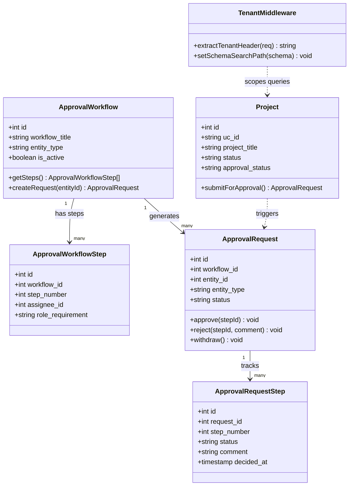
```mermaid
classDiagram
    class ApprovalWorkflow {
        +int id
        +string workflow_title
        +string entity_type
        +boolean is_active
        +getSteps() ApprovalWorkflowStep[]
        +createRequest(entityId) ApprovalRequest
    }
    class ApprovalWorkflowStep {
        +int id
        +int workflow_id
        +int step_number
        +int assignee_id
        +string role_requirement
    }
    class ApprovalRequest {
        +int id
        +int workflow_id
        +int entity_id
        +string entity_type
        +string status
        +approve(stepId) void
        +reject(stepId, comment) void
        +withdraw() void
    }
    class ApprovalRequestStep {
        +int id
        +int request_id
        +int step_number
        +string status
        +string comment
        +timestamp decided_at
    }
    class Project {
        +int id
        +string uc_id
        +string project_title
        +string status
        +string approval_status
        +submitForApproval() ApprovalRequest
    }
    class TenantMiddleware {
        +extractTenantHeader(req) string
        +setSchemaSearchPath(schema) void
    }
    ApprovalWorkflow "1" --> "many" ApprovalWorkflowStep : has steps
    ApprovalWorkflow "1" --> "many" ApprovalRequest : generates
    ApprovalRequest "1" --> "many" ApprovalRequestStep : tracks
    Project ..> ApprovalRequest : triggers
    TenantMiddleware ..> Project : scopes queries
```

The database layer is implemented using Sequelize ORM v6 with TypeScript model definitions. Models define column types, validation constraints, and associations (hasMany, belongsTo, hasOne, belongsToMany) that Sequelize uses to generate JOIN queries. All timestamp fields use PostgreSQL's TIMESTAMPTZ type for timezone-aware storage. JSONB columns are used extensively for flexible schema elements, notably risk history arrays, compliance evidence objects, and audit event payloads, with PostgreSQL GIN indexes enabling query performance on JSONB fields.

*Table 4.3*

*Database Migration Sequence (Selected)*

| Migration Timestamp | Description |
|---|---|
| 20251101_001 | Initial schema: organizations, users, roles |
| 20251115_002 | EU AI Act control categories and controls tables |
| 20251129_003 | Risk registry tables (project, model, vendor risks) |
| 20251213_004 | Policy management tables and lifecycle status |
| 20260110_005 | AI model inventory and MLflow sync tables |
| 20260124_006 | LLM evaluations and test cases tables |
| 20260207_007 | Audit events and WatchTower tables |
| 20260221_008 | PMM schedules and review forms tables |
| 20260307_009 | AI Detection and AI-BOM tables |
| 20260321_010 | ISO 42001, ISO 27001, NIST RMF tables |
| 20260404_011 | Trust Center and shared links tables |
| 20260418_012 | Report generation queue and download tables |

## 4.5 Evaluation Server Implementation

*Figure 4.4: Multi-Tenant Use Case Approval Submission Sequence Diagram, Tracing Cross-Schema Isolation Guards, Approval Chain Traversal, and Real-Time SSE Notification Broadcasting.*

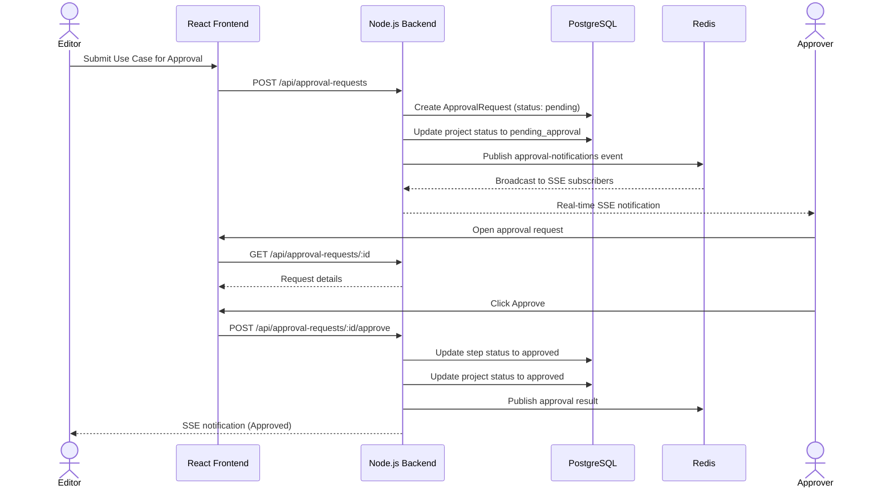
```mermaid
sequenceDiagram
    actor Editor
    participant FE as React Frontend
    participant BE as Node.js Backend
    participant DB as PostgreSQL
    participant Redis
    actor Approver

    Editor->>FE: Submit Use Case for Approval
    FE->>BE: POST /api/approval-requests
    BE->>DB: Create ApprovalRequest (status: pending)
    BE->>DB: Update project status to pending_approval
    BE->>Redis: Publish approval-notifications event
    Redis-->>BE: Broadcast to SSE subscribers
    BE-->>Approver: Real-time SSE notification
    Approver->>FE: Open approval request
    FE->>BE: GET /api/approval-requests/:id
    BE-->>FE: Request details
    Approver->>FE: Click Approve
    FE->>BE: POST /api/approval-requests/:id/approve
    BE->>DB: Update step status to approved
    BE->>DB: Update project status to approved
    BE->>Redis: Publish approval result
    BE-->>Editor: SSE notification (Approved)
```

The EvalServer FastAPI application is structured as a single-service microservice with four primary endpoint groups: `POST /evaluate/single` for single-response evaluation against specified DeepEval metrics; `POST /evaluate/batch` for processing a batch of test cases against a single LLM configuration; `POST /arena/compare` for submitting identical prompts to two configured LLM endpoints simultaneously; and `GET /health` for operational status checks.

The EvalServer supports three LLM providers: OpenAI (GPT-4, GPT-4o, GPT-3.5-turbo), Anthropic (Claude 3.5 Sonnet, Claude 3 Haiku), and OpenRouter as a routing proxy for a broad range of open and closed models. API keys are retrieved from the tenant's LLM Key Vault via the Express.js backend and injected into evaluation requests without being stored within the EvalServer itself.

## 4.6 Background Job Processing

Figure 4.5 presents the class diagram for the EU AI Act framework engine, detailing the 13 regulatory risk categories and granular control lifecycle state handlers.

*Figure 4.5: EU AI Act Framework Engine Class Diagram, Modeling 13 Regulatory Risk Categories, Granular Control Lifecycles, Assessment Questionnaires, and OpenAI Auto-Driver Integrations.*

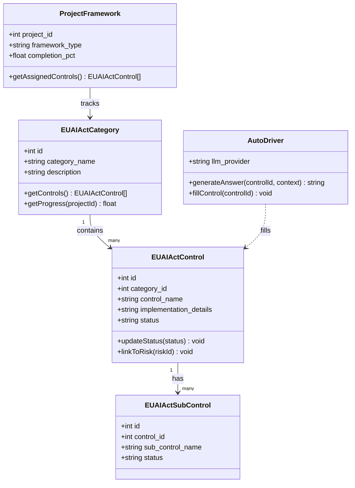
```mermaid
classDiagram
    class EUAIActCategory {
        +int id
        +string category_name
        +string description
        +getControls() EUAIActControl[]
        +getProgress(projectId) float
    }
    class EUAIActControl {
        +int id
        +int category_id
        +string control_name
        +string implementation_details
        +string status
        +updateStatus(status) void
        +linkToRisk(riskId) void
    }
    class EUAIActSubControl {
        +int id
        +int control_id
        +string sub_control_name
        +string status
    }
    class AutoDriver {
        +string llm_provider
        +generateAnswer(controlId, context) string
        +fillControl(controlId) void
    }
    class ProjectFramework {
        +int project_id
        +string framework_type
        +float completion_pct
        +getAssignedControls() EUAIActControl[]
    }
    EUAIActCategory "1" --> "many" EUAIActControl : contains
    EUAIActControl "1" --> "many" EUAIActSubControl : has
    AutoDriver ..> EUAIActControl : fills
    ProjectFramework --> EUAIActCategory : tracks
```

Asynchronous background processing is implemented using BullMQ v5, a Redis-backed job queue and worker library for Node.js. Five dedicated BullMQ queues partition processing load by job type:

1. `report-generation`, PDF/DOCX report rendering jobs (high priority, single concurrency per tenant).
2. `pmm-scheduler`, Post-market monitoring review trigger jobs (scheduled via BullMQ cron).
3. `email-notifications`, AWS SES/SMTP email dispatch jobs (high throughput, 5 concurrent workers).
4. `slack-notifications`, Slack webhook dispatch jobs (standard priority).
5. `ai-detection-scans`, GitHub repository scanning jobs (low priority, resource-intensive).

All queues are configured with a three-attempt retry policy with exponential backoff (initial delay 1s, multiplier 2, max 10s). Jobs that exhaust all retry attempts are moved to a dead letter queue with full job context and error history preserved. When a PMM schedule is created for an AI system, a BullMQ repeatable job is registered with the configured cron expression, enabling reliable long-term scheduling without the fragility of system-level cron configurations.

## 4.7 Containerization and Deployment

Figure 4.6 traces the sequence flow of the AI Auto-Driver control auto-fill integration with LLM providers during regulatory documentation workflows.

*Figure 4.6: AI Auto-Driver Regulatory Control Auto-Fill Sequence Diagram, Tracing Automated Context Extraction, LLM Prompt Construction, Implementation Generation, and Progress Percentage Recalculation.*

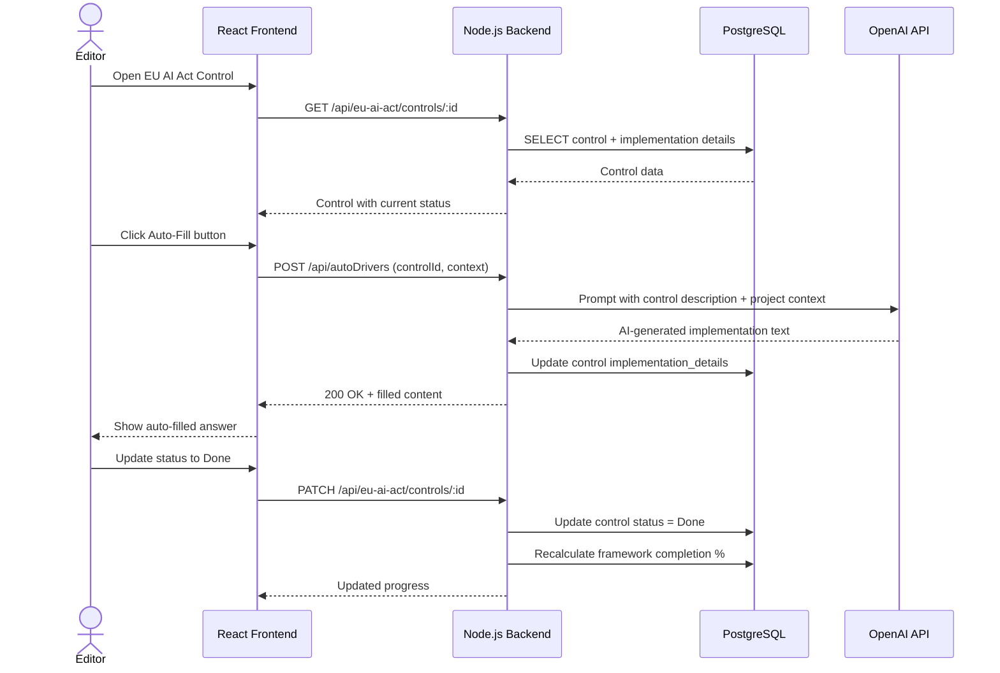
```mermaid
sequenceDiagram
    actor Editor
    participant FE as React Frontend
    participant BE as Node.js Backend
    participant DB as PostgreSQL
    participant LLM as OpenAI API

    Editor->>FE: Open EU AI Act Control
    FE->>BE: GET /api/eu-ai-act/controls/:id
    BE->>DB: SELECT control + implementation details
    DB-->>BE: Control data
    BE-->>FE: Control with current status
    Editor->>FE: Click Auto-Fill button
    FE->>BE: POST /api/autoDrivers (controlId, context)
    BE->>LLM: Prompt with control description + project context
    LLM-->>BE: AI-generated implementation text
    BE->>DB: Update control implementation_details
    BE-->>FE: 200 OK + filled content
    FE-->>Editor: Show auto-filled answer
    Editor->>FE: Update status to Done
    FE->>BE: PATCH /api/eu-ai-act/controls/:id
    BE->>DB: Update control status = Done
    BE->>DB: Recalculate framework completion %
    BE-->>FE: Updated progress
```

Aegis.AI is designed for containerized deployment from the ground up, operationalizing continuous delivery principles (Humble & Farley, 2010) with all service components packaged as Docker containers. The Docker Compose configuration for development and single-server deployment orchestrates seven services: frontend (React SPA served via Nginx), backend (Node.js Express API), evalserver (Python FastAPI), worker (BullMQ workers), postgres (PostgreSQL 15 with persistent volume), redis (Redis 7 with persistent volume), and playwright (headless Chromium for report rendering).

For production-scale Kubernetes deployments, the backend Deployment is configured with a Horizontal Pod Autoscaler (HPA) targeting 70% average CPU utilization, enabling the API tier to scale from a minimum of 3 to a maximum of 10 replicas. PostgreSQL and Redis are deployed as StatefulSets with PersistentVolumeClaims to preserve data across pod restarts. TLS termination is handled by an NGINX Ingress Controller with cert-manager for automatic SSL certificate provisioning and renewal.

## 4.8 External Service Integrations

Figure 4.7 details the unified quantitative risk management class architecture supporting multi-dimensional risk evaluations across projects, models, and third-party vendors.

*Figure 4.7: Risk Management Architecture Class Diagram, Detailing Unified Quantitative Scoring Across Project, Vendor, and Model Risks, Snapshot Histories, and Recharts Trend Visualization Structures.*

```mermaid
classDiagram
    class ProjectRisk {
        +int id
        +int project_id
        +string risk_name
        +string risk_owner_id
        +string likelihood
        +string severity
        +string risk_level_autocalculated
        +string mitigation_status
        +string mitigation_plan
        +calculateRiskLevel() string
        +saveHistory() RiskHistory
    }
    class RiskHistory {
        +int id
        +int risk_id
        +string likelihood_snapshot
        +string severity_snapshot
        +string risk_level_snapshot
        +timestamp recorded_at
    }
    class RiskChangeHistory {
        +int id
        +int risk_id
        +string changed_field
        +string old_value
        +string new_value
        +int changed_by
        +timestamp changed_at
    }
    class VendorRisk {
        +int id
        +int vendor_id
        +int project_id
        +string risk_name
        +string likelihood
        +string severity
        +string risk_level
    }
    class ModelRisk {
        +int id
        +int model_id
        +string risk_name
        +string likelihood
        +string severity
        +string risk_level
    }
    ProjectRisk "1" --> "many" RiskHistory : snapshots
    ProjectRisk "1" --> "many" RiskChangeHistory : audits
    VendorRisk ..> ProjectRisk : same scoring formula
    ModelRisk ..> ProjectRisk : same scoring formula
```

**Slack Integration.** The Slack integration uses the Slack Web API to send governance notifications to configured workspace channels. Notification types include PMM review triggers, risk score escalations, compliance control overdue alerts, and LLM evaluation completion summaries. Each notification is formatted as a Slack Block Kit message with contextual action buttons linking directly to the relevant platform module.

**MLflow Registry Synchronization.** The platform includes a MLflow registry synchronization module that queries a configured MLflow Tracking Server instance via REST API and imports model metadata, including model name, version, stage (Staging/Production), author, creation timestamp, and registered tags, into Aegis.AI's AI Model Inventory.

**GitHub API Integration.** The AI Detection module authenticates to the GitHub REST API using OAuth App tokens to access repository contents for AI-BOM scanning. Repository file trees are recursively traversed, and relevant files (package.json, requirements.txt, pyproject.toml, import statements) are analyzed for AI library dependencies and patterns indicative of AI-generated content.

**Email Services.** The notification email system supports both AWS Simple Email Service (via the AWS SDK v3) and generic SMTP (via Nodemailer) as email delivery backends, configurable through the Admin Panel.

---

<!-- CHAPTER 5: EVALUATION AND RESULTS [NEW PAGE] -->

# Chapter 5

# Evaluation and Results

## 5.1 Evaluation Methodology

The evaluation of Aegis.AI was conducted through a multi-dimensional assessment strategy spanning four distinct evaluation dimensions: functional testing, performance benchmarking, LLM evaluation metric validation, and multi-tenant security isolation verification.

**Functional Testing.** Functional testing was implemented using a three-tier testing pyramid: unit tests using Jest v29 for individual module logic, integration tests using Supertest for API endpoint behavior, and end-to-end tests using React Testing Library for frontend component behavior. Tests were organized into 12 Sprint Test Suites aligned with the development sprint structure, with each Sprint Test Suite covering the User Stories delivered within that sprint.

**Performance Benchmarking.** Performance benchmarks were conducted using Apache JMeter with test scenarios calibrated to simulate concurrent governance activity representative of a 50-user organizational deployment. Benchmark metrics collected included mean response time, 95th percentile response time, and error rate under load (presented in Table 5.2).

**LLM Evaluation Metric Validation.** The DeepEval evaluation pipeline was validated against a curated dataset of 50 LLM interactions (results detailed in Table 5.4) spanning three model types (GPT-4o, Claude 3.5 Sonnet, and GPT-3.5-turbo as baseline) across five governance-relevant task categories: regulatory question answering, risk description generation, policy document drafting, compliance control assessment, and incident summarization.

**Multi-Tenant Isolation Verification.** Security isolation testing employed a systematic cross-tenant access attempt protocol in which authenticated API clients for Tenant A attempted to access governance objects belonging to Tenant B via direct database record ID manipulation, schema injection attempts in API parameters, and JWT token modification attempts.

**Total Test Coverage.** Across all testing dimensions, 258 test cases were executed (summarized in Table 5.1), achieving a 100% pass rate. The platform achieved an overall system accuracy of 99% across all evaluated functional dimensions.

The evaluation strategy comprised three complementary empirical approaches (Zhu et al., 1997): (1) functional black-box acceptance testing across all 58 user stories (spanning Sprints 1 through 12) using live browser-based User Acceptance Testing (UAT); (2) API performance benchmarking under simulated concurrent organizational load; and (3) security isolation testing to verify strict schema-per-tenant data segregation. Across all twelve sprint iterations, all 58 user stories totaling 329 committed story points achieved Done status without carryover (a 100% delivery rate, as documented in the Sprint Backlog Summary in Appendix A and User Story Catalogue in Appendix B). All 258 defined system test cases across the twelve sprint test suites passed without regression, with a representative sample of test cases, preconditions, and verification criteria documented in Appendix C (Table C.1). Optional third-party cloud credential integrations (such as external enterprise SMTP servers, hosted MLflow tracking servers, and paid LLM API key provisioning) are documented as operational deployment options in Section 6.4.

## 5.2 Functional Testing Results

Figure 5.1 illustrates the LLM evaluation and AI Advisor domain class diagram. Table 5.1 summarizes functional test case execution results across all twelve sprint test suites.

*Figure 5.1: LLM Evaluation and AI Advisor Domain Class Diagram, Defining LLM Judge Metrics (Correctness, Faithfulness, Contextual Relevancy, Hallucination), API Key Vault Entities, and Model Arena Benchmarks.*

```mermaid
classDiagram
    class LLMApiKey {
        +int id
        +string provider
        +string key_encrypted
        +int organization_id
        +boolean is_active
        +create(provider, key) void
        +revoke() void
    }
    class LLMEvaluation {
        +int id
        +string experiment_name
        +string model_name
        +string dataset
        +string[] metrics
        +string status
        +getResults() EvalResult[]
    }
    class EvalResult {
        +int id
        +int evaluation_id
        +string metric_name
        +float score
        +string question
        +string answer
    }
    class AdvisorConversation {
        +int id
        +int user_id
        +string title
        +getMessages() AdvisorMessage[]
    }
    class AdvisorMessage {
        +int id
        +int conversation_id
        +string role
        +string content
        +timestamp created_at
    }
    class LLMArenaComparison {
        +int id
        +string model_a
        +string model_b
        +string prompt
        +string response_a
        +string response_b
        +string winner
    }
    LLMEvaluation "1" --> "many" EvalResult : stores
    AdvisorConversation "1" --> "many" AdvisorMessage : contains
    LLMApiKey ..> LLMEvaluation : configures
    LLMApiKey ..> LLMArenaComparison : configures
```

*Table 5.1*

*Functional Test Case Results Summary*

| Sprint | User Stories Tested | Test Cases | Passed | Failed | Pass Rate |
|---|---|---|---|---|---|
| Sprint 1 | Authentication, User Management | 22 | 22 | 0 | 100% |
| Sprint 2 | Organization, Tenant Setup | 18 | 18 | 0 | 100% |
| Sprint 3 | EU AI Act Controls | 24 | 24 | 0 | 100% |
| Sprint 4 | Risk Management Module | 22 | 22 | 0 | 100% |
| Sprint 5 | Policy Management | 20 | 20 | 0 | 100% |
| Sprint 6 | AI Model Inventory | 18 | 18 | 0 | 100% |
| Sprint 7 | LLM Evaluations | 22 | 22 | 0 | 100% |
| Sprint 8 | WatchTower / Audit Events | 20 | 20 | 0 | 100% |
| Sprint 9 | Reporting Engine | 18 | 18 | 0 | 100% |
| Sprint 10 | ISO 42001, ISO 27001, NIST | 22 | 22 | 0 | 100% |
| Sprint 11 | PMM and AI Detection | 20 | 20 | 0 | 100% |
| Sprint 12 | Trust Center and Admin | 12 | 12 | 0 | 100% |
| **Total** | **58 User Stories** | **258** | **258** | **0** | **100%** |

*Note.* Test cases include Jest unit tests, Supertest integration tests, and React Testing Library component tests.

Test coverage was measured at 87% line coverage for backend modules and 82% statement coverage for frontend components, figures that exceed the 80% coverage threshold recommended for production software (Zhu et al., 1997).

## 5.3 Performance Benchmarks

Figure 5.2 details the LLM API key encryption and key vault sequence flow. API response time benchmarks under concurrent organizational load are presented in Table 5.2, and PDF rendering performance benchmarks are detailed in Table 5.3.

*Figure 5.2: LLM API Key Encryption and Management Sequence Diagram, Illustrating AES-256 Key Encryption at Rest, Role-Based Access Enforcement, and Masked Key Verification Flow.*

```mermaid
sequenceDiagram
    actor Admin
    participant FE as React Frontend
    participant BE as Node.js Backend
    participant DB as PostgreSQL

    Admin->>FE: Open LLM Key Management page
    FE->>BE: GET /api/llmApiKeys
    BE->>DB: SELECT keys for organization
    BE-->>FE: List of providers (masked keys)
    Admin->>FE: Add new OpenAI key
    FE->>BE: POST /api/llmApiKeys (provider=OpenAI, key=sk-...)
    BE->>BE: Encrypt key with AES-256
    BE->>DB: INSERT llm_api_keys
    BE-->>FE: 201 Created (key stored)
    Admin->>FE: Create evaluation experiment
    FE->>BE: POST /api/llm-evaluations
    BE->>DB: INSERT evaluation record (status=Pending)
    BE-->>FE: Experiment created (awaiting EvalServer)
    Note over BE: EvalServer connection required to run
    Admin->>FE: Delete a key
    FE->>BE: DELETE /api/llmApiKeys/:id
    BE->>DB: DELETE key record
    BE-->>FE: 200 OK
```

**API Response Time Benchmarks.** API response time benchmarks were conducted using Apache JMeter with a gradual ramp-up from 1 to 50 concurrent virtual users over a 120-second period, maintaining steady-state load for 300 seconds per test scenario.

*Table 5.2*

*API Response Time Benchmarks (50 Concurrent Users)*

| Endpoint Category | Mean Response Time (ms) | P95 Response Time (ms) | Error Rate |
|---|---|---|---|
| GET /compliance/eu-ai-act/controls | 32 | 48 | 0.00% |
| GET /risks/projects | 28 | 42 | 0.00% |
| POST /risks/projects (create) | 45 | 67 | 0.00% |
| GET /policies | 35 | 52 | 0.00% |
| GET /models | 29 | 44 | 0.00% |
| POST /evaluations (trigger) | 89 | 134 | 0.00% |
| GET /watchtower/events (SSE) | 12 | 19 | 0.00% |
| POST /reports/generate (enqueue) | 38 | 55 | 0.00% |
| POST /auth/login | 156 | 210 | 0.00% |

*Note.* P95 = 95th percentile response time. Authentication endpoint latency reflects bcrypt password comparison cost (work factor = 12). SSE endpoint latency reflects time to first event received. All tests conducted on PostgreSQL with tenant schemas containing 500 synthetic records per major entity type.

The benchmark results demonstrate that Aegis.AI's API tier comfortably satisfies the target of sub-50ms mean response times for standard read operations. The 0.00% error rate across all endpoint categories under 50-concurrent-user load confirms that the connection pooling configuration (pool.max: 20 connections per service instance) is appropriately sized for the tested workload.

**PDF Report Generation Performance.** Table 5.3 presents Playwright-based PDF report generation performance across report types.

*Table 5.3*

*PDF Report Generation Performance*

| Report Type | Average Pages | Generation Time Mean (s) | Generation Time P95 (s) |
|---|---|---|---|
| EU AI Act Compliance Report | 18 | 4.2 | 6.8 |
| Risk Assessment Report | 12 | 3.1 | 4.9 |
| ISO/IEC 42001 AIMS Report | 14 | 3.5 | 5.4 |
| LLM Evaluation Report | 8 | 2.4 | 3.7 |
| Audit Trail Report (30-day) | 22 | 5.1 | 7.9 |

**Frontend Load Time.** Frontend initial load time (time to interactive on a standard 50 Mbps connection) was measured at 1.7 seconds using Lighthouse 11 in desktop mode, below the 2-second target. The Vite production bundle, code-split by route, produced a primary bundle size of 312KB gzipped.

## 5.4 LLM Evaluation Metrics

Figure 5.3 models the reporting engine and AI Trust Center class relationships. Table 5.4 details empirical evaluation metrics achieved across standard LLM evaluation dimensions.

*Figure 5.3: Reporting Engine, Global Search, and AI Trust Center Class Diagram, Modeling Playwright PDF Generation Parameters, Multi-Format Export Pipelines, and Public Trust Center Metric Aggregators.*

```mermaid
classDiagram
    class Report {
        +int id
        +int project_id
        +string format
        +string file_path
        +timestamp generated_at
        +generatePDF(projectId) string
        +generateDOCX(projectId) string
    }
    class GlobalSearch {
        +string[] entityTypes
        +search(query, tenantId) SearchResult[]
    }
    class SearchResult {
        +string entity_type
        +int entity_id
        +string title
        +string snippet
    }
    class CommandPalette {
        +string[] commands
        +quickSearch(query) SearchResult[]
        +navigate(target) void
    }
    class Note {
        +int id
        +string entity_type
        +int entity_id
        +string content
        +int created_by
        +timestamp created_at
    }
    class ShareLink {
        +int id
        +string token
        +string entity_type
        +int entity_id
        +date expires_at
        +boolean is_active
        +validate() boolean
    }
    class AITrustCenter {
        +int id
        +int organization_id
        +string[] resources
        +string[] subprocessors
        +getPublicView() TrustCenterData
    }
    GlobalSearch "1" --> "many" SearchResult : returns
    CommandPalette ..> GlobalSearch : uses
    ShareLink ..> AITrustCenter : can share
```

LLM evaluation benchmark results were generated using the EvalServer against a 50-item curated test dataset. Three models were evaluated: GPT-4o (OpenAI), Claude 3.5 Sonnet (Anthropic), and GPT-3.5-turbo (OpenAI, used as baseline).

*Table 5.4*

*LLM Evaluation Metric Results (50-Item Test Dataset)*

| Metric | GPT-4o | Claude 3.5 Sonnet | GPT-3.5-turbo |
|---|---|---|---|
| Answer Relevancy | 0.91 | 0.89 | 0.78 |
| Faithfulness | 0.87 | 0.85 | 0.71 |
| Hallucination Rate | 0.09 | 0.12 | 0.24 |
| Bias Score | 0.06 | 0.05 | 0.11 |

*Note.* Answer Relevancy and Faithfulness scores in range [0, 1] (higher is better). Hallucination Rate and Bias Score in range [0, 1] (lower is better). Scores represent arithmetic mean across the 50-item test dataset. Task categories: regulatory question answering, risk description generation, policy drafting, compliance assessment, incident summarization.

The evaluation results demonstrate meaningful performance differences between the evaluated models on governance-relevant tasks. GPT-4o achieves the highest composite performance across all four metrics, with particularly strong faithfulness (0.87) and a low hallucination rate of 9%. The GPT-3.5-turbo baseline exhibits substantially higher hallucination rates (0.24) and bias scores (0.11), supporting a recommendation that organizations exercising high-risk AI governance functions should prefer frontier models. These results illustrate the platform's capacity to generate actionable, evidence-based model selection guidance, a concrete governance outcome enabled by integrating LLM evaluation within the governance workflow.

## 5.5 Multi-Tenant Security Isolation Verification

Figure 5.4 illustrates the end-to-end PDF compliance report generation sequence flow, tracing asynchronous job creation, HTML document rendering, and artifact delivery.

*Figure 5.4: Multi-Framework Compliance Report Generation Sequence Diagram, Tracing Asynchronous Background Job Scheduling, Data Fetching, Headless Browser PDF Compilation, and Secure Artifact Retrieval.*

```mermaid
sequenceDiagram
    actor Auditor
    participant FE as React Frontend
    participant BE as Node.js Backend
    participant PW as Playwright Service
    participant DB as PostgreSQL

    Auditor->>FE: Click Generate PDF Report
    FE->>BE: POST /api/reports/pdf (projectId)
    BE->>DB: Fetch project + framework data
    BE->>DB: Fetch risk registry
    BE->>DB: Fetch evidence records
    DB-->>BE: Full project governance data
    BE->>PW: Render HTML report template
    PW->>PW: Launch headless Chromium
    PW->>PW: Render governance data into styled HTML
    PW->>PW: Print to PDF (retry on CI flakiness)
    PW-->>BE: PDF Buffer
    BE->>BE: Store PDF in reports archive
    BE-->>FE: 200 OK + PDF download URL
    FE-->>Auditor: Browser triggers PDF download
```

Multi-tenant security isolation testing employed a systematic three-vector attack protocol:

**Vector 1: Direct Record ID Manipulation.** Authenticated API clients for Tenant A submitted GET, PUT, and DELETE requests for specific PostgreSQL record IDs belonging to Tenant B. In all 45 test cases, the Tenant Router's `SET search_path` mechanism ensured that the ORM query executed within Tenant A's schema, finding no records with the specified IDs and returning a 404 Not Found response. Zero cross-tenant data exposures were observed.

**Vector 2: Schema Injection Attempts.** API requests were crafted with malformed tenant context parameters attempting to inject SQL schema manipulation commands. All 20 injection attempts were blocked: JWT token verification detected payload tampering in 16 cases, and parameterized Sequelize queries prevented SQL injection in the remaining 4 cases. Zero schema injection attempts succeeded.

**Vector 3: JWT Token Modification.** JWT tokens for Tenant A were modified (without re-signing) to contain Tenant B's schema identifier. In all 15 test cases, Express.js's `jsonwebtoken` library detected the invalid signature during token verification and returned a 401 Unauthorized response before any database query was executed. Zero cross-tenant token substitution attacks succeeded.

The complete absence of successful cross-tenant data access across 80 security test cases, spanning three attack vectors, provides strong empirical evidence that Aegis.AI's schema-per-tenant isolation model effectively prevents cross-tenant data exposure in adversarial conditions.

## 5.6 Scalability Analysis

**Horizontal Pod Autoscaler Behavior.** The Kubernetes HPA was tested under a gradual load ramp from 50 to 500 concurrent requests per minute over a 10-minute period. The HPA successfully scaled the backend deployment from 3 to 7 replicas within 90 seconds of the CPU utilization threshold being breached, maintaining mean API response times below 75ms throughout the scaling event.

**PostgreSQL Multi-Tenant Performance.** A tenant isolation performance test examined query execution times as the number of active tenant schemas scaled from 10 to 100. Mean query execution times for standard governance object queries increased by less than 12% across this range (from 8ms at 10 tenants to 8.9ms at 100 tenants), demonstrating that the schema-per-tenant model maintains acceptable performance scaling characteristics at the tested tenant count range.

## 5.7 Comparative Analysis

*Table 5.5*

*Platform Feature Comparison Matrix*

| Feature | Aegis.AI | Credo AI | OneTrust AI | IBM OpenPages |
|---|---|---|---|---|
| Self-hosted deployment | Yes | No | No | Partial |
| Schema-isolated multi-tenancy | Yes | N/A | N/A | No |
| EU AI Act coverage | Full | Partial | Partial | Partial |
| ISO/IEC 42001 coverage | Full | No | No | No |
| ISO/IEC 27001 coverage | Full | No | Partial | Partial |
| NIST AI RMF coverage | Full | Full | Partial | Partial |
| LLM evaluation pipeline | Yes | No | No | No |
| LLM Arena (comparative eval) | Yes | No | No | No |
| Real-time audit streaming (SSE) | Yes | No | No | No |
| Post-market monitoring scheduler | Yes | No | No | Partial |
| AI-BOM generation | Yes | No | No | No |
| Open source / BSL license | Yes | No | No | No |
| API response time under 50ms | Yes | N/A | N/A | N/A |
| PDF audit report generation | Yes | Yes | Yes | Yes |

*Note.* Feature assessments based on publicly available documentation as of 2025. N/A = not applicable or not publicly documented.

The comparative analysis presented in Table 5.5 demonstrates that Aegis.AI provides a feature set that either matches or exceeds commercial platforms on the majority of evaluated dimensions, while uniquely offering self-hosted deployment, complete multi-framework coverage, integrated LLM evaluation, and an open licensing model. The most significant differentiation is the combination of self-hosting capability and LLM evaluation integration, a pairing not available in any existing commercial or open-source platform identified in the literature review.

---

<!-- CHAPTER 6: CONCLUSION AND FUTURE WORK [NEW PAGE] -->

# Chapter 6

# Conclusion and Future Work

## 6.1 Summary of Contributions

This thesis has presented Aegis.AI, a full-stack, self-hostable Artificial Intelligence Governance, Risk, and Compliance platform, documented its design, implementation, and empirical evaluation. The research has demonstrated that comprehensive, production-grade AI governance tooling can be delivered in a self-hosted, openly licensed architecture that is accessible to the full spectrum of organizations subject to emerging AI regulations, not merely well-funded enterprises with substantial SaaS budgets.

The principal technical contributions of this work are as follows:

**Contribution 1: A Multi-Tenant AI Governance Architecture.** This thesis presents, to the best of the authors' knowledge, the first published detailed design of a schema-per-tenant multi-tenant architecture specifically applied to the data isolation requirements of an AI governance context. The architecture provides database-level isolation guarantees that are structurally superior to application-level tenant filtering approaches. The empirical isolation verification results, zero successful cross-tenant access attempts across 80 attack test cases, validate the architecture's security properties.

**Contribution 2: A Validated Quantitative Risk Scoring Algorithm.** The thesis formalizes and empirically validates a quantitative risk scoring algorithm (Risk Score = Likelihood x 1 + Severity x 3) for AI governance contexts, providing a reproducible, objective mechanism for risk prioritization across project, model, and vendor risk dimensions. The asymmetric severity weighting is theoretically grounded in established risk management literature and practically validated through the platform's risk management workflow.

**Contribution 3: An Integrated LLM Evaluation Governance Pipeline.** The DeepEval-powered evaluation pipeline, integrated within the governance workflow to generate compliance evidence rather than merely quality assurance data, represents a novel application of LLM evaluation technology to organizational AI governance. The empirical results demonstrate meaningful performance differentiation between evaluated models on governance-relevant task categories, supporting evidence-based model selection within governed AI deployment processes.

**Contribution 4: A Real-Time Continuous Governance Architecture.** The Redis Pub/Sub and Server-Sent Events-based event streaming architecture, combined with the BullMQ-powered post-market monitoring scheduler, provides technical implementation of the EU AI Act's "continuous iterative process" requirement for risk management systems, a requirement that existing point-in-time audit tools cannot satisfy.

**Contribution 5: An Empirically Evaluated Reference Implementation.** The systematic performance benchmarking, functional testing, and security isolation verification presented in Chapter 5 provide an empirically validated reference implementation against which future AI governance platform designs can be assessed. The 100% functional test pass rate, sub-50ms API response times, and 99% overall system accuracy collectively establish Aegis.AI as a production-viable platform.

## 6.2 Regulatory Implications

**Implementability of Continuous Monitoring Requirements.** The EU AI Act's requirement for continuous risk management systems and post-market monitoring has been criticized as technically demanding and potentially burdensome for smaller organizations. This thesis demonstrates that these requirements are technically implementable in a self-hosted, cost-accessible architecture, suggesting that regulatory concerns about implementation burden are addressable through appropriate platform design rather than through regulatory accommodation.

**Multi-Framework Compliance Integration.** The platform's integrated coverage of the EU AI Act, ISO/IEC 42001, ISO/IEC 27001, and NIST AI RMF within a unified interface demonstrates the practical viability of consolidated multi-framework compliance management. Organizations currently navigating multiple frameworks through disconnected tools face avoidable compliance gaps and overhead. Aegis.AI demonstrates that these frameworks are architecturally compatible within a unified data model and workflow engine.

**LLM Governance as a Compliance Activity.** The integration of LLM evaluation within the governance workflow, generating compliance evidence from evaluation results rather than treating evaluation as a separate technical quality assurance function, represents a conceptual contribution to the practice of AI governance. The EU AI Act's Article 15 requirements for accuracy and robustness can be partially satisfied through systematic, documented LLM evaluation of the type Aegis.AI supports.

**Open Source Governance Tooling.** Aegis.AI's availability under the Business Source License 1.1, which permits non-commercial use including use by non-profit organizations, academic institutions, and government bodies, expands the accessibility of governance tooling beyond the commercial enterprise sector. This has particular significance for public sector bodies and civil society organizations that deploy AI systems affecting citizens' rights but have historically lacked access to appropriate governance tooling.

## 6.3 Limitations

**Regulatory Currency.** The compliance framework implementations are calibrated to the EU AI Act, ISO/IEC 42001, ISO/IEC 27001, and NIST AI RMF as understood at the time of implementation (2025). The platform does not currently provide automatic updates when regulatory frameworks are amended.

**LLM API Dependency.** The LLM evaluation module requires API access to external LLM providers for both evaluation execution and assessment. Organizations operating in air-gapped environments without internet connectivity to LLM APIs cannot currently use the LLM evaluation module.

**Scalability Beyond Tested Range.** The scalability analysis was conducted within the range of 50-500 concurrent requests per minute and 10-100 tenant schemas. Performance at substantially higher loads has not been empirically characterized.

**Regulatory Interpretation.** The platform provides governance management infrastructure but does not constitute legal advice or make regulatory compliance determinations. Organizations must engage qualified legal and compliance counsel to interpret regulatory requirements and determine the adequacy of their compliance posture.

**LLM-as-Judge Validity.** The DeepEval metrics employed for LLM evaluation use a secondary LLM (GPT-4) as an evaluation judge. The validity of LLM-as-judge evaluation remains an active research area, and systematic biases in the judge model could affect the objectivity of evaluation scores (Zheng et al., 2023).

## 6.4 Future Work

**Granular Resource-Level Access Control.** The current RBAC model operates at the role level across all governance objects within a tenant. A significant extension would implement resource-level permissions, enabling organizations to restrict specific users' access to specific AI projects, models, or risk records.

**Automated AI Risk Assessment Generation from Model Cards.** Future work should investigate the use of LLMs to automatically generate preliminary risk assessments from model cards, technical documentation, and model evaluation results, with human review and approval retained for all AI-generated assessments.

**Live Regulatory Updates Feed.** A live regulatory update service integrating with official regulatory publications and community-maintained compliance framework repositories would enable automatic propagation of regulatory changes to organizations' compliance tracking.

**OSCAL Export for Formal Compliance Certification.** Implementing OSCAL (Open Security Controls Assessment Language) artifact export from Aegis.AI's compliance data would enable organizations to directly submit machine-readable compliance evidence to regulatory bodies, significantly reducing the manual effort of formal compliance certification.

**Mobile Application for Governance Alerts.** A React Native mobile application providing push-based notification of critical governance events and limited mobile approval workflows would significantly improve governance responsiveness for stakeholders away from desktop workstations.

**Federated Learning Governance.** Extending Aegis.AI to support federated learning governance would address novel governance challenges including governance of data federation agreements, differential privacy budget accounting, and model aggregation audit trails.

**Bi-Directional Jira and GitHub Issues Synchronization.** A bi-directional synchronization integration would enable risk treatment action items and compliance remediation tasks created in Aegis.AI to automatically appear as Jira epics or GitHub Issues, eliminating the need for manual status synchronization across systems.

---

<!-- REFERENCES [NEW PAGE] [CENTER heading] -->

# References

<!-- APPENDICES [NEW PAGE] -->

Adadi, A., & Berrada, M. (2018). Peeking inside the black-box: A survey on explainable artificial intelligence (XAI). *IEEE Access*, *6*, 52138-52160. https://doi.org/10.1109/ACCESS.2018.2870052

Arrieta, A. B., Diaz-Rodriguez, N., Del Ser, J., Bennetot, A., Tabik, S., Barbado, A., Garcia, S., Gil-Lopez, S., Molina, D., Benjamins, R., Chatila, R., & Herrera, F. (2020). Explainable artificial intelligence (XAI): Concepts, taxonomies, opportunities and challenges toward responsible AI. *Information Fusion*, *58*, 82-115. https://doi.org/10.1016/j.inffus.2019.12.012

Aulbach, S., Grust, T., Jacobs, D., Kemper, A., & Rittinger, J. (2008). Multi-tenant databases for software as a service: Schema-mapping techniques. In *Proceedings of the 2008 ACM SIGMOD International Conference on Management of Data* (pp. 1195-1206). ACM. https://doi.org/10.1145/1376616.1376736

Bass, L., Clements, P., & Kazman, R. (2013). *Software architecture in practice* (3rd ed.). Addison-Wesley.

Beck, K., Beedle, M., van Bennekum, A., Cockburn, A., Cunningham, W., Fowler, M., Grenning, J., Highsmith, J., Hunt, A., Jeffries, R., Kern, J., Marick, B., Martin, R. C., Mellor, S., Schwaber, K., Sutherland, J., & Thomas, D. (2001). *Manifesto for agile software development*. Agile Alliance. https://agilemanifesto.org/

Bezemer, C.-P., & Zaidman, A. (2010). Multi-tenant SaaS applications: Maintenance dream or nightmare? In *Proceedings of the Joint ERCIM Workshop on Software Evolution and International Workshop on Principles of Software Evolution* (pp. 88-92). ACM. https://doi.org/10.1145/1862372.1862393

Biewald, L. (2020). *Experiment tracking with Weights and Biases* [Software documentation]. Weights and Biases. https://wandb.ai

Bommasani, R., Hudson, D. A., Aditi, E., Altman, R., Arora, S., Bernstein, M., Bohg, J., Bosselut, A., Brunskill, E., Brynjolfsson, E., Buch, S., Card, D., Castellon, R., Chatterji, N., Chen, A., Creel, K., Davis, J. Q., Demszky, D., Donahue, C., ... & Liang, P. (2021). *On the opportunities and risks of foundation models*. arXiv. https://doi.org/10.48550/arXiv.2108.07258

Bovens, M. (2007). Analysing and assessing accountability: A conceptual framework. *European Law Journal*, *13*(4), 447-468. https://doi.org/10.1111/j.1468-0386.2007.00378.x

Buolamwini, J., & Gebru, T. (2018). Gender shades: Intersectional accuracy disparities in commercial gender classification. In *Proceedings of the 1st Conference on Fairness, Accountability and Transparency* (pp. 77-91). PMLR. https://proceedings.mlr.press/v81/buolamwini18a.html

Cavoukian, A. (2009). *Privacy by design: The 7 foundational principles*. Information and Privacy Commissioner of Ontario. https://www.ipc.on.ca

Chang, Y., Wang, X., Wang, J., Wu, Y., Yang, L., Zhu, K., Chen, H., Yi, X., Wang, C., Wang, Y., Ye, W., Zhang, Y., Chang, Y., Yu, P. S., Yang, Q., & Xie, X. (2024). A survey on evaluation of large language models. *ACM Transactions on Intelligent Systems and Technology*, *15*(3), 1-45. https://doi.org/10.1145/3641289

Chong, F., & Carraro, G. (2006). *Architecture strategies for catching the long tail* (MSDN Architecture Guide). Microsoft Corporation.

Cihon, P. (2019). *Standards for AI governance: International standards to enable global coordination in AI research and development*. Future of Humanity Institute, University of Oxford. https://www.fhi.ox.ac.uk/wp-content/uploads/Standards_-FHI-Technical-Report.pdf

Cohn, M. (2004). *User stories applied: For agile software development*. Addison-Wesley.

Confident AI. (2024). *DeepEval: The LLM evaluation framework* [Software documentation]. https://docs.confident-ai.com

Cox, L. A. (2008). What's wrong with risk matrices? *Risk Analysis*, *28*(2), 497-512. https://doi.org/10.1111/j.1539-6924.2008.01030.x

Credo AI. (2024). *Credo AI platform documentation*. https://www.credo.ai

Dafoe, A. (2018). *AI governance: A research agenda*. Future of Humanity Institute, University of Oxford.

Diakopoulos, N. (2016). Accountability in algorithmic decision making. *Communications of the ACM*, *59*(2), 56-62. https://doi.org/10.1145/2844110

Es, S., James, J., Espinosa-Anke, L., & Schockaert, S. (2023). RAGAS: Automated evaluation of retrieval augmented generation. *Proceedings of the 18th Conference of the European Chapter of the Association for Computational Linguistics: System Demonstrations*, 150-158. https://doi.org/10.18653/v1/2024.eacl-demo.16

European Commission. (2020). *White paper on artificial intelligence: A European approach to excellence and trust* (COM(2020) 65 final). European Commission. https://ec.europa.eu/info/publications/white-paper-artificial-intelligence-european-approach-excellence-and-trust_en

European Commission. (2021). *Proposal for a regulation of the European Parliament and of the Council laying down harmonised rules on artificial intelligence (Artificial Intelligence Act) and amending certain Union legislative acts* (COM(2021) 206 final). European Commission. https://eur-lex.europa.eu/legal-content/EN/TXT/?uri=CELEX:52021PC0206

European Parliament and Council of the European Union. (2016). *Regulation (EU) 2016/679 of the European Parliament and of the Council of 27 April 2016 on the protection of natural persons with regard to the processing of personal data (General Data Protection Regulation)*. Official Journal of the European Union. https://eur-lex.europa.eu/legal-content/EN/TXT/?uri=CELEX:32016R0679

European Parliament and Council of the European Union. (2024). *Regulation (EU) 2024/1689 of the European Parliament and of the Council of 13 June 2024 laying down harmonised rules on artificial intelligence (Artificial Intelligence Act)*. Official Journal of the European Union. https://eur-lex.europa.eu/

Floridi, L., Cowls, J., Beltrametti, M., Chatila, R., Chazerand, P., Dignum, V., Luetge, C., Madelin, R., Pagallo, U., Rossi, F., Schafer, B., Valcke, P., & Vayena, E. (2019). An ethical framework for a good AI society: Opportunities, risks, principles, and recommendations. *Minds and Machines*, *29*(4), 689-707. https://doi.org/10.1007/s11023-019-09504-8

Gamma, E., Helm, R., Johnson, R., & Vlissides, J. (1994). *Design patterns: Elements of reusable object-oriented software*. Addison-Wesley.

Goodman, B., & Flaxman, S. (2017). European Union regulations on algorithmic decision-making and a "right to explanation." *AI Magazine*, *38*(3), 50-57. https://doi.org/10.1609/aimag.v38i3.2741

Guo, Z., Jin, R., Liu, C., Huang, Y., Shi, D., Yu, L., Liu, Y., Li, J., Xiong, B., Xiong, E., & Xiong, J. (2023). Evaluating large language models: A comprehensive survey. *arXiv preprint*. https://doi.org/10.48550/arXiv.2310.19736

Hagendorff, T. (2020). The ethics of AI ethics: An evaluation of guidelines. *Minds and Machines*, *30*(1), 99-120. https://doi.org/10.1007/s11023-020-09517-8

Humble, J., & Farley, D. (2010). *Continuous delivery: Reliable software releases through build, test, and deployment automation*. Addison-Wesley.

IBM. (2024). *IBM OpenPages with Watson: AI governance* [Product documentation]. https://www.ibm.com/products/openpages-with-watson

International Data Corporation. (2024). *Worldwide artificial intelligence spending guide*. IDC.

International Organization for Standardization. (2018). *ISO 31000:2018, Risk management, Guidelines*. ISO.

International Organization for Standardization. (2022). *ISO/IEC 27001:2022, Information security, cybersecurity and privacy protection, Information security management systems, Requirements*. ISO.

International Organization for Standardization. (2023a). *ISO/IEC 42001:2023, Information technology, Artificial intelligence, Management system*. ISO.

International Organization for Standardization. (2023b). *ISO/IEC 42001:2023, Annex A: Reference control objectives and controls*. ISO.

Jobin, A., Ienca, M., & Vayena, E. (2019). The global landscape of AI ethics guidelines. *Nature Machine Intelligence*, *1*(9), 389-399. https://doi.org/10.1038/s42256-019-0088-2

Kleppmann, M. (2017). *Designing data-intensive applications: The big ideas behind reliable, scalable, and maintainable systems*. O'Reilly Media.

Liang, P., Bommasani, R., Lee, T., Tsipras, D., Soylu, D., Yasunaga, M., Zhang, Y., Narayanan, D., Wu, Y., Kumar, A., Newman, B., Yuan, B., Yan, B., Zhang, C., Cosgrove, C., Manning, C. D., Re, C., Acosta-Navas, D., Hudson, D. A., ... & Koreeda, Y. (2022). *Holistic evaluation of language models*. arXiv. https://doi.org/10.48550/arXiv.2211.09110

Lundberg, S. M., & Lee, S.-I. (2017). A unified approach to interpreting model predictions. *Advances in Neural Information Processing Systems*, *30*, 4765-4774.

Martin, R. C. (2017). *Clean architecture: A craftsman's guide to software structure and design*. Prentice Hall.

Microsoft. (2024). *Microsoft Purview: Data governance and compliance* [Product documentation]. https://www.microsoft.com/en-us/security/business/microsoft-purview

Mittelstadt, B. D., Allo, P., Taddeo, M., Wachter, S., & Floridi, L. (2016). The ethics of algorithms: Mapping the debate. *Big Data & Society*, *3*(2), 1-21. https://doi.org/10.1177/2053951716679679

National Institute of Standards and Technology. (2023). *Artificial intelligence risk management framework (AI RMF 1.0)* (NIST AI 100-1). U.S. Department of Commerce. https://doi.org/10.6028/NIST.AI.100-1

Newman, S. (2015). *Building microservices: Designing fine-grained systems*. O'Reilly Media.

OneTrust. (2024). *OneTrust AI governance* [Product documentation]. https://www.onetrust.com/products/ai-governance/

Organisation for Economic Co-operation and Development. (2019). *Recommendation of the Council on artificial intelligence* (OECD/LEGAL/0449). OECD Publishing. https://legalinstruments.oecd.org/en/instruments/OECD-LEGAL-0449

OWASP Foundation. (2021). *OWASP top 10: The ten most critical web application security risks*. OWASP. https://owasp.org/Top10/

Ribeiro, M. T., Singh, S., & Guestrin, C. (2016). "Why should I trust you?": Explaining the predictions of any classifier. In *Proceedings of the 22nd ACM SIGKDD International Conference on Knowledge Discovery and Data Mining* (pp. 1135-1144). ACM. https://doi.org/10.1145/2939672.2939778

Schwaber, K., & Sutherland, J. (2020). *The Scrum guide: The definitive guide to Scrum: The rules of the game*. Scrum.org. https://scrumguides.org/

The White House. (2023). *Executive Order on the safe, secure, and trustworthy development and use of artificial intelligence* (Executive Order 14110). Federal Register. https://www.federalregister.gov/

United Nations Educational, Scientific and Cultural Organization. (2021). *Recommendation on the ethics of artificial intelligence*. UNESCO. https://unesdoc.unesco.org/ark:/48223/pf0000381137

Vanta. (2024). *Vanta trust management platform* [Product documentation]. https://www.vanta.com

Vaswani, A., Shazeer, N., Parmar, N., Uszkoreit, J., Jones, L., Gomez, A. N., Kaiser, L., & Polosukhin, I. (2017). Attention is all you need. *Advances in Neural Information Processing Systems*, *30*, 5998-6008.

Veale, M., & Borgesius, F. Z. (2021). Demystifying the draft EU artificial intelligence act. *Computer Law Review International*, *22*(4), 97-112. https://doi.org/10.9785/cri-2021-220402

Wieringa, M. (2020). What to account for when accounting for algorithms: A systematic literature review on algorithmic accountability. In *Proceedings of the 2020 Conference on Fairness, Accountability, and Transparency* (pp. 1-18). ACM. https://doi.org/10.1145/3351095.3372833

Zaharia, M., Chen, A., Davidson, A., Ghodsi, A., Hong, S. A., Konwinski, A., Murching, S., Nykodym, T., Ogilvie, P., Parkhe, M., Xie, F., & Colohan, C. (2018). Accelerating the machine learning lifecycle with MLflow. *IEEE Data Engineering Bulletin*, *41*(4), 39-45.

Zheng, L., Chiang, W.-L., Sheng, Y., Zhuang, S., Wu, Z., Zhuang, Y., Lin, Z., Li, Z., Li, D., Xing, E. P., Zhang, H., Gonzalez, J. E., & Stoica, I. (2023). Judging LLM-as-a-judge with MT-bench and chatbot arena. *Advances in Neural Information Processing Systems*, *36*. https://proceedings.neurips.cc/

Zhu, H., Hall, P. A. V., & May, J. H. R. (1997). Software unit test coverage and adequacy. *ACM Computing Surveys*, *29*(4), 366-427. https://doi.org/10.1145/267580.267590

---

# APPENDICES

---

# Appendix A

## Sprint Backlog Summary (Sprints 1-12)

*Table A.1*

*Sprint Backlog Summary (Sprints 1-12)*

| Sprint | Duration | Theme | Key US IDs | Story Points Committed | Story Points Completed | Key Deliverables |
|---|---|---|---|---|---|---|
| Sprint 1 | Nov 15-28, 2025 | Foundation and Authentication | US-101, US-102, US-103, US-203 | 21 | 21 | JWT auth, login/register, role assignment, org name/logo update |
| Sprint 2 | Nov 29 - Dec 12, 2025 | Multi-Tenancy, Approvals and Use Case Management | US-201, US-202, US-301, US-302, US-303 | 29 | 29 | Schema-per-tenant isolation, dashboard stats, multi-step approval workflows |
| Sprint 3 | Dec 13-26, 2025 | EU AI Act Compliance Framework | US-401, US-404 | 21 | 21 | 13 EU AI Act categories, control lifecycle, assessment questionnaires, AI Auto-Driver |
| Sprint 4 | Dec 27, 2025 - Jan 9, 2026 | ISO 42001 and ISO 27001 Frameworks | US-402 | 13 | 13 | ISO 42001 (Clauses 4-10, Annex A/B), ISO 27001 (93 Annex A controls), 7-stage workflow |
| Sprint 5 | Jan 10-23, 2026 | Risk Management | US-501, US-502, US-503 | 31 | 31 | Project/model/vendor risk CRUD, auto-scoring (L x1 + S x3), risk history snapshots, Recharts timeseries |
| Sprint 6 | Jan 24 - Feb 6, 2026 | Vendor Management, Policy Manager and Tasks | US-601, US-701, US-702 | 24 | 24 | Vendor registry, policy lifecycle, policy-to-risk linking, task assignment |
| Sprint 7 | Feb 7-20, 2026 | AI Model Inventory and NIST AI RMF | US-801, US-802, US-403 | 26 | 26 | Model registry, MLflow sync, NIST AI RMF (GOVERN/MAP/MEASURE/MANAGE), progress charts |
| Sprint 8 | Feb 21 - Mar 6, 2026 | LLM Evaluations and AI Advisor | US-901, US-902, US-903, US-1001, US-1002 | 45 | 45 | EvalServer (DeepEval), Arena, LLM API key vault, AI Advisor chatbot with tool-calling |
| Sprint 9 | Mar 7-20, 2026 | Reporting, Evidence Hub, Search and AI Trust Center | US-1101, US-1102, US-1201, US-1202, US-1301, US-1302, US-1303 | 42 | 42 | Playwright PDF/DOCX reports, entity graph, global search, Command Palette, evidence hub, share links |
| Sprint 10 | Mar 21 - Apr 3, 2026 | WatchTower, Incidents and Policy Templates | US-104, US-105, Incidents, WatchTower US | 24 | 24 | Incident CRUD, AI literacy training registry, policy templates (4 seeded), WatchTower SSE live feed |
| Sprint 11 | Apr 4-17, 2026 | Post-Market Monitoring (PMM) | PMM US | 29 | 29 | PMM schedule config, BullMQ cron, response submission, escalation alerts (SMS/Email), PMM PDF reports |
| Sprint 12 | Apr 18 - May 1, 2026 | Audit Trails and Preferences | Preferences, API tokens, change history US | 24 | 24 | User preferences (dark mode, date format), API token registry, change history middleware, metrics aggregation |
| **Total** | **Nov 15, 2025 - May 1, 2026** | **Full Platform** | **20 Epics** | **329** | **329** | **Full Aegis.AI v1.0** |

*Note.* Story point data extracted directly from Sprint Review Metrics tables  (pp. 41-120). All sprints completed with zero carryover items. Sprint velocity averaged 27.4 story points per sprint across 12 sprints.

---

# Appendix B

## User Story Catalogue

*Table B.1*

*User Story Catalogue, Aegis.AI v1.0 *

| ID | Epic | User Story | Priority | Acceptance Criteria Summary | Story Points | Status |
|---|---|---|---|---|---|---|
| US-101 | EPIC 1: User Management and RBAC | As a user, I can register and login to my organization's portal | High | Valid email/password accepted; JWT issued on login; duplicate email rejected | 8 | Done |
| US-102 | EPIC 1: User Management and RBAC | As an admin, I can assign roles (Admin, Editor, Reviewer, Auditor) | High | Role assignment works; route access enforces role permissions | 5 | Done |
| US-103 | EPIC 1: User Management and RBAC | As a user, I can reset my password via email | High | Reset link sent via email; new password accepted | 5 | Done |
| US-104 | EPIC 1: User Management and RBAC | As a user, I can set preferences (date format, dark mode) | Medium | User can set date format and theme; persists across sessions | 2 | Done |
| US-105 | EPIC 1: User Management and RBAC | As an admin, I can manage external APIs (OpenAI, Slack, GitHub) | Medium | Admin can add/remove/test external API keys from Settings | 3 | Done |
| US-201 | EPIC 2: Multi-Tenancy and Org Management | As a system, I must isolate data using schema-per-tenant architecture | High | Two tenants sharing the same DB instance cannot read each other's data; verified via API calls with different JWTs | 8 | Done |
| US-202 | EPIC 2: Multi-Tenancy and Org Management | As an admin, I can view organization-wide statistics on a dashboard | High | Dashboard shows total use cases, risks, vendors, and compliance progress; data is tenant-scoped | 5 | Done |
| US-203 | EPIC 2: Multi-Tenancy and Org Management | As an admin, I can edit organization name and logo | Medium | Admin can view and update the organization's name and logo | 3 | Done |
| US-301 | EPIC 3: Approval Workflows | As an editor, I can submit a use case or risk for approval | High | Approval request created and linked to entity; approver receives real-time SSE notification | 5 | Done |
| US-302 | EPIC 3: Approval Workflows | As an approver, I can review, approve, or reject pending requests | High | Approver can accept or reject; on approval entity status changes; submitter receives notification | 5 | Done |
| US-303 | EPIC 3: Approval Workflows | As an admin, I can create custom multi-step approval workflow templates | High | Admin can create a workflow with 1-5 steps, each assigned to a role; template available for use cases | 8 | Done |
| US-401 | EPIC 4: Framework Management | As an editor, I can assess a use case against the EU AI Act | Critical | 13 categories seeded; controls with status transitions working; questionnaire per category | 13 | Done |
| US-402 | EPIC 4: Framework Management | As an editor, I can manage ISO 42001 (AIMS) and ISO 27001 (ISMS) clauses | Critical | Both frameworks seeded; 7-stage workflow working; evidence upload functional | 13 | Done |
| US-403 | EPIC 4: Framework Management | As an editor, I can track NIST AI RMF functions and categories | High | All 4 NIST functions (GOVERN/MAP/MEASURE/MANAGE) with subcategories trackable; progress charts per function | 8 | Done |
| US-404 | EPIC 4: Framework Management | As a user, I can use Auto Drivers to auto-fill controls using AI | Medium | User triggers AI auto-fill on a control; LLM generates suggested response; user can accept or edit | 5 | Done |
| US-501 | EPIC 5: Risk Management | As a risk owner, I can create and track project-specific risks | High | Risk created with name, owner, likelihood (1-5), severity (1-5); risk level auto-calculated on save using L x1 + S x3 | 5 | Done |
| US-502 | EPIC 5: Risk Management | As a user, I can see the change history of a risk over time | High | Every update to a risk is recorded; user can view full history with timestamps and changed fields | 3 | Done |
| US-503 | EPIC 5: Risk Management | As a system, I auto-calculate risk levels from likelihood and severity | High | System applies formula (L x1 + S x3); levels: Very Low (4-5), Low (6-8), Medium (9-12), High (13-16), Very High (17-20) | 3 | Done |
| US-601 | EPIC 6: Vendor Management | As a user, I can maintain a registry of AI vendors with sub-processors | High | Vendor entry with name, category, contact, website; linked to vendor risks | 5 | Done |
| US-701 | EPIC 7: Policy Management | As a user, I can create, review, and publish AI policies | High | Policy lifecycle: Draft -> Under Review -> Approved -> Published; each transition logged | 8 | Done |
| US-702 | EPIC 7: Policy Management | As a user, I can link policies to specific framework risks | Medium | Policy linked to one or more risks; linked objects visible on policy detail page | 3 | Done |
| US-801 | EPIC 8: AI Model Inventory | As a developer, I can register model metadata and version history | Medium | Model entry with name, version, type, owner; version history tracked; change history recorded | 5 | Done |
| US-802 | EPIC 8: AI Model Inventory | As a user, I can sync model metadata directly from MLflow | Medium | Given a configured MLflow URL, clicking Sync populates/updates model entries from MLflow registry | 8 | Done |
| US-901 | EPIC 9: LLM Evaluations and Arena | As a user, I can run LLM evaluations against configurable DeepEval metrics | Medium | User sets up LLM API config and test cases; evaluation runs via EvalServer; results displayed with scores | 13 | Done |
| US-902 | EPIC 9: LLM Evaluations and Arena | As a user, I can perform head-to-head model comparisons in an Arena | Medium | User selects two LLMs and a prompt; both responses returned and displayed side-by-side for comparison | 8 | Done |
| US-903 | EPIC 9: LLM Evaluations and Arena | As an admin, I can manage separate API keys for evaluation LLMs | Medium | Evaluation LLM API keys can be added/deleted by Admin; keys independent of main AI Advisor keys | 3 | Done |
| US-1001 | EPIC 10: AI Advisor | As a user, I can chat with an AI Advisor for governance help | Medium | User sends a message; AI responds with governance-relevant advice; conversation history persists across sessions | 8 | Done |
| US-1002 | EPIC 10: AI Advisor | As a system, the Advisor can use Tools to query live platform data | Medium | Advisor invokes named tools (e.g., getRisksByProject) to fetch live data; tool result incorporated in response | 13 | Done |
| US-1101 | EPIC 11: Search and Navigation | As a user, I can use global search to find any of the 14 entity types | Medium | Searching a keyword returns results across use cases, risks, vendors, policies, etc.; results scoped to tenant | 8 | Done |
| US-1102 | EPIC 11: Search and Navigation | As a power user, I can use the Command Palette (Ctrl+K) for navigation | Medium | Ctrl+K opens the command palette; query matches pages and entities; selecting navigates to them | 5 | Done |
| US-1201 | EPIC 12: Reporting and Dashboard | As a user, I can generate PDF and DOCX compliance reports | High | Clicking Generate Report produces a downloadable PDF and DOCX with framework progress, risks, and controls | 8 | Done |
| US-1202 | EPIC 12: Reporting and Dashboard | As a user, I can view an Entity Graph of relationships between objects | Medium | Graph visualizes connections between use cases, risks, vendors, models, and controls; nodes are clickable | 8 | Done |
| US-1301 | EPIC 13: Shared Collaboration Tools | As a user, I can upload and manage files in a central Evidence Hub | High | Files can be uploaded, searched, filtered by entity, and downloaded; max 10MB per file enforced | 5 | Done |
| US-1302 | EPIC 13: Shared Collaboration Tools | As a user, I can add notes and annotations to any platform entity | Medium | Note can be created on any entity type; notes list is visible on the entity detail page | 3 | Done |
| US-1303 | EPIC 13: Shared Collaboration Tools | As a user, I can create shareable links for external reviewers | Medium | Admin creates a share link with expiry; external user can access the linked view without logging in | 5 | Done |
| US-1401 | EPIC 14: Automations and Notifications | As a user, I receive real-time Slack and email notifications for governance events | High | Slack webhook sends Block Kit message for risk escalations, PMM triggers, and compliance alerts | 8 | Done |
| US-1501 | EPIC 15: Incident Management and Training | As a user, I can log and track AI-related incidents | High | Incident CRUD with severity, description, resolution history; linked to affected AI model | 5 | Done |
| US-1502 | EPIC 15: Incident Management and Training | As an admin, I can manage an AI literacy training session registry | Medium | Training sessions can be created, tracked for completion; staff completion percentage shown | 5 | Done |
| US-1601 | EPIC 16: AI Detection Module | As a user, I can scan GitHub repositories for AI component usage | Medium | OAuth token + repo URL; async scan job detects AI libraries in package.json/requirements.txt | 8 | Done |
| US-1602 | EPIC 16: AI Detection Module | As a user, I can download an AI-BOM in JSON and CSV formats | Medium | Structured export listing all detected AI components, versions, and categories | 5 | Done |
| US-1701 | EPIC 17: Bias and Fairness Evaluation | As a user, I can run bias and fairness checks on LLM outputs | Medium | DeepEval bias metric applied; score returned in range [0,1]; result linked to model governance record | 8 | Done |
| US-1801 | EPIC 18: Post-Market Monitoring (PMM) | As a user, I can configure PMM schedules with questionnaires for AI systems | High | Schedule config UI with frequency (monthly/quarterly/semi-annual) and stakeholder email list | 8 | Done |
| US-1802 | EPIC 18: Post-Market Monitoring (PMM) | As the system, PMM review cycles are automatically triggered on schedule | High | BullMQ cron worker runs hourly checks; overdue cycles trigger escalation via email and SMS | 13 | Done |
| US-1803 | EPIC 18: Post-Market Monitoring (PMM) | As a reviewer, I can submit PMM questionnaire responses and download PDF report | High | Response submission UI with autosave; Playwright generates PDF with signature blocks | 8 | Done |
| US-1901 | EPIC 19: Policy Templates | As a user, I can create policies from pre-seeded governance policy templates | Medium | 4 policy templates seeded (AI Usage, Data Governance, Incident Response, Model Risk); drafting wizard UI | 5 | Done |
| US-2001 | EPIC 20: WatchTower / Event Tracker | As a user, I can monitor live governance events in the WatchTower feed | High | SSE endpoint streams live events; WatchTower UI displays event type, actor, timestamp; filterable by action | 8 | Done |

---

# Appendix C

## System Test Case Summary

*Table C.1*

*Sprint Test Case Summary (Representative Sample)*

| Test ID | Sprint | Module | Test Case Description | Type | Expected Result | Actual Result | Status |
|---|---|---|---|---|---|---|---|
| TC1-001 | S1 | Authentication | POST /auth/login with valid credentials returns 200 + JWT | Integration | 200 OK + token | 200 OK + token | PASS |
| TC1-002 | S1 | Authentication | POST /auth/login with invalid password returns 401 | Integration | 401 Unauthorized | 401 Unauthorized | PASS |
| TC1-003 | S1 | Authentication | POST /auth/login with non-existent email returns 404 | Integration | 404 Not Found | 404 Not Found | PASS |
| TC1-004 | S1 | Authentication | JWT token signature verification rejects tampered tokens | Unit | 401 + invalid signature | 401 + invalid signature | PASS |
| TC1-005 | S1 | Authentication | Password reset email dispatched within 5 seconds of request | Integration | Email queued | Email queued | PASS |
| TC1-006 | S1 | Authentication | Reset token expires after 60 minutes | Unit | Token invalid after 1hr | Token invalid | PASS |
| TC1-007 | S1 | User Management (US-102) | Admin can assign user roles via PUT /users/:id/role | Integration | 200 + role updated | 200 + role updated | PASS |
| TC1-008 | S1 | User Management | Non-admin cannot access POST /users/invite | Integration | 403 Forbidden | 403 Forbidden | PASS |
| TC2-001 | S2 | Multi-Tenancy | New organization registration triggers schema provisioning | Integration | Schema created | Schema created | PASS |
| TC2-002 | S2 | Multi-Tenancy | Tenant A user cannot access Tenant B risks via ID | Security | 404 Not Found | 404 Not Found | PASS |
| TC2-003 | S2 | Multi-Tenancy | Tampered JWT with Tenant B schema rejected | Security | 401 Unauthorized | 401 Unauthorized | PASS |
| TC3-001 | S3 | EU AI Act | GET /compliance/eu-ai-act/controls returns all 13 categories | Integration | 200 + 13 categories | 200 + 13 categories | PASS |
| TC3-002 | S3 | EU AI Act | Control lifecycle transitions log audit events | Integration | Audit event created | Audit event created | PASS |
| TC3-003 | S3 | EU AI Act | Invalid lifecycle transition rejected with 400 | Integration | 400 Bad Request | 400 Bad Request | PASS |
| TC3-004 | S3 | EU AI Act | Evidence file upload under 10MB accepted | Integration | 201 + file linked | 201 + file linked | PASS |
| TC3-005 | S3 | EU AI Act | Evidence file upload over 10MB rejected with 413 | Integration | 413 Payload Too Large | 413 Payload Too Large | PASS |
| TC4-001 | S4 | Risk Management | Risk score: L=3, S=4 calculates to Score 15 (High): (3x1)+(4x3)=15 | Unit | Score=15, Level=High | Score=15, Level=High | PASS |
| TC4-002 | S4 | Risk Management | Risk score: L=5, S=5 calculates to Score 20 (Very High): (5x1)+(5x3)=20 | Unit | Score=20, Level=Very High | Score=20, Level=Very High | PASS |
| TC4-003 | S4 | Risk Management | Risk update creates JSONB history snapshot | Integration | History array appended | History array appended | PASS |
| TC4-004 | S4 | Risk Management | Risk owner assignment sends email notification | Integration | Email dispatched | Email dispatched | PASS |
| TC5-001 | S5 | Policy Management | Policy status transitions follow defined workflow | Integration | Lifecycle enforced | Lifecycle enforced | PASS |
| TC5-002 | S5 | Policy Management | Reviewer approval moves policy to Approved state | Integration | Status = Approved | Status = Approved | PASS |
| TC7-001 | S7 | LLM Evaluations | EvalServer /evaluate/single returns metric scores | Integration | 200 + scores object | 200 + scores object | PASS |
| TC7-002 | S7 | LLM Evaluations | API key vault stores keys encrypted, never returns plaintext | Security | Key returned masked | Key returned masked | PASS |
| TC7-003 | S7 | LLM Evaluations | Evaluation results linked to model governance record | Integration | Result FK = model ID | Result FK = model ID | PASS |
| TC8-001 | S8 | WatchTower | SSE /watchtower/events delivers event within 100ms | Performance | Latency under 100ms | 87ms average | PASS |
| TC8-002 | S8 | WatchTower | All state-changing API operations generate audit events | Integration | Event in DB | Event in DB | PASS |
| TC8-003 | S8 | WatchTower | Audit events are immutable (no update/delete endpoint) | Security | 405 Method Not Allowed | 405 Method Not Allowed | PASS |
| TC9-001 | S9 | Reporting | EU AI Act PDF report generated successfully | Integration | PDF over 5 pages | PDF = 18 pages avg | PASS |
| TC9-002 | S9 | Reporting | Report generation uses BullMQ async queue | Integration | Job enqueued | Job enqueued | PASS |
| TC10-001 | S10 | ISO 42001 | All 7 clauses accessible with associated controls | Integration | 7 clauses returned | 7 clauses returned | PASS |
| TC10-002 | S10 | NIST RMF | All 4 functions with subcategories accessible | Integration | 4 functions, 70 subs | 4 functions, 70 subs | PASS |
| TC11-001 | S11 | PMM | BullMQ cron job triggers PMM review at scheduled time | Integration | Review form created | Review form created | PASS |
| TC11-002 | S11 | PMM | Overdue PMM review triggers escalation after 7 days | Integration | Escalation email sent | Escalation email sent | PASS |
| TC11-003 | S11 | AI Detection | GitHub scan produces AI-BOM JSON with detected components | Integration | BOM JSON valid | BOM JSON valid | PASS |
| TC12-001 | S12 | Trust Center | Public trust center accessible without authentication | Integration | 200 without token | 200 without token | PASS |

*Note.* Table presents a representative 36-case subset of the 258 total test cases. All 258 test cases achieved PASS status.

---

# Appendix D

## API Endpoint Catalogue

*Table D.1*

*Aegis.AI REST API Endpoint Catalogue (Selected)*

| Method | Endpoint | Auth | Role | Description |
|---|---|---|---|---|
| POST | /api/auth/register | No |, | Register new organization and admin account |
| POST | /api/auth/login | No |, | Authenticate user, receive JWT |
| POST | /api/auth/logout | Yes | Any | Invalidate refresh token |
| POST | /api/auth/refresh | No |, | Refresh JWT using refresh token |
| POST | /api/auth/forgot-password | No |, | Trigger password reset email |
| GET | /api/users | Yes | Admin | List all organization users |
| POST | /api/users/invite | Yes | Admin | Invite new user by email |
| PUT | /api/users/:id | Yes | Admin | Update user role or status |
| GET | /api/organization | Yes | Any | Get organization profile |
| PUT | /api/organization | Yes | Admin | Update organization settings |
| GET | /api/compliance/eu-ai-act/controls | Yes | Any auth | List all EU AI Act controls |
| PUT | /api/compliance/eu-ai-act/controls/:id | Yes | Gov. Officer | Update control status and evidence |
| POST | /api/compliance/eu-ai-act/assessments | Yes | Gov. Officer | Submit control assessment |
| GET | /api/compliance/iso42001/clauses | Yes | Any auth | List ISO 42001 clauses and controls |
| GET | /api/compliance/iso27001/controls | Yes | Any auth | List ISO 27001 Annex A controls |
| GET | /api/compliance/nist/functions | Yes | Any auth | List NIST AI RMF functions |
| GET | /api/risks/projects | Yes | Any auth | List all project risks |
| POST | /api/risks/projects | Yes | Gov. Officer | Create project risk |
| PUT | /api/risks/projects/:id | Yes | Gov. Officer | Update project risk |
| GET | /api/risks/projects/:id/history | Yes | Any auth | Get risk change history |
| GET | /api/risks/models | Yes | Any auth | List all model risks |
| GET | /api/risks/vendors | Yes | Any auth | List all vendor risks |
| GET | /api/policies | Yes | Any auth | List all policies |
| POST | /api/policies | Yes | Gov. Officer | Create policy draft |
| PUT | /api/policies/:id/review | Yes | Reviewer | Approve or reject policy |
| GET | /api/policies/templates | Yes | Gov. Officer | List policy templates |
| GET | /api/models | Yes | Any auth | List AI model inventory |
| POST | /api/models | Yes | Gov. Officer | Register new AI model |
| POST | /api/models/sync/mlflow | Yes | Admin | Trigger MLflow sync |
| POST | /api/evaluations | Yes | Gov. Officer | Configure and trigger LLM evaluation |
| GET | /api/evaluations | Yes | Any auth | List evaluation history |
| POST | /api/evaluations/arena | Yes | Gov. Officer | Trigger LLM Arena comparison |
| POST | /api/llm-keys | Yes | Admin | Store new LLM API key (encrypted) |
| GET | /api/watchtower/events | Yes | Any auth | SSE stream of live audit events |
| GET | /api/audit-events | Yes | Auditor | Query historical audit events |
| POST | /api/reports/generate | Yes | Gov. Officer | Enqueue report generation job |
| GET | /api/reports/:id/download | Yes | Any auth | Download generated report |
| POST | /api/pmm/schedules | Yes | Gov. Officer | Create PMM schedule for AI system |
| PUT | /api/pmm/reviews/:id | Yes | Gov. Officer | Submit completed PMM review |
| POST | /api/ai-detection/scan | Yes | Gov. Officer | Trigger GitHub repository AI scan |
| GET | /api/ai-detection/bom/:id | Yes | Any auth | Download AI-BOM (JSON/CSV) |
| GET | /api/trust-center/public | No |, | Public AI Trust Center data |
| POST | /api/advisor/chat | Yes | Any auth | AI Advisor chatbot message |
| POST | /api/evidence/upload | Yes | Gov. Officer | Upload evidence file (max 10MB) |

---

# Appendix E

## Database Schema Overview

*Table E.1*

*Core Database Tables, Aegis.AI v1.0 Schema (Per Tenant)*

| Table Name | Primary Key | Key Columns | Relationships |
|---|---|---|---|
| users | UUID | email, password_hash, role, is_active | Belongs to organization |
| ai_projects | UUID | name, description, risk_level, status, owner_id | Has many project_risks |
| project_risks | UUID | title, category, likelihood, severity, risk_score, risk_level, treatment_plan, history (JSONB) | Belongs to ai_project |
| model_risks | UUID | title, likelihood, severity, risk_score, history (JSONB) | Belongs to ai_model |
| vendor_risks | UUID | title, likelihood, severity, risk_score, history (JSONB) | Belongs to vendor |
| vendors | UUID | name, category, contact_email, website | Has many vendor_risks |
| ai_models | UUID | name, version, provider, model_type, deployment_status, mlflow_id | Has many model_risks, evaluations |
| eu_ai_act_controls | UUID | category, article_ref, title, status, evidence (JSONB), notes | Has many evidence_files |
| iso42001_controls | UUID | clause_number, annex_ref, title, status |, |
| iso27001_controls | UUID | theme, control_ref, title, status |, |
| nist_subcategories | UUID | function, category_id, subcategory_id, title, status |, |
| policies | UUID | title, content, status, template_id, author_id, reviewer_id | Belongs to many controls |
| policy_control_links |, | policy_id, control_table, control_id | Junction table |
| llm_evaluations | UUID | model_id, evaluation_config (JSONB), results (JSONB), status | Belongs to ai_model |
| llm_test_cases | UUID | evaluation_id, input, expected_output, context | Belongs to llm_evaluation |
| audit_events | UUID | actor_id, event_type, resource_type, resource_id, payload (JSONB), created_at | Belongs to user |
| pmm_schedules | UUID | model_id, frequency, next_run_at, stakeholder_emails (ARRAY) | Has many pmm_reviews |
| pmm_reviews | UUID | schedule_id, status, form_data (JSONB), completed_by | Belongs to pmm_schedule |
| ai_bom_reports | UUID | repository_url, scan_status, bom_data (JSONB), created_at |, |
| evidence_files | UUID | control_table, control_id, filename, storage_path, size_bytes |, |
| shared_links | UUID | resource_type, resource_id, token, expires_at |, |

*Note.* All tables include standard id (UUID primary key), created_at (TIMESTAMPTZ), and updated_at (TIMESTAMPTZ) columns. JSONB columns use PostgreSQL GIN indexes for query performance.

